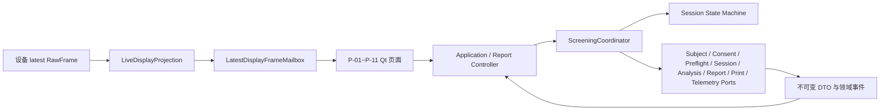

# FeetForcePlate 软件 UI 层实现与验证报告

> 版本：2026-07-23
> 范围：机构采集端 UI、工作流、本地基础分析/报告的已实现能力，以及与 UI 直接相连的显示和回放方法。
> 定位：本报告区分“已实现并自动验证”“真机显示链路已观察”和“仍待现场/人工验收”。平台用于健康筛查与风险提示，不将当前输出描述为疾病诊断或临床计量结论。

## 1. 执行摘要

机构端已经具备一个可组合的 P-01～P-11 一键筛查 UI 壳层：从机构编号/匿名建档、选填档案、简短授权、预检、站位引导、检测中实时热力图，到 `BASIC_READY` 基础报告、PDF 导出、打印和受控升级入口，均由不可变 DTO 与端口驱动。

核心原则已经落实为代码边界：UI 不直接操作串口、数据库私表、分段文件或 HTTP；采集、存储、同步、报告和打印均通过端口注入。检测中视图已接入最新帧投影、显示副本美化、黑底物理尺寸网格及 COP/相对载荷文字冗余；这些视觉处理不会改变原始帧、本地分析、COP、客户报告或可靠存储。

另外，已将一次完整真机采集的四段各 20 秒测试保存为脱敏回放夹具，作为今后 UI/算法验证的默认输入，避免每次测试均连接设备。当前各相关 UI issue 均保持 `In Review`：自动验证较完整，但目标 Windows、高 DPI、实体打印、真实存储/同步适配器、非技术操作员流程与临床/标定验收尚未完成。

## 2. 已实现的机构端体验

### 2.1 页面与状态机

`client/app/pages.py`、`client/app/qt_shell.py`、`client/app/controller.py` 和
`client/workflow/state_machine.py` 已实现 P-01～P-11 的页面目录、线性流程、按钮守卫和恢复分支。

| 页面 | 已实现能力 | 关键保护 |
| --- | --- | --- |
| P-01 工作台 | 新检测入口、网络/设备/待传摘要的页面契约 | 检测中锁定非安全导航 |
| P-02 受试者识别 | 机构编号查找、唯一/冲突/未找到、匿名快速建档 | 固定机构作用域；冲突不自动合并 |
| P-03 选填档案 | 年龄、性别、身高、体重、基础情况和既往损伤 | 记录已提供、无、未知、拒绝、不适用的语义 |
| P-04 授权 | 必要筛查用途与可选研究用途分离、政策变更重确认 | 无 `consent_record_id` 不可创建会话 |
| P-05 预检 | 可注入的设备、存储、联网、授权等预检结果 | 失败停留在可修复步骤；不创建正式会话 |
| P-06 站位引导 | 站位提示、稳定等待、自动倒计时与手动开始守卫 | 离开站位会复位倒计时 |
| P-07 检测中 | 热力图、COP、左右/总相对载荷、剩余时间、单一停止操作 | 显示刷新与工作流计时独立；无新帧不伪造数据 |
| P-08 处理/基础报告 | 有效性结果、`BASIC_READY`、重测引导 | 无效会话不生成客户报告 |
| P-09 记录 | 检测记录页面契约 | 仅在安全结束后可离开流程 |
| P-10 报告 | 版本钉住的文档读取、PDF 导出和打印入口 | 始终使用当前 `report_id + version`，避免后台版本漂移 |
| P-11 设备与支持 | 设备/支持入口、受控升级相关页面契约 | 技术详情只向遥测端口输出 |

页面的基础可读性令牌已设置为最小 1280×720、16 px 正文、48 px 主操作，并提供键盘/可访问名称。针对已发现的匹配档案页面挤压问题，P-02 已改为详情自动换行、主按钮最小 200×56 px，并改用具体年龄（例如“64 岁”）而非年龄段。

### 2.2 一键工作流与端口化架构

`ScreeningCoordinator` 是一次筛查的唯一编排点：预检阻断、开始/停止幂等、断线收尾、质量门控、基础报告状态与导出/打印都在此协调。`build_connected_ui` 是组合根，只接收批准的预检、会话、采集、可靠本地处理、报告、打印、遥测和显示刷新端口；因此 UI 层不拥有串口对象、数据库实体、文件句柄或 HTTP 客户端。

状态机覆盖 `HOME → SUBJECT_IDENTIFICATION → CONSENT_CONFIRMATION → PREFLIGHT → POSITION_GUIDANCE → ACQUIRING → FINALIZING → BASIC_REPORT`，并提供 `INCOMPLETE`、`RETRY_REQUIRED`、`FAILED` 恢复分支。设备启动初始化与 5 秒空载校验已移交给独立的 RAY-113/114/115；本 UI 范围仅保留可扩展的 `PreflightPort` 注入点，未重复实现其页面或算法。

## 3. 检测中热力图与实时显示

### 3.1 最新帧显示链路

`client/app/live_display.py` 的 `LiveDisplayProjection` 从硬件层只读 latest-only `RawFrame` 投影为独立 `DisplayFrame`。`LatestDisplayFrameMailbox` 只保留最新显示帧，不承担可靠存储或上传；Qt 在 `ACQUIRING` 状态用定时器拉取新 sequence，并由 `DisplayRefreshController` 限制最高 30 Hz UI 刷新。COP、左右相对负重、总相对载荷和短轨迹均使用未插值的显示输入计算/呈现。

该链路已用实际 CH340 数据完成一次运行观察：10 秒内处理 201 个实际 compact 48×64 帧，路径为 `CH340 → hardware LatestFrameMailbox → LiveDisplayProjection → LatestDisplayFrameMailbox → DisplayRefreshController → P-07 Qt`。这证明显示通路可工作，但不替代可靠会话、报告、标定或现场验收。

### 3.2 显示副本美化方法

`client/app/heatmap_display.py` 中的 `HeatmapDisplayRefiner` 只处理复制出的 `DisplayFrame.relative_heatmap`，不修改源矩阵。默认 `HeatmapDisplayConfig` 的顺序为：

1. 缓存最近 3 帧，对每像素取时间中值；
2. 以 3×3 邻域进行条件中值/Hampel 孤立异常点处理，阈值为 `max(3.5 × 1.4826 × MAD, 0.08 × 非零 P99)`；
3. 删除 1～2 像素孤岛，并填补有效压力区域内的单像素小孔；
4. 以非零 P99 做稳健归一化，避免单一热像素压暗整图；
5. `gamma = 0.75`；
6. `sigma = 0.9` 的轻量高斯平滑，并按真实接触 mask 裁剪后进行颜色/透明度映射。

该处理不套固定脚形模板，不扩大真实接触轮廓；关闭开关可重现原显示矩阵。自动回归覆盖单个异常高点、内部低点/小孔、2×2 真实高压簇、空帧、输入不可变性、连续刷新和高 DPI 渲染稳定性。

### 3.3 物理尺寸网格与视觉主题

`client/app/heatmap.py` 的 `PhysicalGridOverlay` 依据 DO-P4864 已声明板面 `509.3 × 381.3 mm`，在 P-07 叠加 1 cm 细网格、5 cm 主刻度及厘米标签。热图和 COP 使用同一 letterbox 物理比例，避免为了填满卡片拉伸。

当前主题为黑底：低于 `28/255` 的相对显示值不绘制，其余低压按幂透明度淡出；网格线采用低对比浅色。网格仅为操作员视觉参考，不是额外传感数据、标定读数或临床测量。

## 4. 数据质量与坏点修复的复用边界

与 UI 相连的上游硬件标准化层已提供通用 `client/hardware_standardization/defect_repair.py`：它在每一帧内保守检测可修复的孤立坏点/单行或单列缺失，并以定向插值生成新的派生矩阵、掩码和方法记录。隔离坏点采用局部 3×3/5×5 中值；单条坏行/列使用缺陷两侧的成对方向插值，5 像素窗口再对多个成对估计取中值。

修复发生在零校正和标准化之前，原始帧从不改写。检测只允许高置信度的一条内部行或列，边缘、簇、过大覆盖、多线、饱和或基线异常会使会话失效。修复产物由硬件质量门与审计元数据供本地/云端算法复用；UI 的视觉美化不重复承担这项数据修复，也不将其写回报告。

## 5. 本地基础分析、报告、PDF 与打印

### 5.1 能力门控的基础指标

`client/local_analysis` 使用纯 Python/NumPy 的不可变模型、登记表与分析器。每个指标声明定义/版本、单位、最低采样率、标定要求、所需时长、适用协议、验证状态和客户可见性。

已实现：原始/相对热力图、总相对载荷、左右比例、内部 COP 当前点/路径/幅度/包围面积。当前客户可见白名单仅包含非诊断性的相对总量与左右比例；未验证的 COP、频域、稳定性评分、参考范围和物理力单位均被门控，不会因 UI 或报告文案而放开。未经标定的 count 不会伪装为 N、Pa 或 kg。

### 5.2 离线基础报告

`client/local_analysis/service.py` 只从 `ReliableSessionSourcePort` 读取“已可靠落盘”的会话，并以幂等方式形成不可变 `LocalAnalysisResult`。有效会话可生成 `BASIC_READY`；无效会话仅保存结果与重测原因，不能生成客户报告。离线处理器没有网络/同步/HTTP 依赖；上传快照明确标记为辅助、非权威，云端仍须从原始数据重算。

`client/reporting/models.py` 定义版本化 `BasicReportDocument`，`client/reporting/pdf.py` 生成 A4 基础筛查报告，包含报告编号/版本、脱敏受试者编号、协议、筛查摘要、白名单指标、相对热力图、非诊断声明和来源页脚。`client/reporting/delivery.py` 提供 `.partial` 原子导出、安全临时打印文件和可注入打印端口。基础与完整报告共享 `report_id`，后续云端版本不能静默覆盖已导出的基础版本。

## 6. 四段真机回放测试资产

规范测试资产位于 `tests/fixtures/device/dop4864_reference_protocol_v1/`：

| 回放段 | 请求时长 | 保存帧数 |
| --- | ---: | ---: |
| 并足双脚站立、睁眼 | 20 秒 | 414 |
| 并足双脚站立、闭眼 | 20 秒 | 415 |
| 串联站立、左脚在前 | 20 秒 | 414 |
| 串联站立、右脚在前 | 20 秒 | 415 |

该资产共 1,658 帧，保存为相对 `uint8` 48×64 序列，SHA-256 为
`2495b910bbf7e4fcca0cd0db36dde809f0fd6395bb6060eded44db575acd6f90`。原始串口字节、时间戳、源索引、绝对幅值、操作者和设备标识均未进入仓库。后续 UI/算法验证应优先使用这一确定性输入；旧 `client/tests` 路径仅为兼容副本，并由测试校验哈希一致。

它是工程回放夹具，不是校准压力记录、客户报告输入或闭眼/串联范式的临床验证。连接、吞吐、异常恢复和新硬件版本仍需要真机测试。

## 7. 自动验证与证据

下列是与当前 UI 交付直接相关的已记录验证；数值表示对应定向命令在记录时的结果，不应替代每次合并前的重新运行。

| 范围 | 代表性验证 | 已记录结果 |
| --- | --- | --- |
| RAY-101 工作流/UI 连接 | UI → 工作流 → 显示帧 → 本地报告 → 导出/打印组合 | `112 passed in 1.75s`；定向连接 `6 passed` |
| RAY-84 热力图美化 | Hampel/形态学/P99/高 DPI 显示副本 | `16 passed in 1.84s` |
| RAY-84 物理网格与黑底 | P-07 网格、显示桥接、DisplayModel、组合 UI | `18 passed in 1.74s` |
| RAY-84 实时显示桥接 | latest raw frame 到 P-07 的投影 | `11 passed in 1.70s` |
| RAY-91 四段回放夹具 | 夹具合同、逐帧生产显示投影、坏行修复 | `19 passed in 0.62s` |
| RAY-90 本地指标 | 120×48×64 fixture、门控、独立参考容差 | `67 passed` |
| RAY-85 离线基础报告 | 可靠落盘门控、幂等、`BASIC_READY`、非权威上传边界 | `73 passed` |
| RAY-92 受试者/授权 | 租户边界、冲突、匿名档案、授权复用/重确认、Qt 表单 | `48 passed` |
| RAY-96 PDF/交付/升级合同 | PDF 结构、原子导出、打印确认、升级拒绝/回滚 | `89 passed` |

主要证据位于 `docs/evidence/linear/RAY-84/`、`RAY-85/`、`RAY-90/`、`RAY-91/`、`RAY-92/`、`RAY-96/` 与 `RAY-101/`。其中包含 JUnit、合成截图、报告样本、协议元数据和明确的验证边界。

本报告生成时重新运行了 `QT_QPA_PLATFORM=offscreen ./scripts/local-env.sh python -m pytest client/tests -q`：结果为 **145 passed，1 failed**。失败项是独立启动校验范围的 `RAY-114`：`test_failure_has_plain_copy_one_primary_recovery_and_safe_exit` 中主“重试”按钮未取得焦点；本报告不修改 RAY-114/启动校验代码。其余 UI 回归均通过，且该失败不改变上述各 issue 仍为 `In Review` 的结论。

## 8. Linear 当前状态（2026-07-23 读取）

| Issue | 内容 | 当前状态 | 说明 |
| --- | --- | --- | --- |
| RAY-84 | 检测中热力图、COP、必要状态 | In Review | 已有显示美化、黑底物理网格和真机显示链路观察；待目标环境验收 |
| RAY-85 | 本地基础分析与断网基础报告 | In Review | 契约/门控/离线报告完成；待真实存储、同步和云端升级联调 |
| RAY-90 | 经能力门控的本地指标 | In Review | 被 RAY-117 阻塞；待标定、真实采样节律与客户指标审批 |
| RAY-91 | 标准筛查协议、引导与基础结果 | In Review | 四段工程回放已保存；扩展范式仍未临床/现场验证 |
| RAY-92 | 受试者标识、选填档案与授权 | In Review | 客户端契约/UI 完成；待真实存储、审计和法务/现场确认 |
| RAY-96 | 打包、安装与受控升级 | In Review | 交付合同完成；待 Windows/macOS 实装、签名、驱动和实体打印 |
| RAY-101 | 一键工作流与页面状态机 | In Review | P-01～P-11 与 UI 组合根完成；待真实适配器和操作员验收 |
| RAY-110 | P-07 检测中体验 | Backlog | 被 RAY-105 阻塞；不应把 RAY-84 已交付显示能力误记为该 issue 已完成 |

## 9. 尚未完成项与推荐验收顺序

1. **目标机构端 UI 人工验收**：Windows 100/125/150/200% 缩放、1280×720、高对比/键盘焦点、P-02 文本换行、P-07 信息密度及 P-10 报告阅读。
2. **真实组合根闭环**：将实际设备、可靠加密会话存储、同步和报告适配器接入已存在端口；验证断线、恢复、慢网和长会话，而不是只验证 latest-only 显示。
3. **实体打印与安装验收**：A4 打印机、中文字体、分页、缩放、Windows CH340 驱动、macOS 签名/公证和升级回滚。
4. **指标/协议验证**：完成 RAY-117 的设备标准化与标定边界后，再对当前约 12 Hz 的 COP/静态趋势、协议时长、扩展范式和客户可见指标逐项批准。
5. **维护回放资产**：新设备版本、协议或硬件缺陷策略变化时，保留旧夹具并新增版本化 fixture；不得用新的处理覆盖既有工程基准。

## 10. 交接入口

- UI 组合根：`client/app/ui_integration.py`
- Qt 页面壳层：`client/app/qt_shell.py`
- 工作流与状态机：`client/workflow/coordinator.py`、`client/workflow/state_machine.py`
- 实时显示投影：`client/app/live_display.py`
- 热力图/网格：`client/app/heatmap.py`、`client/app/heatmap_display.py`
- 本地分析与报告：`client/local_analysis/`、`client/reporting/`
- 四段回放资产：`tests/fixtures/device/dop4864_reference_protocol_v1/`
- 逐 issue 证据：`docs/evidence/linear/RAY-*/README.md`

## 11. 本报告关联提交

- `60eed81`：显示副本热力图美化。
- `20c26a7`、`d1b8597`：实时硬件 latest-frame 到 P-07 显示桥接与验证。
- `6df1845`、`9fd42bf`：物理尺寸网格与黑底显示主题。
- `09542f4`、`b0ead9f`：通用单帧传感器缺陷修复。
- `a85fee8`、`2b050ec`：四段真机回放夹具归位与 evidence。

本报告本身只整理现有事实，不改变任何 Linear issue 状态，也不解除任何真机、人工、标定或临床验证门槛。
