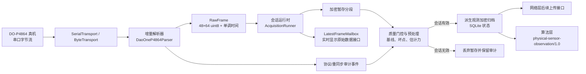

# FeetForcePlate 硬件层实现与交接报告

> 版本：2026-07-23
>
> 范围：DO-P4864 压力板的设备接入、协议解析、可靠采集、数据有效性审核、预处理、局部力学转换、本地加密保存与恢复。
> 定位：MVP 初筛与社区快速检查的硬件数据底座；不构成疾病诊断，也不宣称为高精度计量测力设备。

## 1. 结论摘要

硬件层已具备 MVP 所需的主链路：可从已连接的 DO-P4864 真机稳定读取字节流，按真机实测格式增量解析为 `48×64` 原始阵列；对采集连续性、协议结构、坏点可修复性和力学转换可用性进行审核；仅将通过审核的会话以加密、不可变分段和 SQLite 状态记录保存到本地。输出包含标准化的空间坐标、原始计数、零点校正、坏点修复结果、估计力和完整质量审计信息，足以供后续算法层进行 MVP 初筛分析。

已完成的真实设备证据包括：串口识别、真机帧结构、四方向空间映射、短时基线采集，以及一次约 10 分钟的连续运行验证。该 10 分钟运行解码并提交了 12,396 帧，最长一次相邻有效帧间隔约 114.8 ms，小于当前 5 秒中断阈值；会话最终为 `CLOSED / VALID`。

硬件层尚未“全部完成”：厂商校验和定义、跨设备/温漂/长期稳定性、精密力学标定，以及实时 UI 热力图的最终绑定仍待补齐。它们不阻塞当前原始数据到算法输入的 MVP 链路，但必须在产品扩大部署或宣称精确测力前完成验证。

## 2. 责任边界

### 硬件层负责

- 串口设备发现、连接、字节读取和断连检测。
- DO-P4864 真机协议的增量解析与重同步。
- 以主机单调时间和 `source_index` 标记每一帧，保留协议质量事件。
- 会话级有效性审核：连续 5 秒没有成功解码帧、物理断连、落盘失败、不可修复坏点或力学转换失败时，判定当前会话无效。
- 对短暂坏帧/噪声进行审计；在前后有效帧齐备时生成仅用于派生数据的插补帧，绝不伪造或覆盖原始帧。
- 空载零点基线、噪声阈值、孤立坏点修复、空间标准化和 MVP 估计力转换。
- 本地 AES-GCM 加密分段、SQLite 状态、崩溃恢复、配额审计和人工确认后的本地删除。

### 硬件层不负责

- 网络身份认证、上传、云端解密、云端存储或云端分析。
- COP、步态/平衡评分、疾病风险判断、最终报告与临床解释。
- 最终 UI 页面、热力图视觉设计和操作流程。
- 跨设备法定计量、医疗级精密测力或诊断结论。

## 3. 已确认的 DO-P4864 真机基线

| 项目 | 当前实现所依据的真机事实 |
| --- | --- |
| 连接 | USB 串口，CH340（VID:PID `1A86:7523`），当前真机端口曾观测为 `/dev/cu.usbserial-130` |
| 串口参数 | 1 Mbps，8N1，有限读取超时 |
| 实测帧 | `FF AA | 0C 07 | 01 | 3072 字节 payload | checksum 候选 | FA`，总长 3,079 B |
| 原始单元 | `3072 = 48×64`；当前实测为每点一个 `uint8` 计数，不使用旧文档的 12-bit / 6144 B 假设 |
| 数据排列 | 列主序：第一列从第 1 行到第 48 行，再到第二列；解码为 `reshape((48, 64), order="F")` |
| 物理坐标 | 左上为 `(0,0)`，向右为 `+X`、向下为 `+Y`；坐标约定为 `BOARD_TOP_LEFT_X_RIGHT_Y_DOWN` |
| 栅格间距 | X、Y 均为 7.99 mm；板面约 509.3 × 381.3 mm |
| 实测到达节律 | 主机候选到达间隔中位数约 48.38 ms，约 20.7 Hz；这只是主机观测，不是设备时钟承诺 |
| 校验和 | 厂商覆盖范围/实现尚未由 golden fixture 证实，当前仅记录观察结果，不作为丢帧硬过滤条件 |

旧版资料中“6151 B 长度、6144 B 内容、12-bit”的描述与真机 3,079 B 紧凑 8-bit 帧不一致。运行时已固定使用真机 `observed_compact_8bit` 配置，不会把两种协议混用。

## 4. 已实现架构



运行时的关键原则是：原始帧一经解码即不可改写；预处理、插补、坏点修复和估计力都以派生数据形式保存，并可追溯至原始帧和质量事件。

## 5. 已实现功能

| 能力 | 主要实现 | 当前状态 |
| --- | --- | --- |
| 设备接入 | `client/device/serial_transport.py`、`transport.py` | 已实现；支持枚举、探测、1 Mbps 串口读取及断连识别 |
| 增量协议解析 | `client/device/protocol.py` | 已实现；处理任意分块、粘包、残帧、无效尾、长度/功能码异常和重同步 |
| 原始帧模型 | `RawFrame` | 已实现；含不可变 `48×64 uint8`、`source_index`、`monotonic_time_ns`、质量标记 |
| 接收完整性审计 | `ProtocolIntegrityEvent`、解析统计 | 已实现；坏长度、尾字节、checksum 候选、重同步和无效候选均可记录 |
| 会话状态机 | `ConnectionStateMachine`、`AcquisitionRunner` | 已实现；`DISCONNECTED → CONNECTING → READY → ACQUIRING`，并能进入 `INVALID` |
| 连续性规则 | `MAXIMUM_NO_VALID_SIGNAL_NS` | 已实现；连续 5 秒没有成功解码帧即会话无效，不因单个短暂坏帧立即判废 |
| 短暂坏帧处理 | 邻帧线性插补与审计 | 已实现；只生成带 `RECONSTRUCTED_FROM_NEIGHBORS` 的派生帧，原始帧不伪造 |
| 本地实时数据出口 | `LatestFrameMailbox`、`DisplayCadence` | 已实现；UI 可按显示节奏取得最新 `RawFrame`，不会阻塞采集或改变原始数据 |
| 零点/噪声基线 | `client/hardware_standardization` | 已实现；最短 5 秒空载，逐点 median 零偏与 MAD 噪声 |
| 坏点审核与修复 | `DoP4864HardwareQualityGate` | 已实现；仅接受有限、孤立且可由邻域支持修复的坏点；边缘、相邻成片或超限坏点判无效 |
| MVP 力学转换 | `VoltageToForceModel`、`PhysicalArraySession` | 已实现；从校正后的 8-bit 计数生成 `estimated_force_n` 等派生字段 |
| 本地安全暂存 | `client/spool/segments.py` | 已实现；5–10 秒不可变容器、压缩、AES-256-GCM、fsync 与原子改名 |
| 本地状态库 | `client/spool/state_store.py` | 已实现；SQLite WAL、完整性约束、会话/分段/派生产物/同步状态/配额记录 |
| 崩溃恢复 | `client/spool/recovery.py` | 已实现；扫描暂存、校验归档、隔离损坏项、补登记已落盘未入库项 |
| 会话提交 | `client/spool/session_commit.py` | 已实现；仅有效会话可提升为正式本地记录；无效会话丢弃暂存 |
| 模拟与故障注入 | `client/device/simulator.py` | 已实现；可模拟分块、截断、错误尾、错误长度、checksum 候选异常、间隔过长和断连 |
| 回放/故障复现工具 | RAY-88 | 尚未实施，当前为 Backlog |

## 6. 数据接口与上下游约定

### 6.1 设备到硬件运行时

解析器输出的 `RawFrame` 是设备数据的唯一原始表达：

- `values`：形状 `(48, 64)`、类型 `uint8`、按已验证的列主序映射到板面。
- `source_index`：主机侧成功解码顺序号，不等同于设备帧号。
- `monotonic_time_ns`：主机单调到达时间，不能当作设备采样时间。
- `quality_flags` / `integrity_event_ids`：关联协议观察、重同步和派生处理信息。

### 6.2 硬件层到 UI 层：实时热力图原始接口

`LatestFrameMailbox` 已提供进程内实时出口。UI 应按自己的显示帧率读取最新 `RawFrame.values`，以 `(48,64)` 直接绘制，或在**显示副本**上做归一化/对比度拉伸；不得回写原始值、影响会话有效性、持久化、算法计算或报告。

当前缺口是 UI 绑定而非数据出口：现有 Qt 热力图主要消费后分析 `relative_heatmap`，尚未将 `LatestFrameMailbox` 接到实时显示；并且旧 `VersionedDisplayProcessor` 仍假定 `uint16`，与真机 `uint8` 路径不匹配。后续 UI 层需要增加一个只读适配器，将 `RawFrame` 转成 `RealtimeHeatmapFrame`（显示值、时间、帧索引、质量与连接状态），而不重复硬件层坏点修复逻辑。

### 6.3 硬件层到本地存储/网络层

硬件层只在会话通过质量门控后写入本地加密归档，并在 SQLite 记录对应 segment、派生产物和同步状态。网络层应消费已提交的本地对象和元数据，负责身份认证、传输、云端确认及重试；硬件层不实现上传协议。

云端确认完成后，本地数据当前**不自动删除**。由操作人员在确认需要释放空间时使用受控的手动删除流程；配额触发时也不应静默删除尚未人工确认的数据。

### 6.4 硬件层到算法层

硬件层给算法层的 MVP 输入为 `physical-sensor-observation/1.0`：

- 固定的板面坐标、网格几何和空间约定；
- 原始计数、零点校正结果、活动/坏点/修复掩码；
- `estimated_force_n`、饱和/转换质量标记；
- 协议、连续性、插补和会话质量审计；
- 处理配置和版本号，用于可复现分析。

正式 `physical-pressure-session/1.0` 契约要求已验证的 `normal_force_n`。当前 MVP 不输出该临床/计量级声明，而是输出可用于初筛算法的估计力观测。算法层必须保留质量门控，并禁止把 `estimated_force_n` 自动包装成已验证法向力或医疗诊断结果。

## 7. 预处理与力学转换方法

### 7.1 基线、活动与坏点

1. 采集至少 5 秒空载数据。
2. 对每个感应点计算零偏中位数 `zero_median` 与 MAD 噪声。
3. 活动阈值取 `max(1 count, 3 × MAD)`。
4. 保留完整原始计数；零点校正、阈值化、坏点掩码与修复只作为派生层。
5. 对有限的孤立坏点，用相邻有效点支持的修复策略生成派生值；若坏点在边缘、相邻成片、数量超限或无法得到可靠邻域支持，则整项会话无效。

### 7.2 短暂协议异常的恢复

单帧结构错误、尾字节错误、无法判定的 checksum 候选或重同步事件都会进入审计，但不会立即使会话失败。只要在 5 秒窗口内重新得到有效帧，且异常处有前后有效邻帧，运行时可按逐点线性插补生成一个派生帧，标为 `RECONSTRUCTED_FROM_NEIGHBORS` 和 `RAW_FRAME_UNAVAILABLE`。该策略用于让算法输入保持时序连续，同时明确暴露不确定性。

发生以下任一事件则会话失败：物理断连、写入/加密存储失败、持续 5 秒没有新有效帧、不可修复坏点过多、饱和/转换失败达到质量门控阈值。

### 7.3 MVP 估计力转换

当前转换以统一已知载荷试验拟合为基础，服务于“相对受力分布和初筛特征”的 MVP：

```text
raw_voltage = raw_count / 255 × 4.096
ΔV = max(raw_count - zero_median, 0) / 255 × 4.096
```

对有效 `ΔV`，使用固定版本的双斜率单调电压到力模型生成 `estimated_force_n`；零增量输出 0 N，饱和点输出空值并带饱和标志。模型/配置版本随派生产物保存，以便将来用更充分的标定数据重新处理。

这项方法适合目前的 MVP 初筛方向，但不等于个人体重、接触压强或医学级法向力的精确测量。后续需补充重复加载、卸载迟滞、温漂、逐点增益、跨设备和不同人体接触条件的验证。

## 8. 可靠性、存储与恢复设计

| 场景 | 当前处理 |
| --- | --- |
| 单个坏帧/解析噪声 | 审计并尝试重同步；若恢复及时，使用带标记的派生插补帧 |
| 连续无有效信号 ≥ 5 秒 | 当前会话 `INVALID`，不提升为正式有效会话 |
| 串口断开 | 立即判会话无效，保留原因供操作员重新测试 |
| 加密分段或 SQLite 写入失败 | 立即停止并判无效，避免半完成有效数据 |
| 电力中断/进程崩溃 | 重启后扫描暂存与归档；验证完整性、隔离损坏项、恢复已落盘未入库的记录 |
| 网络中断 | 不影响硬件采集和本地有效会话保存；网络层后续负责传输重试 |
| 空间不足 | 通过 SQLite 配额/审计暴露；不静默删除有效会话 |
| 云端确认成功 | 保留本地数据，等待人工确认删除 |

分段使用 AES-256-GCM、随机 nonce、认证标签和摘要校验；落盘采用临时文件、`fsync` 与原子改名。密钥分发、设备身份认证和网络传输安全属于网络层的后续任务，不应把密钥写入证据、日志或仓库。

## 9. 已完成验证与证据边界

### 自动化验证

- 协议解析、分块、重同步、模拟故障、采集状态机、分段加密、恢复、配额和标准化处理均有自动化覆盖。
- RAY-86 硬件聚焦测试曾通过 `113 passed`。
- RAY-117 标准化相关测试曾通过 `62 passed`；早期该模块基础回归为 `28/28`。
- 历史全项目运行记录为 `267 passed, 2 failed`；两个失败为既有启动持久化测试仍断言旧 SQLite schema v2，而当前共享 `StateStore` 已为 v5，非硬件改动导致。该记录不应替代每次发布前的全套回归。

### 真机验证

- 真机端口可被 pyserial 识别，且无其他进程占用。
- 通过四方向压测与固定物体测试确认列主序物理映射；左上为板面原点。
- 最短约 5.139 秒空载基线：111 帧；未出现有效帧错误。
- 约 600 秒连续运行：12,396 原始帧、12 个尾部无效候选、12 个仅派生的重建帧；最长相关间隔约 114.8 ms，低于 5 秒阈值；重启后恢复扫描未发现需要修复、隔离或重排队的对象。
- 真机候选 checksum 在该批次未命中，故按设计以 `OBSERVE_ONLY` 保留，未作为有效帧剔除条件。

证据目录位于 `docs/evidence/linear/RAY-78/`、`RAY-80/`、`RAY-81/`、`RAY-82/`、`RAY-83/`、`RAY-86/`、`RAY-87/`、`RAY-89/` 和 `RAY-117/`。其中 `RAY-86/real-device-runtime-continuity-10m-20260723.json` 为已脱敏的 10 分钟运行摘要。

## 10. Linear 工作项快照

以下为 2026-07-23 从 Linear 读取的状态；`In Review` 表示实现/自动验证已进行，但仍有真机、人工或外部验收项，不等于 `Done`。

| Issue | 主题 | 状态 | 与本报告的关系 |
| --- | --- | --- | --- |
| RAY-78 | DO-P4864 硬件与协议基线 | In Review | 真机紧凑帧、空间映射和 10 分钟运行已有证据；checksum/厂商确认仍开放 |
| RAY-79 | 工程基础设施与分层骨架 | Backlog | 影响整体工程组织，不是本硬件链路完成的阻塞项 |
| RAY-80 | 设备接入与可靠采集 | In Review | 接入、状态机、连续性和有效会话逻辑已实现 |
| RAY-81 | 协议解析与接收完整性审计 | In Review | 增量解析与事件审计已实现；Linear 中旧的 row-major 描述应以实测 column-major 为准 |
| RAY-82 | 字节级模拟器与故障注入 | In Review | 模拟器与主要故障计划已实现 |
| RAY-83 | 数据处理管线 | In Review | 空载基线、坏点门控、标准化与估计力链路已实现 |
| RAY-86 | 可靠采集监控与 P1 验收 | In Review | 5 秒失效规则和 10 分钟真机连续性证据已完成；长期/破坏性场景待补 |
| RAY-87 | 本地会话、加密分段与恢复 | In Review | 加密暂存、有效会话提交和恢复扫描已实现；电力/磁盘等真实故障仍待验证 |
| RAY-88 | 内部回放与故障复现工具 | Backlog | 未实现 |
| RAY-89 | 状态库、离线配额与确认后清理 | In Review | SQLite、配额和人工删除策略已实现；运营流程验收待补 |
| RAY-117 | DO-P4864 物理层标准化 | In Review | 空间规格、零点、坏点、估计力和算法输入契约已建立；精确力验证待补 |

## 11. 已知限制与后续优先级

1. **完成实时热力图 UI 绑定。** 数据接口已存在，但需由 UI 层将 `LatestFrameMailbox` 的 `uint8 (48,64)` 原始帧接到显示适配器；修正旧 `uint16` 假设。该任务只影响显示，不得影响采集、存储或算法输入。
2. **取得厂商 golden fixture。** 明确 checksum 覆盖范围、长度字段定义和版本/设备身份语义；在证实前维持 checksum 观察模式。
3. **完成 RAY-88 回放工具。** 能将脱敏的原始分段和故障计划离线复现，帮助定位现场问题。
4. **补做破坏性可靠性测试。** 包括真实拔插、串口重连、进程中断、电源中断、磁盘满、数据库异常和恢复后人工核查。
5. **扩展力学标定。** 在不同位置、载荷、设备、温度和加载/卸载条件下收集证据；升级模型时保留原始数据和处理版本，支持重新派生。
6. **明确网络层交接。** 网络层应定义受认证的上传、幂等确认、重试和密钥轮换；硬件层只交付已提交的本地加密对象与审计元数据。
7. **建立运营验收。** 明确“无效会话提示重新测试”“本地空间不足”“上传已确认但本地保留”“人工删除”四个操作流程。

## 12. 主要代码、规范与证据索引

| 类别 | 位置 |
| --- | --- |
| 协议/采集 | `client/device/protocol.py`、`client/device/acquisition.py`、`client/device/serial_transport.py`、`client/device/session_runtime.py` |
| 模拟器 | `client/device/simulator.py` |
| 物理层标准化 | `client/hardware_standardization/` |
| 本地加密存储与恢复 | `client/spool/` |
| 设备规格 | `docs/hardware/device-specifications/do-p4864/1.0.json` |
| 原始数据到压力量级方法 | `docs/hardware/DP-P4864-raw-to-pressure-method-v1.md` |
| 通信接口 | `docs/通信接口设计文档.md` |
| 算法输入说明 | `docs/algorithm/physical-input-interface-v1.md`、`docs/algorithm/standard-physical-input-contract.md` |
| Linear 交付证据 | `docs/evidence/linear/RAY-78/` 至 `RAY-117/` 的对应子目录 |

---

本报告描述的是当前代码和证据所支持的工程状态。后续任何协议、标定或质量门控变化，都应同时更新相应 Linear issue、版本化配置、自动化 fixture 和真机证据，而不是只修改文档说明。
