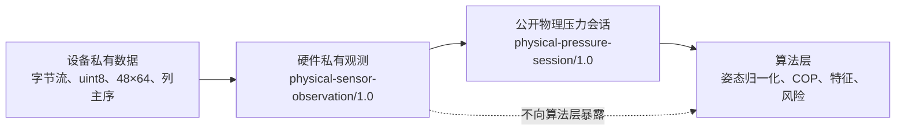

# 硬件层—算法层交互接口 V1

> 状态：设计与实现对照基线（2026-07-28）
>
> 本文定义硬件层交给上层的唯一公开数据边界；不定义串口、设备协议、存储加密、上传或 UI。

## 1. 结论

上层不应接收 DO-P4864 的 `48×64 uint8` 原始阵列、列主序、串口时间、校验和、坏点修复算法或设备型号。硬件层对上层提供的是一个**设备无关的板面法向力场**：每个物理感应点的位置、每一时刻的法向力、时间、质量状态和测量版本。

“物理压力矩阵”在接口中不采用固定二维 `48×64` 数组作为语义。固定行列数、内存顺序和点间距仍是设备知识；标准接口采用 `cells[]` 加同序 `normal_force_n[]` 的点场表示。任意上层如需热力图，可根据物理坐标栅格化；算法层不得根据 DO-P4864 的行列数或列主序推断坐标。

当前硬件实现可产生 `estimated_force_n`，但正式 `physical-pressure-session/1.0` 仍要求 `normal_force_n` 且 `force_validation=VALIDATED`。因此当前实际归档是 `physical-sensor-observation/1.0`，还没有正式发出本文件定义的公开压力会话。这个差异必须在实现交付前收敛，不能仅通过重命名字段掩盖。

## 2. 三层数据边界



| 层级 | 可包含 | 不可包含 |
| --- | --- | --- |
| 设备私有数据 | 串口帧、功能码、原始计数、payload 顺序、checksum、主机接收事件 | 上层业务/算法结论 |
| 硬件私有观测 | 空载基线、原始/零校正/修复计数、候选/估计力、坏点与协议审计 | COP、速度、平衡结论、风险和报告 |
| 公开物理压力会话 | 物理坐标、法向力 N、时间、点状态、帧质量、阶段元数据、测量版本 | 设备型号、原始计数、字节序、帧头、校验和、硬件修复实现细节 |
| 算法层结果 | ML/AP 归一化、COP、动态特征、评分、风险和报告 | 对设备通信/原始计数的重新解释 |

## 3. 公开接口：`physical-pressure-session/1.0`

接口模式文件为 [`physical-pressure-session-1.0.schema.json`](schemas/physical-pressure-session-1.0.schema.json)。交换格式为 UTF-8 JSON；通信层可改用其他传输编码，但字段语义、单位和版本不得改变。

### 3.1 顶层字段

| 字段 | 类型/固定值 | 上层语义 |
| --- | --- | --- |
| `schema_version` | `physical-pressure-session/1.0` | 公开物理接口版本 |
| `session_id` | string | 会话不可变标识 |
| `coordinate_frame` | `BOARD_TOP_LEFT_X_RIGHT_Y_DOWN` | 板面左上为原点，右为 +X、下为 +Y；不是人体 ML/AP |
| `coordinate_unit` | `mm` | 物理坐标单位 |
| `force_unit` | `N` | 法向力单位 |
| `area_unit` | `mm2` | 有效面积单位；未知面积不得伪造 |
| `time_unit` | `s` | 会话相对单调时间单位 |
| `measurement_profile` | object | 本次测量的标定、几何、时间和不确定性版本/状态 |
| `cells` | array | 固定物理点定义 |
| `stages` | array | 客户端工作流提供的动作阶段，不由硬件推断 |
| `frames` | array | 按时间排列的物理法向力场 |

### 3.2 `cells[]`：用物理点消除设备依赖

每个元素定义一个固定物理位置：

```json
{
  "cell_id": "cell-0001",
  "board_x_mm": 0.0,
  "board_y_mm": 0.0,
  "active_area_mm2": null,
  "status": "ACTIVE"
}
```

约束：

- `cell_id` 在会话内唯一且顺序稳定。
- `board_x_mm`、`board_y_mm` 是感应点中心的实际板面坐标。
- `active_area_mm2` 只有在已验证时才可填写；目前未知时为 `null`。
- `status=EXCLUDED` 表示该点不参与算法计算，算法不得以零代替。

公开接口不包含 `source_index`、行号、列号、阵列尺寸或 payload 顺序。这些只存在于硬件适配器内部。

### 3.3 `frames[]`：物理法向力场

每帧的最小公开表达如下：

```json
{
  "timestamp_s": 0.04838,
  "normal_force_n": [0.0, 0.12, 0.08, 0.0],
  "quality": "VALID",
  "quality_flags": ["ZERO_OFFSET_APPLIED"]
}
```

| 字段 | 规则 |
| --- | --- |
| `timestamp_s` | 实际主机单调时间相对会话起点；严格递增；不得按额定帧率虚构补帧 |
| `normal_force_n` | 与 `cells[]` 等长、有限、非负、单位 N；第 *i* 个值对应第 *i* 个 `cells[]` |
| `quality` | `VALID` 或 `INVALID`；算法不得把 `INVALID` 当作零力 |
| `quality_flags` | 可说明基线、插补、坏点、饱和、时间异常等；不得夹带设备字节协议细节 |

这是“法向力场”，不是 Pa 压强场。若业务确实需要 `pressure_pa`，必须先提供已验证的 `active_area_mm2` 或独立的可验证面积模型；目前不能以假定面积生成对外物理压力 Pa。

### 3.4 `measurement_profile`

上层必须根据该对象判断可使用范围，而不是通过设备名称猜测：

```json
{
  "profile_version": "measurement-profile/1.0",
  "measurement_conformance_version": "measurement/1.0",
  "calibration_profile_version": "calibration-profile/1.0",
  "uncertainty_profile_version": "uncertainty-profile/1.0",
  "physical_validation": "VALIDATED",
  "timing_validation": "VALIDATED",
  "coordinate_validation": "VALIDATED",
  "force_validation": "VALIDATED",
  "geometry_validation": "VALIDATED"
}
```

当前 schema 对正式公开接口要求以上验证字段为 `VALIDATED`。如果产品决定让 MVP 初筛使用当前 `MVP_SCREENING_ESTIMATED_V1` 力模型，则必须发布新的、明确版本化的公开 schema/门控规则；不能把 `estimated_force_n` 偷换为 `normal_force_n` 后仍声明 `VALIDATED`。

## 4. 当前实现与目标接口的映射

| 当前硬件字段/事实 | 公开接口处理 |
| --- | --- |
| `raw_count` / `uint8_count` | 不输出 |
| `zero_corrected_count` / `relative_load_count` | 不输出 |
| `raw_voltage_v` / `zero_corrected_voltage_v` | 不输出 |
| `repaired_count` | 不输出具体数值；影响最终力值，并通过质量标记说明 |
| `repaired_cell_mask` | 不输出设备修复策略；必要时用 `quality_flags` 或 `cells[].status` 表达可用性 |
| `estimated_force_n` | 当前硬件 MVP 力学转换结果；尚未满足正式 `normal_force_n` 发布门槛 |
| `normal_force_n` | 正式公开字段；当前实现为全 `null` |
| `RawFrame.source_index` / 列主序 | 不输出；仅用于硬件可追溯性 |
| 主机单调时间 | 转换为相对 `timestamp_s` 后输出 |
| `BOARD_TOP_LEFT_X_RIGHT_Y_DOWN` 与实际点坐标 | 输出；这是物理空间信息，不是设备协议细节 |
| 会话连续性、坏点、饱和结果 | 通过 `quality`、`quality_flags` 和会话/manifest 质量信息输出 |

当前实现的私有观测数据结构为 `PhysicalArraySession` 和 `PhysicalArrayFrame`，定义见 `client/hardware_standardization/models.py`；其序列化会包含原始计数和估计力，故不能直接作为公开算法输入文件。

## 5. 上下游责任

| 责任 | 硬件层 | 算法层 |
| --- | ---:| ---:|
| 解码、基线、坏点修复、有效会话审核 | 负责 | 不读取原始细节 |
| 物理点坐标、法向力、真实时间与质量 | 生产并声明版本 | 校验并消费 |
| 阶段动作元数据 | 不推断、不改写，仅透传 | 使用阶段姿态解释数据 |
| 人体 ML/AP、COP、速度、范围、特征 | 不负责 | 负责 |
| 评分、风险提示、报告 | 不负责 | 负责 |
| 设备、原始数据与协议审计 | 本地留存、按需追溯 | 不依赖 |

## 6. 接收方拒绝规则

算法层必须拒绝或隔离以下输入：

- schema/单位/坐标系不支持，或存在未知公开字段；
- `cells[]` 中 ID 重复、坐标无效，或某帧力数组长度与点数不一致；
- 时间不严格递增，负值/非有限力值，或把 `INVALID` 帧作为有效值使用；
- 验证状态和实际载荷字段不一致；
- 原始计数、设备协议、COP、评分或风险字段被塞入公开物理输入；
- 活动面积未知却将法向力擅自换算为 Pa。

## 7. 需要完成的收敛工作

1. 确认 MVP 的对外力语义：保持当前“估计力研究输入”，或新建允许 `MVP_SCREENING_ESTIMATED_V1` 的正式初筛公开 schema。
2. 在硬件层新增专用公开导出器：从已提交且有效的会话生成公开压力会话，删除原始计数和所有设备协议字段。
3. 为公开导出器增加 schema、单位、坐标、时间、数组对齐和不可泄露字段的自动化测试。
4. 算法层只从该公开导出文件读取数据；实时 UI 另走只读显示适配器，不得反向影响会话、存储或算法输入。

在第 1 项决策与第 2 项导出器完成之前，当前 `physical-sensor-observation/1.0` 只能视作硬件内部的受控观测归档，不能被误称为设备无关的算法公共接口。
