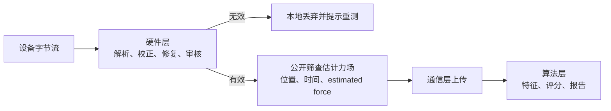

# 硬件层—算法层交互接口 V1

> 状态：接口边界基线（2026-07-28）
>
> 本文规定算法层只接收硬件层认可的、设备无关的筛查估计力场；硬件质量和设备实现不跨越该边界。

## 1. 交互原则

硬件层必须在本地完成设备接入、协议解析、基线校正、坏点修复/隔离、掉帧处理和会话有效性审核。只有整体通过审核的会话，才生成 `estimated-force-session/1.0` 并交给通信层上传、算法层分析。

算法层只需要以下物理事实：

- 每一个可用感应点的板面位置；
- 每一帧的实际时间；
- 每一点的筛查估计力（N）；
- 坐标、时间和力的单位。

算法层不接收，也不需要判断：设备型号、原始阵列大小、字节序、串口时间、原始计数、电压、校验和、坏点掩码、修复过程、掉帧、断连、质量状态或质量标记。



## 2. 公开对象

公开 schema 为 [`estimated-force-session/1.0`](schemas/physical-pressure-session-1.0.schema.json)，规范说明见[筛查估计力接口 V1](physical-input-interface-v1.md)。

```json
{
  "schema_version": "estimated-force-session/1.0",
  "session_id": "uuid",
  "coordinate_frame": "BOARD_TOP_LEFT_X_RIGHT_Y_DOWN",
  "coordinate_unit": "mm",
  "force_unit": "N",
  "time_unit": "s",
  "points": [
    {"point_id": "point-0001", "board_x_mm": 0.0, "board_y_mm": 0.0}
  ],
  "frames": [
    {"timestamp_s": 0.04838, "estimated_force_n": [0.12]}
  ]
}
```

### 2.1 `points[]`：物理位置

`points[]` 描述输出力场的空间排列。`point_id` 只是会话内稳定、通用的数组对齐标识；它不表示设备行列、寄存器或串口序号。`board_x_mm`、`board_y_mm` 是实际板面坐标。

接口故意不输出固定二维 `48×64` 矩阵。固定矩阵形状、存储顺序和点间距属于硬件实现；以物理点清单和同序力数组表达后，任意硬件布局都能进入同一算法。算法需要显示热力图时，可按这些坐标生成自身的显示网格。

### 2.2 `frames[]`：时间和力学信息

每帧只包含：

| 字段 | 含义与约束 |
| --- | --- |
| `timestamp_s` | 相对会话起点的实际单调时间，严格递增 |
| `estimated_force_n` | 与 `points[]` 等长、有限、非负、单位 N 的逐点筛查估计力 |

`estimated_force_n[i]` 对应 `points[i]`。未知、不可修复或不可信的值不能以 `null`、零值或质量状态传给算法层；硬件层必须先修复/隔离，若无法可靠处理则使整个会话不进入公开接口。

这里传输的是**筛查估计力场**，而不是 Pa 压强场或经认证绝对力。Pa 需要已验证的有效接触面积；没有该证据时，硬件层和算法层均不得自行换算或标注为压力 Pa。

## 3. 隐藏在硬件层内的内容

| 内部信息 | 处理原则 |
| --- | --- |
| 原始 `uint8` 计数、列主序、协议帧、校验和 | 只存于硬件层原始归档/审计，不公开 |
| 空载基线、零点校正、电压和模型中间值 | 用于生成筛查估计力，不公开 |
| 坏点位置、修复掩码、修复方法 | 硬件层修复或隔离，不公开 |
| 单帧异常、重同步、短暂插补、掉帧 | 硬件层审核；不足以保证可信时使会话无效 |
| 断连、持续无有效信号、加密/存储失败 | 会话无效，不生成/上传公开对象 |
| 质量状态与质量标记 | 仅用于硬件审计和操作员诊断，不传给算法层 |

## 4. 上下游责任

| 责任 | 硬件层 | 算法层 |
| --- | ---:| ---:|
| 设备数据可靠获取 | 负责 | 不参与 |
| 数据校正、坏点修复和会话有效性 | 负责 | 不参与 |
| 无效会话拦截 | 负责 | 不接收 |
| 位置、时间、筛查估计力 | 输出 | 消费 |
| 人体方向、阶段姿态 | 不推断 | 从工作流会话关联并解释 |
| COP、动态特征、评分和风险提示 | 不负责 | 负责 |

阶段动作、受试者朝向和安全事件由工作流层单独维护，并通过 `session_id` 与筛查估计力场关联；它们不是硬件层公开数据的一部分。

## 5. 硬件层到软件/UI 层的失败结果通道

硬件质量状态不进入算法筛查估计力场，但无效会话的**可操作原因**必须送到软件/UI 层，以便指导操作员处理后重新测试。该通道与 `estimated-force-session/1.0` 完全分离，不上传给算法层。

硬件运行时通过 `HardwareSessionResult.ui_failure` 返回 `HardwareUiFailure`：

```text
code + recovery_action + retry_allowed + operator_message_key
```

UI 必须根据稳定代码显示本地化指引，不得直接显示 `reason` 中的异常类、串口路径、原始字节或存储实现细节。详细原因只保存在硬件审计与支持诊断路径。

| `code` | UI 建议动作 | 可立即重试 |
| --- | --- | --- |
| `DEVICE_DISCONNECTED` | 检查供电/连接线，重新连接设备 | 是 |
| `NO_VALID_SIGNAL` | 检查压力板和连接线，确认设备已就绪后重测 | 是 |
| `SENSOR_DATA_UNUSABLE` | 检查板面与传感器状态，重新测试 | 是 |
| `FORCE_CONVERSION_FAILED` | 检查压力板接触/状态后重测 | 是 |
| `LOCAL_STORAGE_UNAVAILABLE` | 释放本地存储空间或检查写入权限后重测 | 是 |
| `LOCAL_FINALIZATION_FAILED` | 停止当前流程，联系支持人员处理本地保存问题 | 否 |
| `HARDWARE_PROCESSING_FAILED` | 停止当前流程，联系支持人员 | 否 |

“传感器数据不可用”表示硬件层无法获得可用数据，不能直接向用户断言设备已经物理损坏；UI 应使用“检查设备/联系支持”的措辞。

## 6. 当前实现状态

DO-P4864 当前已能在硬件内部形成 `physical-sensor-observation/1.0`：其中有原始计数、零校正值、坏点修复信息、`estimated_force_n` 和质量审计。这些是硬件私有数据，不能直接作为算法输入。

专用公开导出器现已位于
`client/hardware_standardization/public_export.py`：

1. `export_committed_valid_hardware_session()` 仅接收硬件层已判定有效并完成本地提交的会话；
2. 输出 `points[]`、`timestamp_s` 和 `estimated_force_n`；
3. 从导出物中删除一切原始、协议、质量和修复字段；
4. 在导出器前硬性阻断无效或未提交会话；
5. 自动测试覆盖字段最小化、数组对齐、时间单调性和无效/未提交会话零输出。

因此上层组件应只读取 `estimated-force-session/1.0`，不得直接读取
`physical-sensor-observation/1.0` 或 `RawFrame`。MVP 筛查输出不构成高精度绝对
测力或临床结论。
