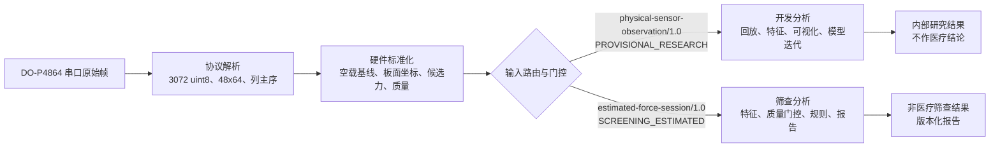

# 算法层架构与输入分流

| 项目 | 内容 |
|---|---|
| 文档版本 | `algorithm-layer-architecture/1.0` |
| 当前设备适配器 | `adapter/do-p4864/1.0` |
| 当前观测模式 | `physical-sensor-observation/1.0` |
| 生效日期 | 2026-07-22 |

## 1. 目标与结论

DO-P4864 已具备从真机原始帧生成可复现的板面观测和逐点首版候选力的能力。这足以启动算法开发：回放、可视化、特征提取、稳定性比较和参数迭代。

产品定位为非医疗筛查：当前冻结的已知砝码曲线输出 `estimated_force_n`，是所有算法计算的统一输入。它不等同于临床或计量级绝对力；产品不以此作医疗声明。



## 2. 输入路径

### 2.1 `PROVISIONAL_RESEARCH`：当前首版可用路径

此路径接收 `physical-sensor-observation/1.0`。DO-P4864 适配器输出以下已知信息：

- 原始 `uint8` 计数阵列，形状为 `(48, 64)`；串行数据按列主序重排，首点是板面左上角。
- 每帧主机单调时间、墙钟时间和严格递增的 `source_index`。
- 逐点空载中位数、MAD 噪声、活动阈值和质量标记。
- 板面坐标系 `BOARD_TOP_LEFT_X_RIGHT_Y_DOWN`：右为 +X、下为 +Y，X/Y pitch 均为 7.99 mm。
- 冻结 `estimated_force_n`，连同曲线、几何和基线版本；饱和或无效点保留质量信息，不能静默替换。

该路径允许输出内部分析运行、特征表、图形、数据质量结论和模型比较。每一个结果必须携带：

```text
input_lane = PROVISIONAL_RESEARCH
input_schema = physical-sensor-observation/1.0
publication_allowed = false
screening_conclusion_allowed = false
```

它不得输出正式风险等级、0–100 综合筛查评分、对外机构报告、临床阈值判断或“已验证的 N/Pa”声明。

### 2.2 `SCREENING_ESTIMATED`：产品筛查路径

此路径只接收 [`estimated-force-session/1.0`](physical-input-interface-v1.md)。其 `estimated_force_n`、时间与板面坐标必须满足硬件质量门控和冻结的筛查曲线版本，才可进入筛查算法的特征、规则、评分和报告。

研究回放与产品筛查路径必须使用不同的 `AnalysisRun` 身份；不得以替换字段、覆盖历史运行或仅更改显示文案的方式伪装其用途或验证级别。

## 3. 上下游责任

| 层 | 负责 | 不负责 |
|---|---|---|
| 设备/协议 | 串口接收、帧界定、数组重排、主机时间与原始质量观察 | COP、人体方向、风险或报告 |
| 硬件标准化 | 基线、板面坐标、筛查估计力、适配器与曲线版本 | 身体 ML/AP、算法二级特征 |
| 采集工作流 | 受试者/会话关联、阶段起止、站位朝向、前脚语义、安全记录 | 改写原始帧或推断标定状态 |
| 算法输入路由 | 检查模式、质量、版本和用途；拒绝不合规输入 | 修复或伪造缺失物理证据 |
| 算法特征管线 | 坐标变换、COP、轨迹、范围、RMS、阶段比较 | 把候选结果伪装成正式结果 |
| 规则/报告 | 仅在筛查估计力输入上输出非医疗筛查结果和报告 | 从未通过硬件质量门控的研究输入直接对外发布 |

## 4. 建议的内部接口

```text
HardwareObservation
  { observation_payload, source_digest, device_spec_version,
    adapter_version, baseline_profile, force_profile, quality }

StageManifest
  { session_id, stage_id, start_monotonic_ns, end_monotonic_ns,
    participant_facing, forefoot, operator_confirmation }

AlgorithmInputRouter.route(observation_or_session, stage_manifest, requested_lane)
  -> AdmittedAlgorithmInput | Rejection(reason_codes)

FeaturePipeline.run(admitted_input)
  -> VersionedFeatureSet

ResultGate.publish(feature_set, requested_output)
  -> ResearchArtifact | ScreeningResult | Rejection
```

阶段元数据不是压力板可以自行推断的内容。特别是人体前方、左/右足前后关系和动作有效区间，必须来自采集工作流的显式记录；算法再把板面坐标转换为人体 ML/AP 坐标。

## 5. 现有实现与仍需接线的部分

当前实现已提供协议解析、加密不可变分段、SQLite 状态、恢复扫描和 `DoP4864StandardizationAdapter`。适配器可以直接产出冻结的筛查估计力观测，故产品筛查计算不依赖额外的医疗级标定。

尚未接通的是端到端业务运行：真实采集运行器尚未在主应用测试流程中与分段写入器、标准化适配器、阶段工作流和算法路由器统一编排；网络上传/服务端确认也尚未实现。这些缺口不阻碍离线回放或内部算法开发，但阻碍正式机构端交付链路。
