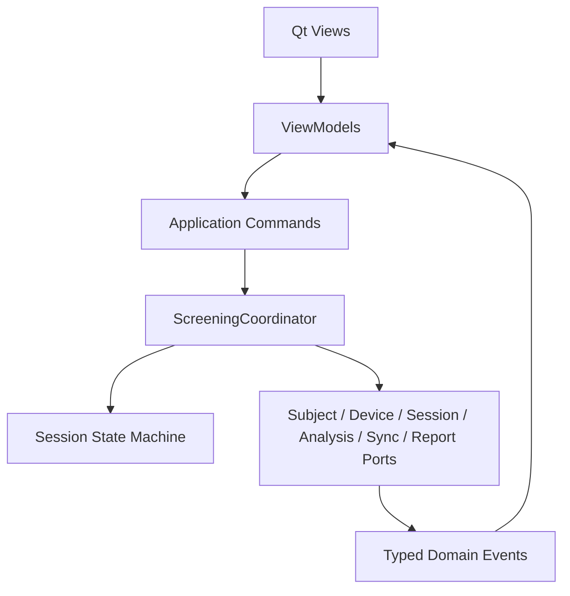

# 模块 01：客户端外壳与一键工作流

## 1. 目标

为机构操作员提供唯一、线性的筛查流程，并协调设备、受试者、采集、基础分析、上传和报告模块。该模块追求“操作简单但状态不含糊”，不承担协议解析、算法计算或文件格式实现。

## 2. 职责边界

### 负责

- 应用启动、依赖组装和全局导航；
- 机构操作员登录或终端自动登录；
- 新建/查找受试者、简短授权和测试项目选择；
- 测试前预检、倒计时、采集进度、完成与重试；
- 基础报告和完整报告状态展示；
- PDF 导出、打印入口和通俗错误提示；
- 会话状态机和所有按钮的操作守卫。

### 不负责

- 直接操作串口、SQLite、分段文件或 HTTP；
- 计算 COP、特征或 AI 结果；
- 决定内部质量阈值；
- 直接修改云端任务或报告数据库。

## 3. 底层架构



建议组件：

- `ApplicationShell`：窗口、导航、全局消息和退出策略；
- `ScreeningCoordinator`：一次筛查的唯一编排者；
- `PreflightOrchestrator`：并行执行联网、设备、磁盘、标定和授权检查；
- `SessionStateMachine`：拒绝非法状态跳转；
- `CommandGuard`：防止重复点击、双重开始和结束期间退出；
- `ViewModel`：把领域状态转换为客户可读文字，不包含业务计算。

## 4. 用户流程状态

```text
HOME
  → SUBJECT_IDENTIFICATION
  → CONSENT_CONFIRMATION
  → PREFLIGHT
  → POSITION_GUIDANCE
  → ACQUIRING
  → FINALIZING
  → BASIC_REPORT
  → FULL_REPORT_READY（可异步到达）
```

异常分支：

- 预检失败：停留在可修复步骤，不创建正式会话；
- 质量失败：进入 `RETRY_REQUIRED`，不生成报告；
- 中途断线：进入 `INCOMPLETE`，提供重新检测；
- 仅上传失败：基础报告继续可用，显示非阻断同步提示；
- 云端分析失败：基础报告继续可用，后台自动重试。

## 5. 设计原理

1. **单一主动作**：每个页面只有一个高优先级按钮，例如“开始检测”或“重新检测”。
2. **逐步披露**：普通页面不显示串口号、校验率、队列水位和堆栈。
3. **状态而非弹窗驱动**：重要故障在页面中持续呈现，不依赖一次性弹窗。
4. **防重复提交**：命令产生幂等键，按钮提交后立即进入处理中状态。
5. **可恢复导航**：测试中禁止跳离；测试完成或安全结束后才开放其他档案。
6. **术语一致**：客户界面使用“检测、基础报告、完整报告、重新检测”，不混用采集、任务、推理等技术词。

## 6. 关键接口

```python
class ScreeningUseCases(Protocol):
    def identify_subject(self, request: SubjectLookupRequest) -> SubjectSummary: ...
    def confirm_consent(self, request: ConsentRequest) -> ConsentReceipt: ...
    def run_preflight(self, request: PreflightRequest) -> PreflightSummary: ...
    def start_session(self, request: StartSessionRequest) -> SessionHandle: ...
    def stop_session(self, session_id: str) -> None: ...
    def retry_session(self, previous_session_id: str) -> SessionHandle: ...
```

所有返回对象是不可变 DTO；UI 不持有数据库实体或文件句柄。

## 7. 异常与文案原则

| 内部原因 | 客户文案 | 主动作 |
|---|---|---|
| 设备未连接 | 未检测到压力设备，请检查连接 | 重新检查 |
| 站位不稳定 | 请保持站稳，系统将自动开始 | 继续等待 |
| 数据无效 | 本次检测未完成，请重新站稳后检测 | 重新检测 |
| 网络中断 | 网络连接异常，基础检测可继续 | 继续检测 |
| 超过离线门槛 | 检测数据尚未同步，请恢复网络 | 重新检查网络 |
| 系统错误 | 暂时无法完成检测，请联系技术支持 | 重试/导出诊断包 |

## 8. 验收要求

- 新操作员在不查看说明书的情况下能完成标准测试；
- 同一次会话无法被重复开始或重复结束；
- 任何状态下关闭应用均不会绕过安全收尾；
- 客户界面不出现堆栈、串口异常码或内部质量阈值；
- 关键流程具备键盘操作、清晰焦点、足够字号和高对比度；
- UI 自动化测试覆盖所有状态与按钮可用性映射。
