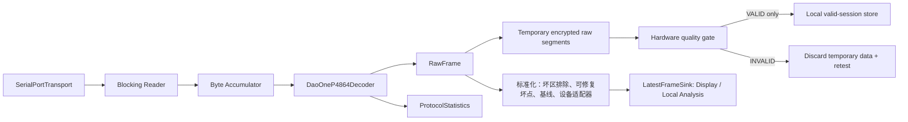

# 模块 02：设备接入与可靠采集

## 1. 目标

可靠接收 DO-P4864 字节流，解析为带主机时间和质量标志的原始压力帧，并把数据同时交给分段存储和本地显示。设备或协议异常不得阻塞 UI、破坏已落盘数据或生成错误成功状态。

## 2. 职责边界

### 负责

- 串口枚举、打开、读取、关闭和设备占用检查；
- DO-P4864 帧同步、解码和校验；
- 主机到达时间、成功解码序号和协议质量统计；
- 设备模拟器和真实抓包回放；
- 将原始帧发布给硬件质量门和本地显示端口。

### 不负责

- 受试者档案、上传、报告和云端算法；
- 将原始计数解释为绝对压力；
- 在没有设备帧序号的情况下声称精确检测漏发帧。

## 3. DO-P4864 协议

```text
帧头       长度字段       功能码   数据内容          校验       帧尾
0xFFAA     0x0C07        0x01    3072 bytes      CheckSum   0xFA
2 bytes    2 bytes       1 byte  3072×uint8      1 byte     1 byte
```

- 当前真机结构帧长 3079 bytes；长度字段与总长的关系仅记录、不硬过滤；
- 内容按**列优先**排列：每 48 个字节是从上到下的一列，依次填充 64 列，解码为
  `uint8(frame[5:3077]).reshape((48, 64), order="F")`；
- 四角真机载荷已经确认该映射与物理四角一致；原始 `uint8` 的压力语义、单位和
  标定仍未确认；
- 传输为 CH340、1,000,000 baud、8N1；`observed_compact_8bit` 的默认运行时
  名义输入速率为 **20.7 Hz**（60 秒空板记录 1,242 帧；10 分钟记录约 20.6 Hz）。
  采集监控、回放和显示数据更新以此作为当前真机基线；会话质量仍按主机单调时间
  计算实际间隔、缺帧与抖动，20.7 Hz 不是设备能力上限承诺；
- 当前协议无设备序号、设备时钟和正式下行命令。

用户提供 PDF 中的 6151-byte、6144-byte `uint16`/12-bit 与逐行排列描述同当前
真机字节流和四角映射均冲突，仅保留为历史来源，禁止作为运行时默认解析规则。

## 4. 底层架构



线程原则：串口读取与解析在设备工作线程运行；存储通过有界完整性队列消费；显示通过单槽最新帧邮箱消费。显示覆盖旧帧不影响存储。

显示和本地分析不得直接消费 `RawFrame`。它们只消费标准化后的派生帧：先用经批准的
设备/基线版本和已知坏区掩码排除非解剖响应，再执行可修复坏点处理、零点校正和声明的设备
适配器。原始矩阵始终保持不可变；无法标准化的帧不得降级为“原始直通显示”。

## 5. 原始帧模型

```python
@dataclass(frozen=True)
class RawFrame:
    values: np.ndarray              # (48, 64), uint8；列优先 wire mapping
    host_monotonic_ns: int
    host_wall_time_ns: int
    source_index: int               # 主机成功解码序号
    device_frame_seq: int | None
    device_timestamp_ns: int | None
    quality_flags: FrameQuality
```

`source_index` 不能命名为设备帧序号。未来协议真实提供序号和时钟时，通过可选字段加入。

开始采集前，运行时必须冻结并写入原始分段/会话清单的版本快照：协议 profile、设备规格、
几何与零基线规则、坏点策略、力转换 profile/验证级别、**连续无有效信号 5 秒**策略、
重建策略和存储交接阈值。完成后的会话不得依赖以后修改的默认配置重新解释。

## 6. 解析策略

1. 支持任意大小和任意边界的字节输入；
2. 在噪声、半帧、粘包和连续多帧中恢复同步；
3. 硬验证帧头、功能码和帧尾；长度候选与 CheckSum 仅记录审计结果；
4. 结构失败时移动到下一个可能帧头，不清空全部缓存；
5. 对缓存设置硬上限，防止持续噪声导致内存增长；
6. 记录有效帧、校验失败、重新同步、接收字节和帧间隔分布。

## 7. 设备异常与短暂错误策略

- 开始前设备不可用：预检失败，不创建正式会话；
- 串口断开、存储交接失败，或**从上一个成功解码帧起连续达到 5 秒仍没有任何成功解码帧**：
  当前整项采集判定 `INVALID`，删除暂存数据，不尝试跨中断续接正式会话；持续时间验收以
  首末成功解码帧的主机单调时间跨度为准，不能以估算帧率换算帧数代替；
- 单一结构失败、噪声或重新同步本身不使整项采集无效。解析器生成有序
  `ProtocolIntegrityEvent`（失败类型、无效候选帧数、丢弃字节、发生在何两个成功帧之间）；
  原始无效字节不写入原始分段；
- 若异常位于前后两个成功帧之间，硬件层仅在**派生处理流**中逐点线性插值重建相同数量的
  `uint8` 矩阵，并附加 `RECONSTRUCTED_FROM_NEIGHBORS`、`RAW_FRAME_UNAVAILABLE` 和关联
  事件标记。原始分段绝不改写、补写或伪装为真实帧；若缺少前/后邻帧或主机时间分辨率不足，
  事件仍保留审计记录但不生成重建矩阵；
- 连续性策略只依据成功解码帧，不以“仍收到字节”或 CheckSum 候选命中替代有效信号；
- 在 CheckSum 规则获得真机 fixture 验证前：记录不匹配与质量标记，不因候选不匹配丢帧；
- 数据连续为零、饱和、无法修复的坏点或不稳定基线：记录内部质量标志，由硬件质量门
  判定整项采集是否无效；
- 质量评估、派生观测加密或正式会话提交/封存发生任何异常：删除当前暂存目录，不生成
  正式会话、网络交接或算法输入，并返回“无效，请重测”；
- 自动重连只恢复设备到 `READY`，不自动续接上一正式会话。

## 8. 设计原理

- **协议插件化**：传输、解码和设备能力分开，新增硬件不改上层帧模型。
- **真实能力优先**：默认采集节律采用实测的 20.7 Hz；不在软件中虚构硬件序号、
  设备时钟、超出实测的采样能力和绝对单位。
- **存储优先**：慢 UI 可以丢显示帧，存储队列不能静默丢帧。
- **先判有效再入库**：采集中的原始帧只能进入可删除的加密暂存区；只有整项采集通过
  结构、连续性、坏点修复和力学转换后，才提升为正式本地会话。
- **模拟器同接口**：模拟器可生成字节流覆盖真实解析器，而不是绕过协议直接造 NumPy 帧。

## 9. 测试与验收

- golden fixture 覆盖真实帧；
- 覆盖逐字节、随机分块、粘包、噪声、错长度、错校验和错帧尾；
- 模糊测试确保错误后可恢复且缓存有界；
- 已完成 10 分钟结构候选接收观察；在已验证解析器上仍需量化逐帧抖动、校验失败、重同步与内存；
- 单帧结构失败会保留审计并在相邻成功帧可用时仅重建派生帧；连续 5 秒无有效信号、强制拔线
  或存储失败后均无正式会话，且操作员得到“重新检测”结果；
- 模拟器和真机通过相同 `ByteTransport` 契约测试。
