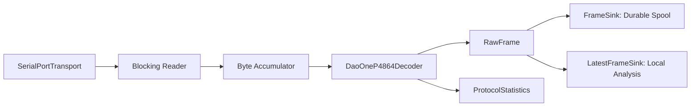

# 模块 02：设备接入与可靠采集

## 1. 目标

可靠接收 DO-P4864 字节流，解析为带主机时间和质量标志的原始压力帧，并把数据同时交给分段存储和本地显示。设备或协议异常不得阻塞 UI、破坏已落盘数据或生成错误成功状态。

## 2. 职责边界

### 负责

- 串口枚举、打开、读取、关闭和设备占用检查；
- DO-P4864 帧同步、解码和校验；
- 主机到达时间、成功解码序号和协议质量统计；
- 设备模拟器和真实抓包回放；
- 将原始帧发布给存储与本地分析端口。

### 不负责

- 受试者档案、上传、报告和云端算法；
- 将原始计数解释为绝对压力；
- 在没有设备帧序号的情况下声称精确检测漏发帧。

## 3. DO-P4864 协议

```text
帧头       长度字段       功能码   数据内容          校验       帧尾
0xFFAA     0x1807        0x01    6144 bytes      CheckSum   0xFA
2 bytes    2 bytes       1 byte  3072×uint16     1 byte     1 byte
```

- 总帧长 6151 bytes；
- 内容按左上到右下逐行排列；
- 小端 uint16 解码，保留低 12 bit；
- 标称 1,000,000 baud、约 12 Hz；
- 当前协议无设备序号、设备时钟和正式下行命令。

## 4. 底层架构



线程原则：串口读取与解析在设备工作线程运行；存储通过有界完整性队列消费；显示通过单槽最新帧邮箱消费。显示覆盖旧帧不影响存储。

## 5. 原始帧模型

```python
@dataclass(frozen=True)
class RawFrame:
    values: np.ndarray              # (48, 64), uint16
    host_monotonic_ns: int
    host_wall_time_ns: int
    source_index: int               # 主机成功解码序号
    device_frame_seq: int | None
    device_timestamp_ns: int | None
    quality_flags: FrameQuality
```

`source_index` 不能命名为设备帧序号。未来协议真实提供序号和时钟时，通过可选字段加入。

## 6. 解析策略

1. 支持任意大小和任意边界的字节输入；
2. 在噪声、半帧、粘包和连续多帧中恢复同步；
3. 依次验证帧头、长度、功能码、校验和和帧尾；
4. 校验失败时移动到下一个可能帧头，不清空全部缓存；
5. 对缓存设置硬上限，防止持续噪声导致内存增长；
6. 记录有效帧、校验失败、重新同步、接收字节和帧间隔分布。

## 7. 设备异常策略

- 开始前设备不可用：预检失败，不创建正式会话；
- 采集中串口断开：停止会话并标记 `INCOMPLETE`，不尝试把断线前后数据拼成正式报告；
- 校验错误达到内部阈值：会话质量失败，引导重测；
- 数据连续为零或饱和：记录内部质量标志，由质量门控决定；
- 自动重连只恢复设备到 `READY`，不自动续接上一正式会话。

## 8. 设计原理

- **协议插件化**：传输、解码和设备能力分开，新增硬件不改上层帧模型。
- **真实能力优先**：不在软件中虚构硬件序号、时钟、采样率和绝对单位。
- **存储优先**：慢 UI 可以丢显示帧，存储队列不能静默丢帧。
- **模拟器同接口**：模拟器可生成字节流覆盖真实解析器，而不是绕过协议直接造 NumPy 帧。

## 9. 测试与验收

- golden fixture 覆盖真实帧；
- 覆盖逐字节、随机分块、粘包、噪声、错长度、错校验和错帧尾；
- 模糊测试确保错误后可恢复且缓存有界；
- 真机连续 30 分钟记录实际 Hz、最大间隔、错误率和内存；
- 强制拔线后状态准确、已完成分段仍可恢复；
- 模拟器和真机通过相同 `ByteTransport` 契约测试。
