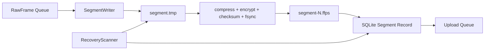

# 模块 03：本地会话、加密分段与恢复

## 1. 目标

把原始数据可靠地保存为可独立上传、校验和恢复的小分段，保证在断网、崩溃、断电或云端故障时数据仍然存在。该模块是采集端的数据完整性边界。

## 2. 职责边界

### 负责

- 本地会话元数据、状态和上传状态持久化；
- 原始帧分段、压缩、加密、摘要和原子关闭；
- 会话最终清单；
- 启动恢复扫描、磁盘配额和服务端确认后的清理；
- 为回放、本地分析和上传提供只读数据源。

### 不负责

- 串口读取、云端算法、报告内容和受试者身份明文；
- 在服务端确认前删除待上传数据。

## 3. 底层架构



建议存储：

- SQLite 使用 WAL 模式保存会话、分段、上传和报告状态；
- 分段文件使用版本化二进制容器，包含小型头部和压缩帧块；
- 建议 Zstandard 压缩、AES-256-GCM 分段加密；
- 每段随机 nonce，数据密钥由系统安全存储保护的终端密钥封装；
- 默认每 5–10 秒或达到目标字节数关闭一个分段。

## 4. 分段生命周期

```text
WRITING → SEALED → PENDING_UPLOAD → UPLOADING → ACKNOWLEDGED → RETAINED/DELETED
```

原子关闭顺序：

1. 写临时文件；
2. 写入帧数、时间范围和模式版本；
3. 压缩并加密；
4. 计算密文摘要；
5. flush + fsync；
6. 原子重命名；
7. 在 SQLite 事务中登记 `SEALED`；
8. 发布可上传事件。

上传模块只读取 `SEALED` 及之后状态的不可变文件。

## 5. 会话清单

```text
session_id
tenant_id / terminal_id / device_id / subject_uuid
test_protocol_id / consent_record_id
started_at / ended_at
segment_count / total_frames / total_bytes
segment hashes
device / protocol / calibration / schema versions
local_quality_outcome
manifest_hash
```

清单本身版本化并签名或绑定终端认证上下文。服务端确认清单前，会话不能标记为云端完整。

## 6. 崩溃恢复

启动时：

- 扫描 `.tmp`、已关闭分段和 SQLite 状态；
- 可验证且已完整写入的临时文件恢复为 `SEALED`；
- 无法验证的临时文件隔离，不拼入正式会话；
- `ACQUIRING` 状态但无活动进程的会话标记 `INCOMPLETE`；
- 所有未确认分段重新进入上传队列；
- 恢复过程产生内部审计日志。

## 7. 配额与清理

- 测试前预检保守估算磁盘容量；容量不足时阻止开始；
- 待上传上限 50 次或 2 GB，与 24 小时门槛共同生效；
- 服务端确认前禁止普通用户删除；
- 服务端确认后按配置保留本地报告和有限期限原始数据；
- 清理任务按最旧已确认会话执行，不删除失败诊断所需证据；
- 磁盘接近硬下限时优先停止新测试，不依赖清理“碰运气”。

## 8. 设计原理

- **Write-ahead**：先落盘再上传，网络不是数据可靠性的前提。
- **不可变分段**：避免并发读写大型 HDF5 的复杂一致性问题。
- **显式状态**：文件存在不等于上传完成，数据库状态不等于文件有效。
- **可校验恢复**：只恢复能够证明完整的分段。
- **删除滞后**：服务端确认和保留策略共同决定删除。

## 9. 测试与验收

- 任意写入点断电后，已关闭分段保持可读且摘要一致；
- SQLite 提交前后崩溃均能恢复到单一合法状态；
- 上传线程读取时写入线程不修改该分段；
- 密钥不可用、文件被篡改和磁盘满均进入明确失败状态；
- 分段、时间轴和帧数严格一致；
- 达到配额后禁止新测试但继续允许上传和查看既有报告。
