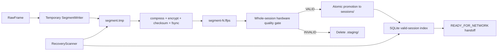

# 模块 03：本地会话、加密分段与恢复

## 1. 目标

把通过硬件质量门的会话可靠地保存为可独立同步、校验和恢复的小分段，保证在断网、崩溃、断电或云端故障时有效数据仍然存在。采集未通过时，临时数据必须丢弃，不能形成正式会话。

## 2. 职责边界

### 负责

- 本地会话元数据、状态和上传状态持久化；
- 原始帧分段、压缩、加密、摘要和原子关闭；
- 会话最终清单；
- 启动恢复扫描、磁盘配额和人工删除前的本地保留；
- 为回放、本地分析和上传提供只读数据源。

### 不负责

- 串口读取、云端算法、报告内容和受试者身份明文；
- 在服务端确认前删除待上传数据。

## 3. 底层架构



建议存储：

- SQLite 使用 WAL 模式保存会话、分段、上传和报告状态；
- 分段文件使用版本化二进制容器，包含小型头部和压缩帧块；
- 建议 Zstandard 压缩、AES-256-GCM 分段加密；
- 每段随机 nonce，数据密钥由系统安全存储保护的终端密钥封装；
- 默认每 5–10 秒或达到目标字节数关闭一个分段。

## 4. 分段生命周期

```text
`.staging/<id>/WRITING → SEALED → whole-session VALID → sessions/<id>/READY_FOR_NETWORK → CLOUD_CONFIRMED → RETAINED`
```

原子关闭顺序：

1. 写临时文件；
2. 写入帧数、时间范围和模式版本；
3. 压缩并加密；
4. 计算密文摘要；
5. flush + fsync；
6. 原子重命名；
7. 对整项会话执行硬件质量门；
8. 仅 `VALID` 会话先写入可恢复的登记标记，再原子移动到 `sessions/<id>`；随后在同一
   SQLite 事务登记会话、原始分段、派生力学文件和 `READY_FOR_NETWORK` 交接。原始分段
   只含成功解码的真实帧；派生文件可额外含按相邻真实帧插值的重建帧及其通信完整性审计；
9. 登记成功后删除登记标记。若在“目录已提升、SQLite 未提交”之间断电，启动扫描根据
   标记精确补登记一次；若仍是 `.staging/<id>`，则删除而非恢复部分采集；
10. `INVALID` 会话删除 `.staging/<id>`，不写正式 SQLite 会话记录，也不产生同步任务。

上传模块只读取 `SEALED` 及之后状态的不可变文件。

## 5. 会话清单

```text
session_id
tenant_id / terminal_id / device_id / subject_uuid
test_protocol_id / consent_record_id
started_at / ended_at
segment_count / total_frames / total_bytes
segment hashes
device / protocol / calibration / schema versions
local_quality_outcome
manifest_hash
```

通信完整性审计（无效候选帧数、丢弃字节、重建数量、前后成功帧序号和 5 秒策略版本）写入
加密派生观测的 `hardware_processing.communication_integrity`；它不是上传层可据以重放的
原始串口数据。

清单本身版本化并签名或绑定终端认证上下文。服务端确认清单前，会话不能标记为云端完整。

## 6. 崩溃恢复

启动时：

- 扫描 `.staging`、已提升会话和 SQLite 状态；
- 未完成的 `.staging/<id>` 一律删除，不把断电前的部分采集恢复成正式会话；
- 已提升且保有有效登记标记、但尚未写入 SQLite 的会话，验证其原始/派生加密文件后补写
  一次正式登记；登记标记随成功提交删除，重复启动不重复登记；
- 已提升但无法验证的文件隔离，禁止进入网络交接；
- 已通过 SQLite 登记但网络中断的正式会话保持 `READY_FOR_NETWORK`，由网络层重试；
- 恢复过程产生内部审计日志。

## 7. 配额与清理

- 测试前预检保守估算磁盘容量；容量不足时阻止开始；
- 待网络交接上限 50 次或 2 GB，与磁盘预检共同生效；
- 云端确认只更新 `CLOUD_CONFIRMED` 状态，**不会自动删除**本地原始或派生数据；
- 当前版本仅允许用户发起的人工删除；删除实现必须同时删除文件和 SQLite 索引，并保留审计记录；
- 磁盘接近硬下限时优先停止新测试，不依赖自动清理“碰运气”。

## 8. 设计原理

- **Write-ahead**：先落盘再上传，网络不是数据可靠性的前提。
- **不可变分段**：避免并发读写大型 HDF5 的复杂一致性问题。
- **显式状态**：文件存在不等于上传完成，数据库状态不等于文件有效。
- **可校验恢复**：只恢复能够证明完整的分段。
- **人工删除**：服务端确认只改变同步状态；当前 MVP 必须由操作员明确选择单个有效会话后才允许删除。

## 9. 测试与验收

- 任意写入点断电后，已关闭分段保持可读且摘要一致；
- SQLite 提交前后崩溃均能恢复到单一合法状态；
- 上传线程读取时写入线程不修改该分段；
- 密钥不可用、文件被篡改和磁盘满均进入明确失败状态；
- 分段、时间轴和帧数严格一致；
- 达到配额后禁止新测试但继续允许上传和查看既有报告。
