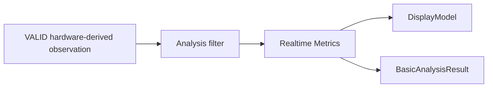

# 模块 04：本地基础分析与质量门控

## 1. 目标

本模块只消费硬件层已经确认有效的标准化观测，提供后续本地展示或分析能力。硬件采集完整性、坏点修复、基线和 V1 力学转换不在本模块重复实现。

## 2. 职责边界

### 负责

- 实时热力图、相对载荷、COP 和分区指标；
- 基础报告所需的固定版本结果；
- 向 UI 提供最新显示模型。

### 不负责

- 复杂步态、云端 AI、跨人群参考模型；
- 绕过硬件层的会话有效性、坏点掩码或 `estimated_force_n` 来源版本；
- 把内部质量详情写入客户报告。

## 3. 底层架构



算法实现为纯 Python/NumPy 包，不依赖 Qt、SQLite、HTTP 或具体分段文件。所有算法函数带显式版本和参数对象。

## 4. 硬件输入前提

```text
硬件层输入包含不可变原始分段引用、每点零校正、坏点掩码/修复结果、
`estimated_force_n`、板面坐标和版本化质量信息。算法层不得修改这些原始或硬件派生值；
它只在此基础上计算产品指标。
```

`estimated_force_n` 是 V1 初筛的设备估计值，不是临床或计量认证结论；分析/报告层必须保留其设备规格、基线、坏点修复和曲线版本。

## 5. 基础能力

首版候选：

- 原始/相对压力热力图；
- 总相对载荷及时间曲线；
- 左右区域载荷和对称性；
- 前后区域载荷；
- COP 当前点和基础轨迹；
- 测试时长和站位稳定提示；
- 经过验证的少量风险提示规则。

双足分割、区域模板和风险规则必须版本化。显示插值只用于视觉，不进入算法原始数据。

## 6. 分析前置门控

只接受硬件层明确标记为 `VALID` 且派生文件完整可验证的会话。硬件层已拒绝的断连、连续
5 秒无有效信号、不可修复的坏点、饱和和力学转换失败，不得由算法层补救。短暂结构错误的
重建帧仅可通过其质量标记和通信完整性审计识别，算法层不得把它们当作未标记的真实帧。

算法自身仍可定义指标适用性，但不能把硬件 `INVALID` 转换成可报告结果。

## 7. 采样率边界

当前设备约 12 Hz：

- 可用于实时显示和基础静态趋势；
- 静态摆动和频域指标必须单独验证；
- 精细步态事件、双支撑时间等通常要求更高采样率，默认不进入正式报告；
- 云端 AI 不得绕过 `required_sample_rate` 和质量规则。

每个指标声明：最低采样率、标定要求、所需时长、适用测试范式、算法版本和验证状态。

## 8. 设计原理

- **基础而可靠**：本地只承诺少量稳定能力，不复制全部云端算法。
- **质量先于报告**：不通过时直接阻止报告，不用免责声明掩盖无效数据。
- **原始数据可重算**：本地结果是版本化快照，服务器仍从原始数据统一提取特征。
- **展示与分析分离**：平滑、插值和颜色映射不改变分析输入。

## 9. 测试与验收

- 合成矩阵验证 COP、区域载荷和边界条件；
- golden 数据验证算法版本回归；
- 零载荷、单点饱和、坏点、缺帧和中断会话均得到正确门控结果；
- 相同输入和版本产生确定性输出；
- UI 慢刷新不改变指标；
- 未验证指标无法通过配置误入正式报告。
