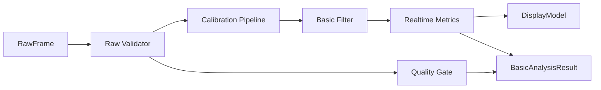

# 模块 04：本地基础分析与质量门控

## 1. 目标

在机构网络不可用或云端尚未完成时，提供即时热力图、基础指标和基础报告；同时执行客户不可见的质量门控，防止无效数据生成报告。

## 2. 职责边界

### 负责

- 原始计数检查、标定、坏点和基础滤波；
- 实时热力图、相对载荷、COP 和分区指标；
- 本地数据质量门控；
- 基础报告所需的固定版本结果；
- 向 UI 提供最新显示模型。

### 不负责

- 复杂步态、云端 AI、跨人群参考模型；
- 将未经标定的计数标记为 N、Pa 或 kg；
- 把内部质量详情写入客户报告。

## 3. 底层架构



算法实现为纯 Python/NumPy 包，不依赖 Qt、SQLite、HTTP 或具体分段文件。所有算法函数带显式版本和参数对象。

## 4. 标定流程

```text
原始 12 bit 计数
  → 有效位、坏点、饱和检查
  → 零点与漂移修正
  → 非线性标定曲线/LUT
  → 力或压力矩阵（仅验证后）
  → 可选低通与空间处理
  → 指标
```

`CalibrationProfile` 至少包含每点零点、灵敏度、坏点、饱和值、面积、坐标、单位、曲线参数、来源、版本和验证状态。没有验证标定时只展示“相对载荷”。

## 5. 基础能力

首版候选：

- 原始/相对压力热力图；
- 总相对载荷及时间曲线；
- 左右区域载荷和对称性；
- 前后区域载荷；
- COP 当前点和基础轨迹；
- 测试时长和站位稳定提示；
- 经过验证的少量风险提示规则。

双足分割、区域模板和风险规则必须版本化。显示插值只用于视觉，不进入算法原始数据。

## 6. 质量门控

内部检查包括：

- 有效时长和稳定时段；
- 实际采样率、帧间抖动和解码错误；
- 有效传感点、坏点、连续零值和饱和比例；
- 是否达到最低接触载荷；
- 站位是否进入有效区域；
- 标定是否存在、匹配且在有效期内；
- 会话是否被中断或分段不完整。

输出为 `VALID / INVALID / DEGRADED` 加内部原因。首版客户报告只允许 `VALID`；`INVALID` 和不允许交付的 `DEGRADED` 进入重新检测。

## 7. 采样率边界

当前设备约 12 Hz：

- 可用于实时显示和基础静态趋势；
- 静态摆动和频域指标必须单独验证；
- 精细步态事件、双支撑时间等通常要求更高采样率，默认不进入正式报告；
- 云端 AI 不得绕过 `required_sample_rate` 和质量规则。

每个指标声明：最低采样率、标定要求、所需时长、适用测试范式、算法版本和验证状态。

## 8. 设计原理

- **基础而可靠**：本地只承诺少量稳定能力，不复制全部云端算法。
- **质量先于报告**：不通过时直接阻止报告，不用免责声明掩盖无效数据。
- **原始数据可重算**：本地结果是版本化快照，服务器仍从原始数据统一提取特征。
- **展示与分析分离**：平滑、插值和颜色映射不改变分析输入。

## 9. 测试与验收

- 合成矩阵验证 COP、区域载荷和边界条件；
- golden 数据验证算法版本回归；
- 零载荷、单点饱和、坏点、缺帧和中断会话均得到正确门控结果；
- 相同输入和版本产生确定性输出；
- UI 慢刷新不改变指标；
- 未验证指标无法通过配置误入正式报告。
