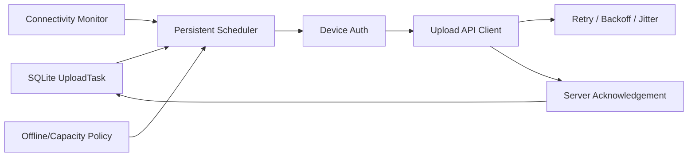

# 模块 05：渐进上传与同步

## 1. 目标

在不影响采集和本地基础报告的前提下，把所有已关闭原始数据分段、会话清单、必要档案和内部日志可靠上传到云端，并在断网、慢网、重复请求和进程重启后最终达到一致状态。

## 2. 职责边界

### 负责

- 持久化上传队列、优先级和重试时间；
- 网络可达性与服务器健康检查；
- 会话创建、分段上传、缺段查询和最终清单提交；
- 终端鉴权、请求签名/证书、摘要和幂等键；
- 离线时长、待传次数和字节数统计；
- 服务端确认后的本地状态更新。

### 不负责

- 修改原始分段、计算算法特征或删除未确认数据；
- 把网络错误转换为测试失败；
- 直接决定客户报告内容。

## 3. 底层架构



上传在独立后台任务中运行，读取不可变分段。采集线程不等待 HTTP，也不共享可变文件句柄。
只有正式且硬件质量为 `VALID` 的已关闭会话可在同一 SQLite 事务中提升原始分段、加密
`FormalUploadEnvelope` 并创建 `READY_FOR_NETWORK` handoff；`INVALID`、取消、中断、
不完整或部分采集会话绝不创建 handoff。密封分段本身不是“立即入队上传”的承诺，网络队列
只消费这个有效会话的原子 handoff。

## 4. 同步协议

建议 API：

```text
POST /v1/sessions                         创建/确认会话
PUT  /v1/sessions/{id}/segments/{index}  幂等上传分段
GET  /v1/sessions/{id}/segments          查询已接收索引和摘要
POST /v1/sessions/{id}/complete          提交最终清单
GET  /v1/sessions/{id}/status            查询接收/分析/报告状态
POST /v1/telemetry/batches                批量上传日志和设备指标
```

当前 seed 写请求由 `feetforceplate-tenant` audience 的 tenant access token 推导
`tenant_id/account_id/license_id/client installation`，载荷不能自选租户；创建会话请求
必须显式携带 `client_installation_id`，服务端与认证主体及 legacy `terminal_id` 交叉校验。
`terminal_id` 仅保留 legacy terminal compatibility 审计字段。每个写请求还含
`session_id`、幂等键、模式版本和内容摘要。相同索引与摘要幂等成功，不同摘要
明确冲突，禁止静默覆盖。

## 5. 上传顺序

一次持久 handoff 的恢复严格按以下顺序执行：

1. 先查询会话 `status`；已 `INGESTED` 且仍为 `VALID` 时直接本地确认，不重建对象；
2. 幂等上传受试者元数据；
3. 幂等上传授权记录；
4. 幂等创建/确认会话（含显式 `client_installation_id`）；
5. 查询已收分段，仅上传本地清单中缺失的不可变分段；
6. 提交最终清单；
7. 再查询 `status`，仅在服务端为 `INGESTED` 且 `VALID` 后标记 `CLOUD_CONFIRMED`。

基础报告快照及内部质量/运行日志是独立的低优先级业务，不改变原始会话的确认条件。

服务器可在分段到达时预解码和预处理，但最终清单确认前不得发布完整报告。

## 6. 重试和断点续传

- 连接超时、429、5xx 和可恢复网络错误使用持久化 equal-jitter 退避：第 `n` 次尝试的
  上界为 `min(900 s, 5 s × 2^(n-1))`，等待时间在该上界的 50%–100% 之间随机取值；
  `Retry-After` 更大时优先。基数为 5 秒，封顶为 900 秒；
- 鉴权失败先刷新设备凭据，仍失败则进入需要支持的阻断状态；
- 4xx 业务错误不无限重试，进入隔离队列并上报告警；
- 客户端重启后从 SQLite 恢复任务，不依赖内存状态；
- 会话完成前后均可查询服务端缺段，只补传缺失或摘要不一致项；
- 大分段可进一步使用对象存储分片上传，但业务分段边界保持不变。

## 7. 离线与容量策略

已确认默认值（针对尚未 `CLOUD_CONFIRMED` 的 handoff，而非仅当前正在上传的任务）：

- 最近成功联网不超过 24 小时；
- 非确认 handoff 会话不超过 50 次；
- 非确认 handoff 分段数据不超过 2 GiB。

任一门槛达到后禁止开始新测试，但允许：当前测试安全结束、查看既有报告、继续上传、下载已完成报告和导出诊断包。
`CLOUD_CONFIRMED` 只改变确认状态，不自动删除本地原始分段；删除仍须由操作员显式发起。

## 8. 安全

- TLS 传输，终端使用独立设备身份；
- 不在日志中记录 token、身份明文和原始载荷；
- 上传前验证本地密文摘要，服务端验证接收摘要；
- 客户端不接受服务器要求上传任意本地路径；
- 服务器时间只用于云端状态，采集时间轴保留主机单调时钟。

## 9. 设计原理

- **Store-and-forward**：上传是已持久化数据的复制，不是数据的唯一去向。
- **幂等优先**：网络请求是否收到响应不能决定数据是否已写入服务端。
- **分层状态**：测试有效、上传完成、算法完成和报告完成是不同事实。
- **自动而可控**：不要求用户手动集中上传，但离线门槛保证数据最终回收。

## 10. 测试与验收

- 随机断网、超时、重复响应、乱序和 5xx 下最终分段集合一致；
- 客户端在任意上传点重启不重复生成业务对象；
- 相同索引不同摘要被明确拒绝并告警；
- 慢网下串口采集和本地报告性能不下降；
- 三个离线门槛分别触发正确限制；
- 服务端确认前本地数据不被清理。

## Seed MVP access model

15-minute tenant access token 过期前通过 30-day idle / 180-day absolute 刷新
会话轮换。License 暂停、过期或撤销后禁止创建新会话，但
**upload and report access continue**，保证既有数据收尾。24-hour offline grace、
50 次和 2 GB 门槛只阻止新测试。公网 IP:7443 为联调环境；正式同步入口要求
**domain + public CA + 443**。
