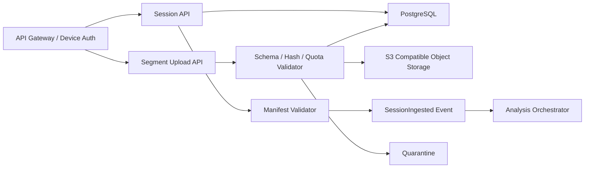

# 模块 06：云端数据接收与存储

## 1. 目标

安全、幂等地接收来自大量机构终端的原始数据分段，验证完整性，保存原始数据和关系元数据，并在会话完整后触发算法任务。

## 2. 职责边界

### 负责

- 终端身份、租户上下文和请求权限校验；
- 会话、分段和最终清单 API；
- 分段摘要、大小、顺序和模式版本验证；
- 原始分段写入对象存储；
- 会话元数据和接收状态写入 PostgreSQL；
- 完整会话事件和隔离队列。

### 不负责

- 算法特征、AI 推理、报告排版；
- 修改客户端原始数据；
- 向算法运行时暴露直接身份字段。

## 3. 底层架构



首版可在同一 FastAPI 应用中实现模块边界，但对象存储、数据库和异步任务独立。规模增长后再按接收吞吐拆服务。

## 4. 数据模型

```text
IngestSession(session_id, tenant_id, terminal_id, subject_uuid,
              schema_version, status, expected_segments?, manifest_hash?, timestamps)
IngestSegment(session_id, segment_index, object_key, sha256,
              size_bytes, frame_count, status, received_at)
IngestManifest(session_id, segment_count, total_frames, total_bytes,
               manifest_json, verified_at)
IngestProblem(id, session_id, type, evidence_json, status)
```

对象路径只使用不可猜测内部 ID，例如：

```text
tenant/{tenant_uuid}/sessions/{session_uuid}/segments/{index}-{sha256_prefix}.ffps
```

不得包含姓名、机构档案号、病历号或联系方式。

## 5. 完整性确认

完整会话必须同时满足：

- 最终清单模式版本受支持；
- 声明的分段数量与已接收集合一致；
- 每段索引、摘要、字节数和帧数匹配；
- 会话总帧数和总字节数可重算；
- 受试者、机构和授权引用有效；
- 数据未超过配置的硬件能力和结构约束。

验证通过后原子更新为 `INGESTED` 并发布一次幂等事件。事件发布失败采用事务外盒模式或等价机制重试。

## 6. 隔离与错误

- 未知模式版本：保留原始数据，进入 `SCHEMA_UNSUPPORTED`；
- 摘要冲突：拒绝覆盖，进入 `CONTENT_CONFLICT`；
- 授权引用缺失：进入隔离区，不启动算法；
- 跨租户引用：拒绝并触发安全告警；
- 对象存储成功但数据库提交失败：通过补偿扫描恢复引用；
- 数据库成功但对象缺失：会话不能完成，后台一致性任务告警。

## 7. 设计原理

- **原始数据不可变**：算法升级只生成新结果，不回写原始分段。
- **对象与元数据分离**：大数据进入对象存储，查询状态进入关系库。
- **完整后触发**：流式到达可预处理，正式算法必须基于完整清单。
- **租户上下文不可由载荷自证**：机构身份来自认证上下文，并与载荷交叉校验。

## 8. 测试与验收

- 同一分段重复上传返回相同结果；
- 摘要冲突、缺段、乱序和未知模式均进入预期状态；
- 对象存储与数据库部分失败可以恢复；
- 租户越权和伪造终端被拒绝并审计；
- `SessionIngested` 对一个会话只产生一个业务效果；
- 容量和并发测试覆盖目标机构峰值的至少两倍。
