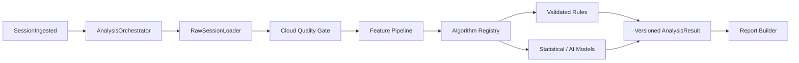

# 模块 07：云端算法、AI 与版本化重算

## 1. 目标

从完整原始会话统一提取一级特征，执行经过验证的规则、统计和 AI 算法，生成可追溯的结构化结果，并支持未来算法升级后对历史数据进行版本化重算。

## 2. 职责边界

### 负责

- 原始分段解密/解码、重组和数据质量复核；
- 一级特征统一提取；
- 算法注册、能力门控、任务编排和资源限制；
- 规则、统计模型和 AI 推理；
- 结果版本、解释证据和重算；
- 将可报告结果交给报告模块。

### 不负责

- 直接身份信息、终端上传、PDF 排版；
- 超过硬件和验证边界强行输出指标；
- 静默修改已经交付的历史结果。

## 3. 底层架构



算法任务运行在隔离工作进程/容器中，使用只读输入和资源限制。输入通过 `subject_uuid` 和分析档案引用，不提供姓名、联系方式或机构编号明文。

## 4. 算法描述符

每个算法必须声明：

```text
algorithm_id / semantic_version
input_schema_version
required_sample_rate
required_calibration_level
required_duration / test_protocols
required_profile_fields
supported_device_models
validation_status
output_schema_version
model_artifact_hash（如适用）
```

能力门控返回 `SUPPORTED / DEGRADED / UNSUPPORTED` 及内部原因。只有 `SUPPORTED` 且被批准进入产品的指标可以进入完整报告。

## 5. 一级特征

一级特征全部由服务器从原始数据生成，例如：

- 每帧总载荷、左右/前后分区；
- COP 序列；
- 有效接触面积和峰值位置；
- 时域统计；
- 经验证的事件候选；
- 数据质量和缺失模式。

一级特征可以缓存，但缓存键必须包含原始会话摘要、特征管线版本、标定版本和参数摘要。客户端不上传一级特征作为权威输入。

## 6. AI 使用原则

- AI 输出定位为筛查风险和分析辅助，不自动给出临床诊断；
- 首版优先使用可解释规则和经验证统计指标，AI 逐项进入；
- 保存模型版本、训练数据说明、阈值、输入特征和解释证据；
- 缺失档案字段显式作为未知，不默认推断为阴性；
- 训练/研发用途受授权范围控制，服务推理数据和训练数据集分离；
- 模型更新先离线验证、影子运行和批准，再进入正式报告。

## 7. 重算与结果版本

```text
AnalysisRun(id, session_id, pipeline_version, algorithm_set_version,
            calibration_version, model_versions, status, created_at)
AnalysisResult(id, run_id, metric_id, value, unit, interpretation,
               evidence, validation_status)
```

- 相同输入与相同版本幂等；
- 新版本生成新 `AnalysisRun`，不覆盖旧结果；
- 已交付报告继续引用原运行；
- 机构可生成新版完整报告，但必须显示新版本和生成时间；
- 回滚算法只影响后续任务，不删除历史结果。

## 8. 设计原理

- **服务器统一计算**：避免客户端版本碎片导致特征口径不同。
- **原始数据长期价值**：新算法可以重算历史会话。
- **验证门控**：专业术语不等于经过验证，必须有适用范围证据。
- **可解释和可追溯**：每个报告结论能定位到指标、算法和输入版本。

## 9. 测试与验收

- golden 会话验证特征和指标确定性；
- 采样率、标定、时长和缺失字段门控覆盖；
- 同一任务重复执行不产生重复业务结果；
- 新旧算法并行重算不覆盖历史；
- 算法运行时无法读取身份明文；
- 模型性能、偏差、稳定性和异常输入测试达到批准门槛后才可发布。
