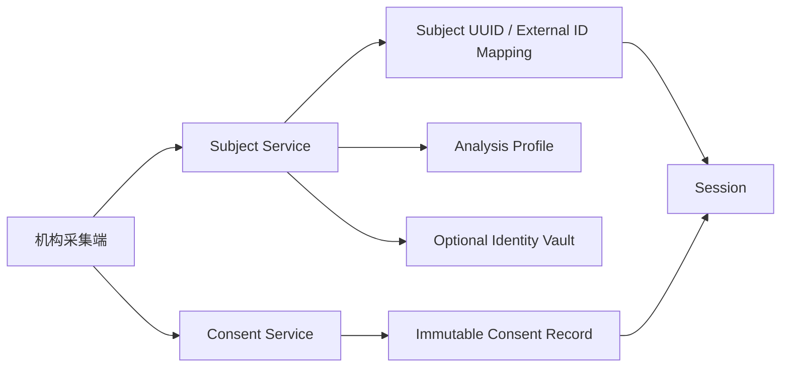

# 模块 08：受试者、机构编号与授权

## 1. 目标

在不强制身份证的前提下，快速建立受试者档案、关联机构历史编号和选填分析标签，并保存可追溯的个人信息告知与授权记录。

## 2. 产品原则

- 优先使用机构档案号、病历号、体检号或住户编号；
- 姓名、身份证和联系方式不是算法特征，首版不强制身份证；
- 支持非实名筛查，但仍使用平台内部 `subject_uuid`；
- 档案字段尽量选填，缺失不等于阴性；
- 报告由机构分发，不建设受试者账号和公开领取链接；
- 身份区与分析区隔离，算法无权读取直接身份信息。

## 3. 底层架构



首版可在同一后端应用中部署，但身份字段使用独立表、独立访问角色和字段级加密。算法服务只访问分析档案视图。

## 4. 标识模型

```text
Subject(subject_uuid, tenant_id, status, created_at)
ExternalSubjectId(id, subject_uuid, tenant_id, issuer, id_type,
                  encrypted_value, normalized_hmac, masked_value, status)
IdentityProfile(subject_uuid, encrypted_name?, encrypted_contact?)
AnalysisProfile(subject_uuid, birth_year?, age_band?, sex?, height?, weight?,
                foot_length?, dominant_side?, condition_tags?, injury_tags?, source)
```

唯一性按 `tenant_id + issuer + id_type + normalized_hmac` 判断。不同机构默认不能跨租户匹配。外部编号冲突只产生候选，不自动合并。

## 5. 字段缺失模型

每个重要选填字段记录值和状态：

```text
PROVIDED       已提供
NONE_REPORTED  明确表示没有相关情况
DECLINED       不愿提供
UNKNOWN        不知道或未询问
NOT_APPLICABLE 不适用
```

算法输入保留缺失状态，不能将 `DECLINED/UNKNOWN` 转换为否定值。

## 6. 快速授权流程

首次建档：

1. 展示一页简短告知，说明原始压力、基础档案和云端分析；
2. 提供完整信息处理规则入口；
3. 取得明确确认并创建不可变授权记录；
4. 相同目的、方式和数据范围的后续测试复用有效授权；
5. 用途、字段、接收方或规则实质变化时重新确认。

建议把服务必需处理和额外算法研发/科研用途分别记录。界面可以在同一页完成，不增加多页流程。

## 7. 授权记录

```text
ConsentRecord(id, subject_uuid, tenant_id, policy_version,
              purpose_codes, data_categories, granted_at,
              evidence_type, operator_id, terminal_id,
              representative_type?, revoked_at?)
```

每次会话保存 `consent_record_id` 快照。离线时使用已缓存的有效政策完成本地授权记录，并由终端身份签名；同步后服务器验证版本。无有效授权上下文的数据进入隔离区，不启动云端分析。

## 8. 合并、撤回与删除

- 合并档案需要显示两个档案的机构编号和少量核对信息，明确确认；
- 合并保留审计和旧 ID 映射，不物理重写历史会话；
- 撤回后停止超出保留依据的新处理，并触发后续处置流程；
- 删除或更正请求由机构工作流发起，平台记录执行结果；
- 已匿名化且无法关联的数据与可回溯档案分开管理。

## 9. 设计原理

- **平台 UUID 稳定，机构编号可变**：外部编号不能成为平台主键。
- **数据最小化**：不为算法收集姓名或身份证。
- **快速但有证据**：授权只在首次和实质变更时确认，不每次重复点击。
- **错误关联优先防止**：宁可创建待合并档案，也不自动把两个人合并。

## 10. 测试与验收

- 不同机构相同编号不会冲突；
- 编号规范化、查询、重复和冲突流程正确；
- 身份字段不进入算法请求、日志和对象路径；
- 缺失状态贯穿 API 和算法输入；
- 授权版本变更后强制重新确认；
- 未授权会话不能启动云端分析；
- 合并、撤回和更正均有完整审计。
