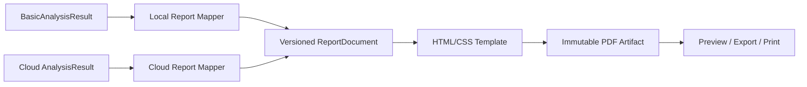

# 模块 09：报告生成、版本、PDF 与打印

## 1. 目标

把本地基础结果或云端完整结果转换为同一报告业务对象的不可变版本，并为合作机构提供查看、PDF 导出和打印。报告面向健康筛查和分析，不自动生成临床诊断。

## 2. 报告结构

客户报告固定三部分：

1. **筛查摘要与风险提示**：测试信息、主要发现、通俗解释和下一步建议；
2. **核心指标**：左右/前后载荷、基础稳定性、压力分布和已验证指标；
3. **专业参数与曲线**：参数定义、单位、热力图、COP 轨迹和原始/基础曲线。

不进入客户报告：帧校验错误、队列水位、内部质量分数、堆栈、调试参数和未验证指标。

## 3. 报告生命周期

```text
NOT_AVAILABLE
  → BASIC_READY(version 1, local)
  → CLOUD_ANALYZING
  → FULL_READY(version 2+, cloud)
```

- 基础与完整版本共享 `report_id`；
- 每个 `report_version` 不可变；
- 完整报告不能静默改写已经导出的基础版本；
- 云端算法升级重算生成新完整版本；
- 数据质量不合格时状态保持 `NOT_AVAILABLE`，引导重测。

## 4. 底层架构



基础和云端模板可以不同，但共享版本化 `ReportDocument` 核心模式、品牌令牌、术语表和指标定义。客户端建议使用 QtWebEngine 打印基础 PDF；云端建议使用受控 Chromium/等价渲染环境生成完整 PDF。

## 5. 报告数据契约

```text
ReportDocument
  identity: report_id, version, kind, generated_at
  subject: masked external ID, optional demographics
  test: protocol, time, site, device display info
  summary: findings, risk prompts, recommended actions
  metrics: value, unit, label, explanation, reference?
  figures: heatmaps, trajectories, curves, captions
  provenance: software, algorithm and report versions
```

`provenance` 可在页脚用简短版本信息呈现，不展示内部质量细节。参考范围只有在来源、适用人群和验证状态明确时才允许进入报告。

## 6. 本地基础报告

目标是在采集完成和质量门控通过后数秒内生成，内容限于本地已验证能力：

- 基础热力图；
- 总相对载荷和左右/前后分布；
- COP 基础轨迹；
- 少量规则化筛查提示；
- 专业曲线的本地可用部分。

页眉标记“基础筛查报告”。网络恢复后同一报告进入云端完整分析，不要求用户手动上传。

## 7. 云端完整报告

在原始数据完整、算法成功且报告模式验证后生成：

- 包含基础内容；
- 增加服务器统一提取的一级特征；
- 增加经过批准的专业参数、历史对比和 AI 辅助分析；
- 页眉标记“完整分析报告”；
- 保存算法集和模型版本引用。

## 8. PDF 与打印

- 机构端只提供预览、导出 PDF 和打印；
- 不生成受试者二维码、账号或永久公开链接；
- 导出使用安全文件名，不包含完整身份明文；
- 打印前显示受试者机构编号和测试时间供操作员确认；
- PDF 工件包含页码、版本、生成时间和报告编号；
- 字体必须内嵌或随应用部署，避免机构电脑缺字。

## 9. 设计原理

- **同一报告、版本演进**：避免基础和完整结果成为两个不相关对象。
- **不可变交付物**：已经发放的 PDF 可以追溯。
- **指标白名单**：只有批准指标可以进入客户模板。
- **客户简洁、专业可读**：通俗摘要在前，专业数据在后。

## 10. 测试与验收

- 基础与完整报告共享报告 ID 且版本不同；
- 重算不覆盖旧 PDF；
- 无效会话无法生成客户报告；
- PDF 在目标 Windows 打印机、A4 纸和常见缩放下不截断；
- 中文字体、图表、分页、页眉页脚和长字段通过视觉回归；
- 报告不包含内部质量、堆栈、身份明文泄露和未批准指标。
