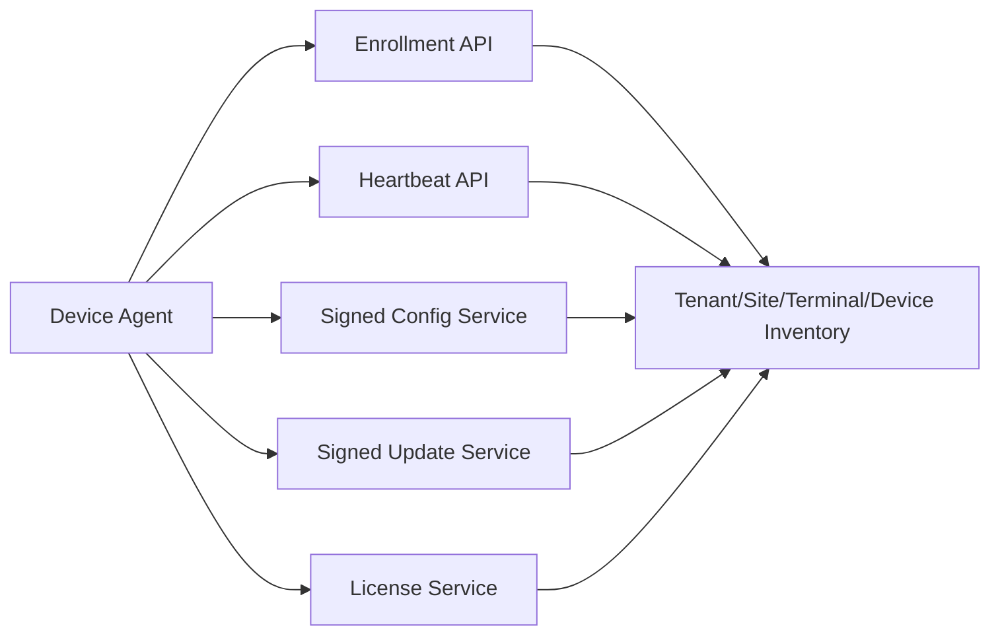

# 模块 10：终端纳管、配置、License 与升级

## 1. 目标

把每台机构终端和压力设备纳入云端管理，控制激活、周期联网、功能许可、配置版本和软件升级，同时保证短时网络故障不破坏当前测试。

## 2. 职责边界

### 负责

- 机构、站点、终端和设备绑定；
- 终端密钥/证书申请、轮换和吊销，以及 License 验证后签发受信任服务器
  公钥 keyset；
- 心跳、在线状态、版本、磁盘和待传摘要；
- License 和功能开关；
- 签名配置下发、软件更新、灰度和回滚；
- 24 小时、50 次、2 GB 策略下发和执行。

### 不负责

- 原始数据上传协议、算法结果和报告内容；
- 在测试过程中强制安装更新；
- 通过远程配置绕过硬件和质量门控。

## 3. 底层架构



设备 Agent 作为客户端内部模块运行，不独立获得串口原始数据权限。它通过稳定端口读取应用版本、健康摘要和状态。

## 4. 首次激活

1. 服务商 Platform operations 预先创建 tenant account、License 和一次性激活码；
2. 客户端提交账号、激活码、密码、client installation 和稳定硬件身份；
3. 云端原子激活账号、`license/2` 和 hardware binding；
4. 客户端只打开 License 绑定的真实压力设备；
5. 云端下发签名 License、允许的设备型号和配置；
6. 激活码失效，后续使用终端身份认证。

不得把长期共享密钥写入安装包。

## 5. 心跳

心跳建议包含：

```text
terminal_id / site_id
app_version / config_version / protocol_version
device_id / device_model / connection_state
last_successful_sync / pending_sessions / pending_bytes
disk_free / clock_skew / last_error_code
```

不包含姓名、机构档案号、原始压力数据和报告内容。

## 6. License 与功能开关

- License 使用云端签名、本地公钥验证和缓存；
- 功能开关控制商业模块，但不能覆盖数据质量和算法验证门控；
- 超过在线宽限、终端吊销或机构停用时限制新测试；
- 当前测试始终允许安全结束；
- License 变化记录审计并显示通俗状态。

## 7. 配置管理

配置包括：测试项目、采集时长、显示设置、上传门槛、报告品牌和已批准指标集。配置包必须：

- 有模式版本、配置版本、签名和适用范围；
- 下载后先验证，再原子切换；
- 当前会话使用启动时的配置快照；
- 新配置只作用于后续会话；
- 验证失败自动回退到上一有效配置。

## 8. 软件升级

- 安装包签名并验证摘要；
- 支持灰度发布、暂停、回滚和最低版本；
- 采集中、报告生成中和数据最终化时禁止升级；
- 升级前确认待上传数据和数据库迁移可恢复；
- 失败后回滚旧版本，不删除本地分段；
- 医疗/机构环境的版本升级、配置和验证结果留档。

## 9. 设计原理

- **强制纳管而非强依赖瞬时网络**：周期在线保证治理，短时断网保证现场可用。
- **签名和版本化**：终端不信任未验证配置和安装包。
- **会话快照**：运行中配置不漂移。
- **可回滚升级**：升级失败不能把采集终端变成不可恢复状态。

## 10. 测试与验收

- 激活码只能使用一次且不能跨机构；
- 终端吊销后不能创建新会话；
- 签名错误配置和安装包被拒绝；
- 测试进行中不会安装更新；
- 配置切换和数据库迁移失败可以回滚；
- 心跳不泄露身份和健康数据；
- 离线门槛与 License、当前会话收尾行为一致。

## Seed MVP access model

License 跟随 tenant account 与 physical hardware，不跟随电脑终端。
client installation 允许同一账号换电脑登录，用于刷新会话、租约和审计。
同一机构支持 `1 -> 3 -> 2` 个账号/License/设备组；MVP 全部由
provider-provisioned，不提供客户机构搜索、新建、加入或管理员后台。

tenant access token audience 是 `feetforceplate-tenant`，有效 15 分钟；刷新
窗口为 30-day idle / 180-day absolute。License 周期为 6/12 个月，并支持远程
续约、暂停、恢复和撤销。暂停、过期或撤销阻止新测试，但
**upload and report access continue**。24-hour offline grace 允许短时现场工作，
但离线跨电脑排他不是已证明能力。

旧 `terminal_id`、心跳和配置路由属于 **legacy terminal compatibility**；不再
作为 License 权威绑定。IP:7443 只用于联调，正式入口为
**domain + public CA + 443**。
