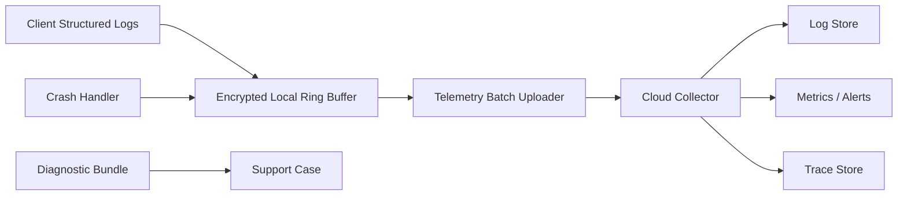

# 模块 11：可观测性、自动日志与技术支持

## 1. 目标

在不增加普通操作员负担、不泄露身份和健康内容的前提下，自动收集足以复盘设备、采集、上传、云端算法和报告故障的证据，并支持主动告警和售后诊断。

## 2. 职责边界

### 负责

- 客户端与云端结构化日志；
- 指标、分布式追踪和统一关联 ID；
- 崩溃捕获和自动日志上传；
- 设备/机构运营看板与告警；
- 错误编号和诊断包；
- 日志脱敏、轮转和保留策略。

### 不负责

- 把内部日志显示在客户报告；
- 默认上传身份明文或完整原始压力数据作为日志；
- 提供不受控的远程 Shell 或文件浏览。

## 3. 底层架构



## 4. 统一关联字段

```text
timestamp / severity / component / event_name
tenant_id / site_id / terminal_id / device_id
session_id / segment_index / upload_task_id
analysis_run_id / report_id / correlation_id
app_version / config_version / error_code
safe_context
```

日志不记录姓名、联系方式、完整机构档案号、授权文本、访问 token、原始帧内容或完整报告。

## 5. 错误编号

采用稳定分类，例如：

```text
E-DEV-xxx  设备与串口
E-ACQ-xxx  采集和协议
E-DAT-xxx  本地存储和数据
E-SYN-xxx  上传与同步
E-CLD-xxx  云端接收
E-ALG-xxx  算法任务
E-RPT-xxx  报告和打印
E-AUT-xxx  激活、授权和权限
E-UPD-xxx  更新和配置
```

客户界面显示错误编号和可执行提示；研发通过编号和关联 ID 查询内部证据。

## 6. 自动上传

- 默认自动批量上传运行日志、设备健康和错误事件；
- 正常日志低优先级，故障摘要和崩溃信息高优先级；
- 网络中断时进入加密本地环形缓冲；
- 达到容量后优先保留错误和状态转换，淘汰最旧低级别日志；
- 日志上传失败不阻塞测试；
- 与原始数据上传使用独立队列和限流。

## 7. 诊断包兜底

仅当自动上传持续失败或售后要求时，提供“导出问题诊断包”：

- 软件、系统、设备和配置版本；
- 指定时间窗口的结构化日志；
- 状态转换、错误编号和崩溃信息；
- 串口、队列、磁盘和数据库健康摘要；
- 默认不包含原始压力数据和身份明文；
- 若确需会话数据，使用单独授权和独立导出动作；
- 诊断包加密并生成内容摘要。

## 8. 运营指标和告警

至少监控：

- 终端在线率、版本分布和心跳延迟；
- 每机构测试量、有效率和重测率；
- 待传会话、字节数、上传时延和失败率；
- 分段冲突、缺段和对象存储失败；
- 算法队列时延、失败率和完整报告生成时延；
- 客户端崩溃率、设备断线率和磁盘不足；
- 跨租户拒绝、异常鉴权和配置签名失败。

告警必须可归属、可去重、有严重等级和处理手册，避免告警风暴。

## 9. 设计原理

- **客户简单、后台可诊断**：不让操作员解释技术错误。
- **结构化优于文本堆栈**：统一字段才能跨模块关联。
- **隐私默认安全**：日志不是绕过数据分区的后门。
- **主动发现**：云端应在客户投诉前发现离线、失败和版本问题。

## 10. 测试与验收

- 一次测试可通过 `session_id/correlation_id` 串联端云日志；
- 日志脱敏测试覆盖所有身份字段和密钥；
- 断网后日志可补传且不影响采集；
- 环形缓冲满时保留高优先级错误；
- 崩溃后下次启动自动上报崩溃证据；
- 诊断包无身份明文且可验证完整性；
- 关键告警在目标时间内触发且不重复轰炸。

## Seed MVP access model

Platform IAM 使用独立 `feetforceplate-platform` audience，并区分
`PLATFORM_OWNER`、`PLATFORM_OPERATIONS`、`PLATFORM_SUPPORT`、
`PLATFORM_ENGINEER`。跨机构列表只显示脱敏运营摘要；身份内容必须由 support
或 owner 申请 15 分钟 `SensitiveAccessGrant`，每次使用均审计。

机构数据 API 使用 `feetforceplate-tenant` tenant access token。日志可记录内部
tenant/account/license/client installation UUID 与关联 ID，但不记录账号明文、
硬件完整身份、token、激活码、身份内容或 License 签名材料。旧 terminal 字段
属于 **legacy terminal compatibility**。种子服务只通过 Nginx 7443 提供受限
联调，正式支持入口仍要求 **domain + public CA + 443**。
