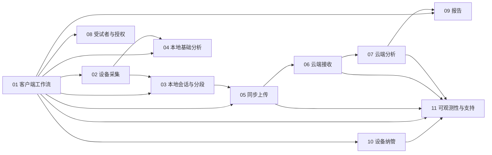

# 模块设计文档索引

本目录把总体架构拆成可独立理解、开发和验收的模块。每个模块统一描述：功能目标、职责边界、底层架构、接口、状态与数据、异常处理、设计原理和验收要求。

## 模块依赖

## 统一规则

1. 模块只能通过显式接口通信，不读写其他模块的私有数据库表或文件。
2. 所有跨进程/跨网络接口必须带版本号、关联 ID 和幂等语义。
3. 客户端错误提示使用可执行的通俗语言；技术详情只进入内部日志。
4. 测试会话、数据分段、上传、算法任务和报告分别维护状态，不用一个布尔值表示全部完成。
5. 身份信息、分析档案、原始测量和算法结果逻辑隔离。
6. 原始数据可靠落盘优先于显示、分析和上传。
7. 云端算法不能绕过硬件、标定和质量门控。

## 文档列表

1. [客户端外壳与一键工作流](01-client-workflow.md)
2. [设备接入与可靠采集](02-device-acquisition.md)
3. [本地会话、加密分段与恢复](03-local-session-spool.md)
4. [本地基础分析与质量门控](04-local-analysis.md)
5. [渐进上传与同步](05-sync-upload.md)
6. [云端数据接收与存储](06-cloud-ingestion.md)
7. [云端算法与版本化重算](07-cloud-analysis.md)
8. [受试者、机构编号与授权](08-subject-consent.md)
9. [报告生成、版本与打印](09-reporting.md)
10. [终端纳管、配置、License 与升级](10-device-management.md)
11. [可观测性、自动日志与技术支持](11-observability-support.md)
