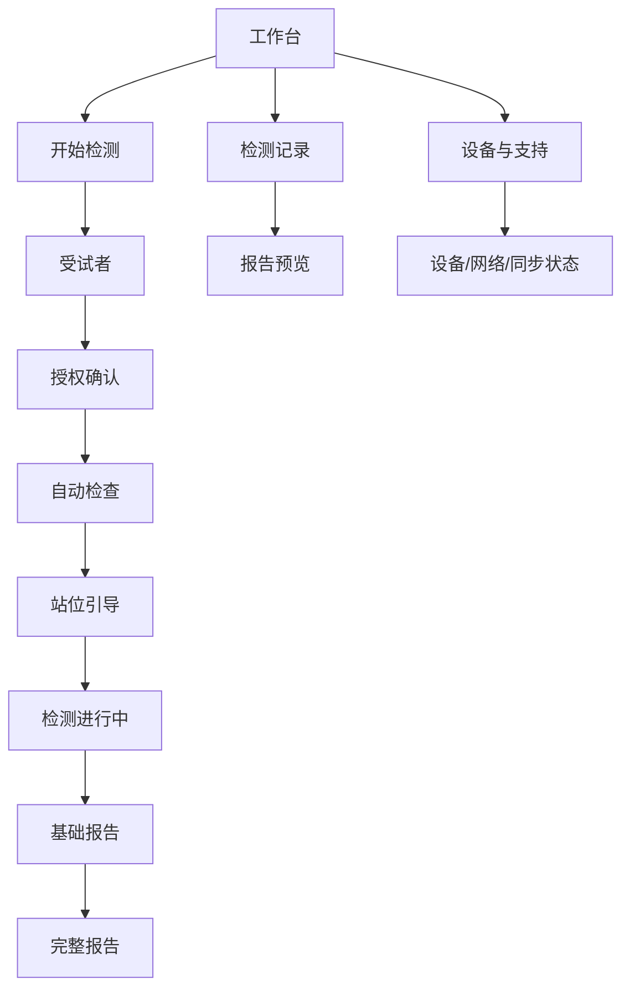

# 足底压力健康筛查与分析平台 —— 产品需求文档（PRD）

| 项目 | 内容 |
|---|---|
| 文档版本 | v1.0 |
| 日期 | 2026-07-20 |
| 文档责任方 | 项目团队 |
| 产品阶段 | 方案确认 / 进入实施规划前 |
| 适用端 | 机构 Windows/macOS 采集端、云端数据与分析平台 |
| 关联文档 | [总体架构](架构设计文档.md) / [模块设计](modules/README.md) |

---

## 1. 产品概述

本产品面向养老机构、体检机构、医院健康服务场景以及体育/康复辅助分析场景，通过足底压力阵列完成快速筛查，生成通俗风险提示、核心指标、专业参数与曲线。

产品定位是 **健康筛查、风险提示和专业分析工具**，不是自动诊断系统。日常操作只提供一个一键式流程；专业内容直接进入同一份报告，不设置专业模式。

产品同时承担云端数据平台入口：机构终端自动、渐进地上传全部原始压力数据，服务器统一提取一级特征并执行复杂算法或 AI 分析。本地保留基础分析和基础报告作为短时断网兜底。

---

## 2. 背景与问题

目标机构普遍存在：

- 操作员不是研发人员，不能理解串口、标定、算法和同步细节；
- 检测量可能较大，建档和授权流程必须短；
- 网络质量不稳定，但现场不能因瞬时断网完全停摆；
- 数据、报告和受试者关联错误会造成严重信任问题；
- 机构需要即时基础结果，也需要后续更完整的云端分析；
- 平台需要持续回收原始数据、设备健康和故障证据；
- 受试者可能不愿提供实名和敏感身份字段。

---

## 3. 产品目标与非目标

### 3.1 产品目标

| ID | 目标 | 首版衡量方式 |
|---|---|---|
| G-01 | 普通机构操作员可独立完成测试 | 经过不超过 30 分钟培训，首次任务成功率 ≥ 90% |
| G-02 | 返回受试者快速进入检测 | 查找档案至开始预检的中位时间 ≤ 15 秒 |
| G-03 | 非实名/临时受试者快速建档 | 不填写选填字段时 ≤ 20 秒进入预检 |
| G-04 | 数据不静默丢失 | 已关闭本地分段和服务端已确认数据均可校验追溯 |
| G-05 | 网络异常不破坏当前测试 | 短时断网下当前会话和基础报告正常完成 |
| G-06 | 自动回收原始数据 | 网络恢复后无需用户操作自动补传 |
| G-07 | 快速提供基础结果 | 有效采集结束后 10 秒内基础报告可查看 |
| G-08 | 云端完整分析 | 数据完整上传后 120 秒内完整报告就绪，首版目标 p95 |
| G-09 | 问题可诊断 | 关键故障均有错误编号、端云关联日志和自动上传证据 |

### 3.2 非目标

- 自动疾病诊断、处方或治疗建议；
- 受试者注册登录、二维码领取报告或公开分享链接；
- 机构内复杂报告审批和客户关系管理；
- 首版支持所有压力设备型号；
- 用云端算法突破 DO-P4864 约 12 Hz 的硬件采样限制；
- 未经验证即提供精细步态或临床参考范围。

---

## 4. 用户与使用环境

### 4.1 主要用户

| 用户 | 主要任务 | 能力假设 |
|---|---|---|
| 机构操作员 | 建档、引导站位、开始测试、导出/打印报告 | 会使用常规 Windows 软件，不掌握设备协议和算法 |
| 机构管理员 | 管理机构账号、终端和少量配置 | 能完成基础 IT 操作 |
| 体育/康复专业人员 | 阅读报告中的专业参数和曲线 | 理解专业指标，但不是系统管理员 |
| 平台运营/售后 | 查看终端健康、同步、错误和诊断包 | 有受控内部权限 |
| 算法/研发人员 | 研究原始数据、特征和算法版本 | 默认不接触直接身份字段 |

### 4.2 使用环境

- Windows 10/11 为主要交付平台；macOS 用于开发兼容和特定客户；
- 常见分辨率 1920×1080，最低支持 1280×720；
- 可能使用鼠标、触控板、键盘、条码扫描器和普通 A4 打印机；
- 环境可能嘈杂、人员流动快，操作员需要同时引导受试者；
- 机构网络可能短时掉线、限速或需要代理；
- 同一终端可能连续工作 8 小时并完成大量测试。

---

## 5. 产品原则

1. **一个流程**：不提供普通/专业模式切换。
2. **一个主要动作**：每个步骤只有一个突出主按钮。
3. **自动优先**：连接、自检、采集、质量判断、上传和刷新尽量自动。
4. **失败安全**：数据无效时不生成报告；错误不得伪装成成功。
5. **客户简洁、内部透明**：客户只见可执行提示，技术证据进入内部日志。
6. **先落盘再上传**：网络不能成为原始数据唯一归宿。
7. **数据最小化**：不强制身份证，机构编号和选填标签满足关联与分析。
8. **报告渐进完成**：同一报告先基础、后完整，版本可追溯。
9. **专业但不越界**：术语可专业，结论保持筛查和分析定位。

---

## 6. 首版产品范围

### 6.1 P0 必须功能

- 终端激活、周期心跳和机构绑定；
- 机构档案号查找、新建非实名受试者；
- 选填年龄、性别、身高、体重和基础病等标签；
- 一页式简短授权确认；
- DO-P4864 自动连接、自检和压力采集；
- 实时热力图和采集进度；
- 本地质量门控和重新检测；
- 本地基础报告；
- 原始数据加密分段、边采边传和断点续传；
- 云端原始数据存储、一级特征和完整报告；
- 报告预览、PDF 导出和打印；
- 自动故障日志、设备健康和诊断包兜底。

### 6.2 后续功能

- 更多设备协议；
- 更高采样率硬件和经验证步态参数；
- 历次趋势和人群统计；
- 机构级品牌模板；
- 算法影子运行和批量历史重算界面；
- 受试者自助访问或二维码（当前明确不做）；
- HIS/体检系统接口（需求明确后单独设计）。

---

## 7. 信息架构



一级导航只保留：

- 工作台；
- 检测记录；
- 设备与支持。

设置、工程参数和内部质量信息不进入普通一级导航。

---

## 8. 端到端主流程

### 8.1 标准流程

```text
工作台
  → 输入/查找机构档案号（可跳过并生成随机编号）
  → 补充选填信息
  → 首次授权确认
  → 自动预检
  → 站位引导
  → 自动/手动开始采集
  → 自动质量检查
  → 基础报告
  → 后台上传和云端分析
  → 同一报告升级为完整版本
  → PDF 导出或打印
```

### 8.2 返回受试者

1. 输入机构编号；
2. 显示脱敏编号和少量档案信息；
3. 操作员确认不是同名/错号档案；
4. 授权仍有效则跳过授权页；
5. 进入自动预检。

### 8.3 临时/非实名受试者

1. 点击“无机构编号，快速建档”；
2. 平台生成随机 `subject_uuid` 和显示编号；
3. 所有分析档案字段允许跳过；
4. 完成简短授权；
5. 进入自动预检。

---

## 9. 功能需求

### 9.1 终端与联网

| ID | 需求 | 优先级 |
|---|---|---|
| FR-001 | 首次使用必须联网激活并绑定机构、站点和终端 | P0 |
| FR-002 | 软件启动后自动使用终端身份登录，不要求操作员反复输入技术账号 | P0 |
| FR-003 | 终端周期发送不含身份明文的健康心跳 | P0 |
| FR-004 | 最近成功联网超过 24 小时后限制新测试 | P0 |
| FR-005 | 待上传超过 50 次或 2 GB 后限制新测试 | P0 |
| FR-006 | 达到门槛时仍允许当前测试安全结束、查看既有报告和继续上传 | P0 |

### 9.2 受试者与授权

| ID | 需求 | 优先级 |
|---|---|---|
| FR-101 | 支持机构档案号、病历号、体检号或住户编号 | P0 |
| FR-102 | 机构外部编号在本机构范围内查找和去重 | P0 |
| FR-103 | 支持无机构编号的非实名快速建档 | P0 |
| FR-104 | 姓名、身份证和联系方式不作为必填；首版不要求身份证 | P0 |
| FR-105 | 年龄、性别、身高、体重、基础病和既往损伤为选填 | P0 |
| FR-106 | 区分“明确无、未知、拒绝提供、不适用” | P0 |
| FR-107 | 首次建档完成简短授权，相同用途后续测试复用 | P0 |
| FR-108 | 用途、字段或规则实质变化时要求重新确认 | P0 |
| FR-109 | 档案冲突不自动合并，提示机构人员确认 | P0 |

### 9.3 设备与采集

| ID | 需求 | 优先级 |
|---|---|---|
| FR-201 | 自动发现支持的 DO-P4864 串口设备 | P0 |
| FR-202 | 测试前自动检查连接、磁盘、标定、联网门槛和设备零载状态 | P0 |
| FR-203 | 站位达到条件后允许自动倒计时开始，也保留明确的手动开始按钮 | P0 |
| FR-204 | 检测过程中显示热力图、剩余时间和单一停止动作 | P0 |
| FR-205 | 显示帧率与采集帧率解耦 | P0 |
| FR-206 | 设备断开或关键写盘错误时安全停止并标记会话不完整 | P0 |
| FR-207 | 无效会话不生成客户报告，提供重新检测 | P0 |

### 9.4 数据与上传

| ID | 需求 | 优先级 |
|---|---|---|
| FR-301 | 原始帧按 5–10 秒或目标字节数形成不可变加密分段 | P0 |
| FR-302 | 分段可靠落盘并校验后立即加入上传队列 | P0 |
| FR-303 | 采集和上传并行，上传不得阻塞设备线程 | P0 |
| FR-304 | 支持断点续传、缺段查询、幂等去重和摘要冲突检测 | P0 |
| FR-305 | 客户端上传原始数据和必要元数据，不上传一级特征作为权威数据 | P0 |
| FR-306 | 服务端确认前不得按正常策略删除本地分段 | P0 |
| FR-307 | 网络恢复后自动补传，不要求用户手动集中上传 | P0 |

### 9.5 分析与报告

| ID | 需求 | 优先级 |
|---|---|---|
| FR-401 | 有效采集结束后本地生成基础分析结果 | P0 |
| FR-402 | 云端从完整原始数据统一提取一级特征 | P0 |
| FR-403 | 每项指标按采样率、标定、时长和验证状态门控 | P0 |
| FR-404 | 基础和完整报告共享同一报告 ID，保存不可变版本 | P0 |
| FR-405 | 客户报告包含筛查摘要、核心指标、专业参数与曲线 | P0 |
| FR-406 | 内部质量详情和调试信息不得进入客户报告 | P0 |
| FR-407 | 机构可预览、导出 PDF 和打印报告 | P0 |
| FR-408 | 不提供二维码、公开链接和受试者账号 | P0 |
| FR-409 | 算法升级重算产生新版本，不覆盖已交付版本 | P1 |

### 9.6 故障与支持

| ID | 需求 | 优先级 |
|---|---|---|
| FR-501 | 关键错误显示稳定错误编号和通俗动作提示 | P0 |
| FR-502 | 结构化日志、设备健康和崩溃信息默认自动上传 | P0 |
| FR-503 | 日志默认不含身份明文和原始压力内容 | P0 |
| FR-504 | 自动上传持续失败时允许导出加密诊断包 | P0 |
| FR-505 | 诊断包默认不含原始会话，附加会话数据需独立动作 | P0 |

---

## 10. 页面与界面规范

### P-01 工作台

**目标**：让操作员一眼知道是否可以开始测试。

```text
┌──────────────────────────────────────────────────────────────┐
│ 机构名称                         设备已就绪   数据已同步       │
├──────────────────────────────────────────────────────────────┤
│                                                              │
│                    足底压力健康筛查                           │
│              按照引导完成一次快速检测                         │
│                                                              │
│                   [ 开始新的检测 ]                            │
│                                                              │
│ 最近检测                                                     │
│ 编号        时间        报告状态              [查看]          │
└──────────────────────────────────────────────────────────────┘
```

要求：

- 主按钮位于首屏中央，不与其他高强调按钮并列；
- 顶部只显示“已就绪/需要处理”，不显示串口号和技术指标；
- 网络在宽限期内中断时显示非阻断横幅；达到门槛时主按钮替换为“检查网络”；
- 最近检测最多显示 5 条，完整列表进入检测记录。

### P-02 受试者识别与快速建档

```text
┌──────────────────────────────────────────────────────────────┐
│ ← 返回                 受试者信息                             │
├──────────────────────────────────────────────────────────────┤
│ 机构档案号 / 病历号 / 体检号                                 │
│ [____________________________] [查找]                         │
│                                                              │
│ 或                                                           │
│ [ 无机构编号，快速建档 ]                                      │
│                                                              │
│ 找到档案时：编号 ＊＊2781   年龄段 60–69   上次检测 07-12     │
│                                            [确认并继续]       │
└──────────────────────────────────────────────────────────────┘
```

要求：

- 编号字段支持扫描器键盘输入和手动输入；
- 查无结果时在同页提供“以此编号新建”，不弹出技术错误；
- 找到档案后显示脱敏编号和少量核对信息，防止错人；
- 冲突时不自动合并，进入受控确认页；
- 快速建档不强制姓名和身份证。

### P-03 选填档案

```text
┌──────────────────────────────────────────────────────────────┐
│ 基础信息（选填，可直接继续）                                  │
├──────────────────────────────────────────────────────────────┤
│ 年龄段 [请选择]    性别 [请选择/不提供]                       │
│ 身高   [    ] cm  体重 [    ] kg                             │
│ 基础情况 [高血压] [糖尿病] [既往下肢损伤] [其他]             │
│                                                              │
│ [跳过]                                      [保存并继续]      │
└──────────────────────────────────────────────────────────────┘
```

要求：

- 标题明确“选填”；
- 跳过与保存都进入同一步骤，保存为主按钮；
- 未选择与明确“无”分开；
- 基础病标签显示为“本人/机构提供的信息”，不自动定义为临床确诊；
- 数字字段即时校验合理范围，但不阻塞其他选填字段。

### P-04 授权确认

```text
┌──────────────────────────────────────────────────────────────┐
│ 数据使用说明                                                 │
├──────────────────────────────────────────────────────────────┤
│ 本次筛查将采集足底压力和您自愿提供的基础信息，数据会加密上传，│
│ 用于生成基础及完整分析报告、保存历次记录和保障服务运行。      │
│                                                              │
│ [查看完整信息处理规则]                                       │
│ □ 我已了解并同意上述必要处理                                 │
│ □ 我同意将去标识化数据用于额外算法研究（选填）               │
│                                                              │
│                                      [同意并继续]             │
└──────────────────────────────────────────────────────────────┘
```

要求：

- 不默认勾选；
- 必需与额外用途分开记录；
- 相同有效授权的返回受试者跳过本页；
- 规则变更时显示变化摘要并重新确认；
- 拒绝必要处理则不进入上传型筛查服务，显示清晰说明，不使用恐吓文案。

### P-05 自动检查

```text
┌──────────────────────────────────────────────────────────────┐
│ 正在准备检测                                                 │
├──────────────────────────────────────────────────────────────┤
│ ✓ 压力设备                                                   │
│ ✓ 数据存储                                                   │
│ ✓ 标定状态                                                   │
│ ✓ 数据同步                                                   │
│                                                              │
│              请确保压力垫上暂时无人站立                       │
│                          [重新检查]                           │
└──────────────────────────────────────────────────────────────┘
```

要求：

- 检查并行执行，逐项显示完成；
- 正常完成后自动进入站位引导；
- 失败项只显示可执行说明；
- “查看技术详情”仅对受控支持角色开放，普通操作员不可见。

### P-06 站位引导

```text
┌──────────────────────────────────────────────────────────────┐
│ 请站到压力垫中央                                             │
├──────────────────────────────────────────────────────────────┤
│                  [实时低细节足印示意]                         │
│                                                              │
│              双脚自然站立，保持身体放松                       │
│              检测到稳定站位后将自动开始                       │
│                                                              │
│         稳定中…  3   2   1                 [手动开始]         │
└──────────────────────────────────────────────────────────────┘
```

要求：

- 以动作指令为主，不显示专业指标；
- 自动开始条件必须保守并允许取消；
- 受试者离开有效区域时倒计时复位；
- 手动开始仍需满足最低接触和设备条件。

### P-07 检测进行中

```text
┌──────────────────────────────────────────────────────────────┐
│ 检测进行中                                      剩余 00:25   │
├───────────────────────────────┬──────────────────────────────┤
│                               │ 请保持自然站立               │
│        实时压力热力图          │ 不要说话或大幅移动           │
│                               │                              │
│                               │ 当前状态：采集中             │
├───────────────────────────────┴──────────────────────────────┤
│                                                   [停止检测] │
└──────────────────────────────────────────────────────────────┘
```

要求：

- 不展示同步进度，上传完全后台化；
- 停止是次级危险动作，需要一次简短确认；
- 不允许导航到其他档案；
- 网络变化不弹窗打断；
- 设备断开时立即进入安全结束和重新检测页。

### P-08 处理与基础报告

```text
┌──────────────────────────────────────────────────────────────┐
│ 检测完成                                                     │
├──────────────────────────────────────────────────────────────┤
│ ✓ 基础报告已生成                                             │
│ ⟳ 完整分析正在后台生成                                       │
│                                                              │
│ [查看基础报告]                    [开始下一位检测]             │
└──────────────────────────────────────────────────────────────┘
```

离线状态：

> 基础报告已生成。网络恢复后系统会自动完成完整分析。

质量失败状态：

> 本次检测未完成，请重新站稳后检测。

要求：

- 质量失败不显示“检测完成”；
- 完整分析异步完成，不阻止开始下一位；
- 状态变更后检测记录自动刷新；
- 云端失败显示“正在自动重试”，不要求用户上传。

### P-09 检测记录

```text
┌──────────────────────────────────────────────────────────────┐
│ 检测记录                                                     │
├──────────────────────────────────────────────────────────────┤
│ [机构编号] [日期] [报告状态]                    [搜索]       │
│                                                              │
│ 编号      时间          测试项目       报告状态       操作    │
│ **2781   07-20 10:20   静态筛查       完整报告       查看    │
│ 临时034  07-20 10:05   静态筛查       基础报告       查看    │
│ **1052   07-20 09:42   静态筛查       生成中         查看    │
└──────────────────────────────────────────────────────────────┘
```

要求：

- 默认显示本机构最新记录；
- 搜索外部编号时只在当前租户内执行；
- 状态使用文字和图标，不只依赖颜色；
- 不显示内部质量失败原因；失败记录允许重新检测和查看支持编号。

### P-10 报告预览

```text
┌──────────────────────────────────────────────────────────────┐
│ ← 检测记录    完整分析报告 v2         [导出PDF] [打印]       │
├──────────────────────────────────────────────────────────────┤
│                                                              │
│                    A4 报告分页预览                            │
│                                                              │
└──────────────────────────────────────────────────────────────┘
```

要求：

- 页眉明确基础/完整版本；
- 导出前使用安全默认文件名；
- 打印前显示机构编号和时间供核对；
- 不提供二维码、公开分享和直接发送功能；
- 新版本可用时提示“已有更新版本”，不覆盖当前正在查看的版本。

### P-11 设备与支持

```text
┌──────────────────────────────────────────────────────────────┐
│ 设备与支持                                                   │
├──────────────────────────────────────────────────────────────┤
│ 压力设备       已连接                                        │
│ 数据同步       正常                                          │
│ 待同步数据     0 次                                          │
│ 软件版本       1.0.0                                         │
│                                                              │
│ [重新检查] [导出问题诊断包]                                  │
└──────────────────────────────────────────────────────────────┘
```

要求：

- 普通操作员只能查看摘要和执行安全动作；
- 串口号、队列细节、日志和配置签名不直接展示；
- 错误持续时显示错误编号和联系支持方式；
- 工程设置通过受控入口进入，不纳入日常流程。

---

## 11. 全局交互规范

### 11.1 布局与尺寸

- 设计基线 1440×900，最低 1280×720 不遮挡主动作；
- 使用 8 px 间距体系；
- 正文建议不小于 16 px，辅助文字不小于 14 px；
- 主标题 24–32 px，步骤标题 20–24 px；
- 主要按钮高度不小于 48 px；通用点击目标不小于 44×44 px；
- 内容最大阅读宽度约 960–1120 px，避免超宽长行。

### 11.2 颜色与状态

- 颜色必须配合图标和文字，不能只用红/绿表达；
- 红色只用于阻断、失败和危险停止；
- 黄色用于可继续但需关注，例如宽限期内断网；
- 蓝色用于处理中和信息；
- 绿色用于已完成和已就绪；
- 热力图色标与状态色分离，避免把压力颜色理解为系统错误。

### 11.3 表单

- 标签始终可见，不使用仅占位符标签；
- 单位显示在输入框旁；
- 选填字段明确标注；
- 校验在字段失焦或提交时呈现，不在输入每个字符时频繁报错；
- 错误信息说明如何修复；
- 不要求重复输入已经存在的信息。

### 11.4 加载与等待

- 300 ms 内任务不显示加载；
- 300 ms–2 s 显示局部进度；
- 超过 2 s 显示明确任务名称和持续状态；
- 云端分析在后台运行，操作员可以开始下一位；
- 不显示虚假百分比；只有能够计算进度时才显示百分比。

### 11.5 键盘与无障碍

- 所有主要功能可以通过键盘完成；
- Tab 顺序与视觉顺序一致，焦点始终可见且不被遮挡；
- 快捷键不能覆盖常见系统快捷键；
- 文本和关键控件满足至少 WCAG 2.2 AA 的对比和目标尺寸意图；
- 图表提供标题、图例、单位和文字摘要；
- 动画不快速闪烁，倒计时同时用数字和文字说明。

界面设计参考 IEC 62366-1 的安全相关可用性工程过程，以及 W3C [WCAG 2.2](https://www.w3.org/TR/WCAG22/) 的可感知、可操作、可理解和健壮原则。桌面端不宣称网页标准形式合规，但把相应成功准则作为设计与测试基线。

---

## 12. 客户报告需求

### 12.1 固定内容结构

1. 封面/摘要：机构、受试者机构编号、测试时间、基础或完整版本；
2. 筛查摘要：主要风险提示、通俗解释、建议进一步评估或复测；
3. 核心指标：值、单位、简短解释和经批准参考信息；
4. 专业参数：定义、值、单位、算法版本对应名称；
5. 图表：热力图、COP 轨迹、载荷曲线和经批准专业曲线；
6. 页脚：报告编号、版本、生成时间和软件/算法简短版本。

### 12.2 内容规则

- 不使用“确诊、患有、治疗方案”等自动诊断措辞；
- 风险提示使用“建议关注、建议复测、建议进一步评估”；
- 未验证指标不进入客户报告；
- 缺失选填档案不显示为“正常/没有”；
- 内部质量记录和技术限制不作为客户交付部分；
- 数据质量不合格时不生成报告；
- 基础报告和完整报告版式保持同一品牌和阅读顺序。

### 12.3 PDF 和打印

- A4 纵向为默认；专业宽图允许受控横向页；
- 中文字体内嵌，图表分辨率适合 300 DPI 打印；
- 页面不截断表格、图例和关键结论；
- 导出文件名使用脱敏机构编号、日期和报告版本；
- 打印与导出保留不可变报告版本。

---

## 13. 数据与埋点

产品埋点用于改进流程，不记录身份明文：

| 事件 | 目的 |
|---|---|
| `screening_started` | 测试量和入口成功率 |
| `preflight_failed` | 找出设备、网络和磁盘阻断 |
| `acquisition_completed` | 采集成功率和时长 |
| `quality_retry_required` | 重测率和站位问题 |
| `basic_report_ready` | 本地结果时延 |
| `session_ingested` | 上传完成时延 |
| `full_report_ready` | 云端完整报告时延 |
| `report_exported/printed` | 机构报告使用情况 |
| `client_error` | 稳定性和错误分布 |

所有事件使用 `tenant_id/terminal_id/session_id` 等内部标识并按最小必要原则保留。

---

## 14. 非功能需求

### 14.1 可靠性

- 单终端连续 8 小时、至少 100 次模拟测试无崩溃和静默丢失；
- 真机连续 30 分钟采集无不可解释帧丢失；
- 任意分段写入点断电后可恢复已关闭分段；
- 上传 API 和算法任务幂等；
- 云端故障不影响宽限期内的本地基础报告；
- 已确认原始数据具有摘要校验和备份策略。

### 14.2 性能

- 应用冷启动至工作台可用：目标 ≤ 10 秒；
- UI 主线程不执行串口阻塞读、文件压缩、HTTP 或长算法；
- 热力图显示目标 30 FPS，数据更新仍以设备实际约 12 Hz 为准；
- 基础报告目标 10 秒内可用；
- 云端完整报告目标：数据上传完成后 p95 ≤ 120 秒；
- 查找机构编号目标 p95 ≤ 2 秒。

### 14.3 安全与隐私

- 终端独立设备身份和 TLS；
- 本地原始分段加密，身份字段和云端存储加密；
- 租户隔离覆盖 API、数据库和对象存储；
- 算法运行时无直接身份权限；
- PDF 不使用永久公开 URL；
- 授权、身份访问、报告导出和管理员操作可审计；
- 上线前完成个人信息保护影响评估、威胁建模和依赖审查。

### 14.4 可维护性

- 设备协议、数据模式、算法、配置和报告均版本化；
- 结构化日志贯穿端云关联 ID；
- 配置和更新签名、灰度、暂停和回滚；
- 数据库迁移可回滚或提供安全前向恢复；
- 所有外部接口有契约测试。

---

## 15. 验收场景

| ID | 场景 | 预期结果 |
|---|---|---|
| AC-01 | 返回受试者输入机构编号 | 找到正确档案并显示脱敏核对信息 |
| AC-02 | 临时人员跳过全部选填信息 | 仍可完成授权和测试，缺失字段为 UNKNOWN |
| AC-03 | 测试中网络断开 | 采集和基础报告完成，分段待传 |
| AC-04 | 网络恢复 | 自动补传，无需用户操作，无重复会话 |
| AC-05 | 达到 24 小时/50 次/2 GB | 新测试被限制，当前收尾与上传继续 |
| AC-06 | 设备中途拔线 | 会话 INCOMPLETE，无报告，提示重测 |
| AC-07 | 数据质量不足 | 不生成报告，显示重新检测 |
| AC-08 | 应用在写入时崩溃 | 重启后恢复已关闭分段，未完成会话不误报成功 |
| AC-09 | 云端算法失败 | 基础报告仍可用，后台重试并自动上传日志 |
| AC-10 | 完整报告生成 | 同一报告 ID 增加新版本，不覆盖基础 PDF |
| AC-11 | 导出和打印 | 使用正确版本、正确机构编号且无内部质量信息 |
| AC-12 | 两机构编号相同 | 数据保持租户隔离，不发生错误关联 |
| AC-13 | 日志自动上传 | 能按会话关联排障且无身份明文 |
| AC-14 | 算法要求高于采样率 | 指标被门控，不进入正式报告 |

---

## 16. 发布门槛

首个机构试点前必须完成：

- DO-P4864 真实协议和 30 分钟稳定性验证；
- 本地加密分段、崩溃恢复和磁盘满测试；
- 断网、慢网、重复请求和断点续传测试；
- 基础报告指标白名单和标定状态确认；
- 机构编号、选填档案和授权文本评审；
- PDF/打印视觉回归；
- 多租户隔离、身份字段脱敏和权限测试；
- 自动日志、错误编号和支持流程演练；
- 真实机构操作员可用性测试及主要使用错误修复。

---

## 17. 已知约束与后续验证

以下内容不阻止文档进入实施规划，但必须在对应阶段用试点事实验证：

- 标准测试项目的准确时长和站位指令；
- 基础报告和完整报告的最终指标白名单；
- 12 Hz 下各专业参数的有效性；
- 标定曲线、坏点、漂移和重复性；
- 机构编号实际格式、扫描能力和重复规则；
- 云端分析 120 秒目标在真实并发下的容量；
- 数据保留周期、额外算法研发授权文本和机构合同责任；
- 目标打印机、网络代理和 Windows 环境兼容性。

这些项目需要形成验证记录，不能以假设直接转换为对外承诺。

---

## 18. 参考规范

- IEC 62366-1:2015 + AMD1:2020，医疗器械安全相关可用性工程过程：[IEC 官方页面](https://webstore.iec.ch/en/publication/21863)
- WCAG 2.2，界面可感知、可操作、可理解和健壮原则：[W3C Recommendation](https://www.w3.org/TR/WCAG22/)
- 《中华人民共和国个人信息保护法》，数据最小化、敏感信息、授权和影响评估：[中央网信办官方全文](https://www.cac.gov.cn/2021-08/20/c_1631050028355286.htm)
- 医疗器械软件注册审查相关要求仅作为未来产品合规评估输入，最终适用范围和产品分类由法规专业人员结合正式预期用途确认。
