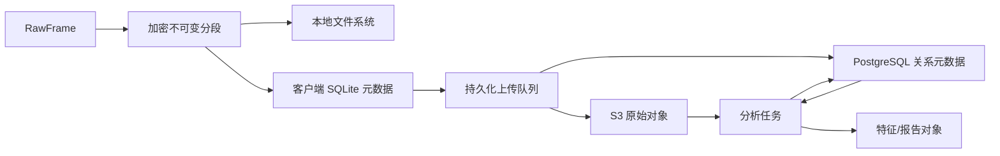
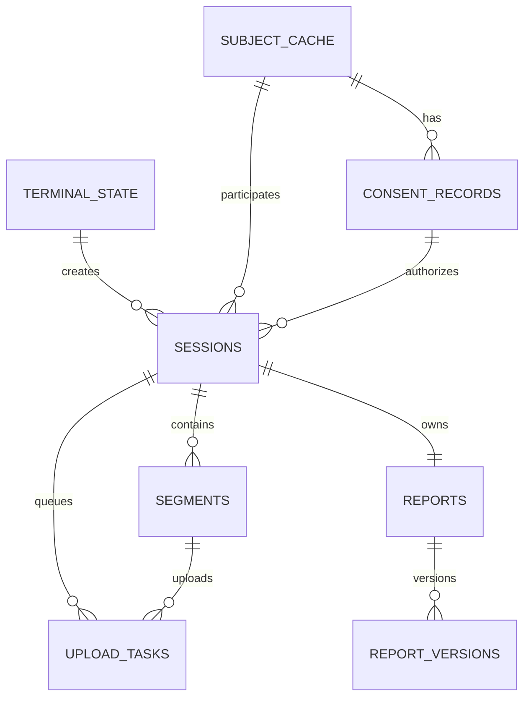
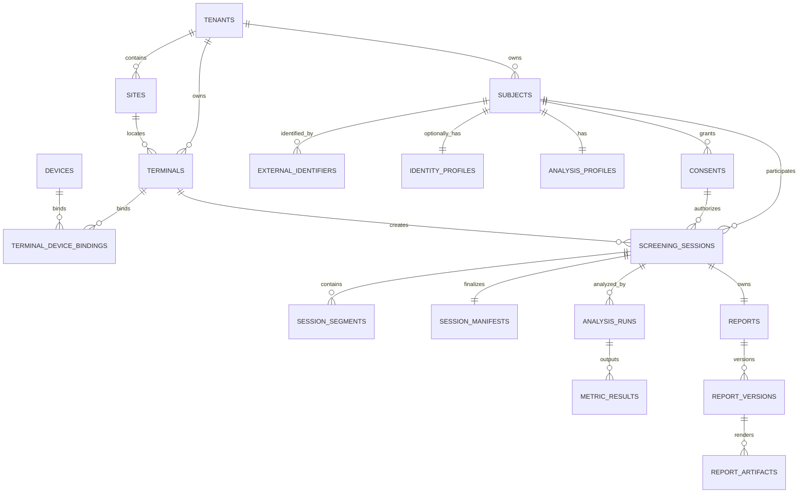

# 足底压力健康筛查与分析平台 —— 数据库设计文档

| 项目 | 内容 |
|---|---|
| 文档版本 | 1.0 |
| 状态 | 已批准设计基线 |
| 日期 | 2026-07-20 |
| 客户端存储 | SQLite WAL + 加密不可变分段 |
| 云端存储 | PostgreSQL + S3 兼容对象存储 |
| 关联文档 | [总体架构](架构设计文档.md) / [通信接口](通信接口设计文档.md) / [PRD](产品需求文档_PRD.md) |

---

## 1. 设计目标

1. 原始数据先可靠落盘，再异步上传；断网、崩溃和重启不丢失已关闭分段。
2. 客户端 SQLite 只承担本机状态和短期缓存，不成为云端权威分析数据库。
3. PostgreSQL 保存关系、状态、索引和审计；原始矩阵与大工件进入对象存储。
4. 身份、分析档案、原始测量、算法结果和内部日志逻辑隔离。
5. 测试有效性、上传、分析和报告分别建模，不使用单一 `completed` 布尔值。
6. 所有算法结果和报告可追溯到原始会话摘要、标定和版本。
7. 多租户隔离贯穿表结构、查询、索引、对象路径和审计。

本文不把逐帧 48×64 压力矩阵写入关系数据库，不把机构编号或身份证作为平台主键，也不建立跨机构自动匹配自然人的全局身份库。

---

## 2. 存储拓扑



| 数据类型 | 权威存储 | 说明 |
|---|---|---|
| 采集中的临时数据 | 本地临时文件 | 只在原子关闭前存在 |
| 已关闭原始分段 | 本地加密文件 + 云端对象存储 | 当前 MVP 服务端确认后仍保留本地副本；仅操作员显式单会话删除 |
| 终端本地状态 | SQLite | 支持恢复、补传和基础报告 |
| 机构、身份、授权和会话关系 | PostgreSQL | 带租户隔离和审计 |
| 一级特征和算法结果 | PostgreSQL 元数据 + 对象存储 | 大数组进入对象存储 |
| PDF、图表和诊断包 | 对象存储 | PostgreSQL 保存版本、摘要和权限 |

---

## 3. 通用建模约定

### 3.1 标识与时间

- 新业务对象使用应用层生成的 UUID，推荐 UUIDv7。
- `session_id` 在客户端创建会话前生成，端云保持不变。
- 外部编号保存为独立映射，不能成为 `subjects` 主键。
- PostgreSQL 使用 `timestamptz` 并保存 UTC；SQLite 使用 UTC RFC 3339 文本。
- 采集时间轴额外保存 `host_monotonic_ns`，不能用服务器时间替代。
- 表至少包含 `created_at`；可变资源包含 `updated_at`；不可变事实不改写原内容。

### 3.2 命名和类型

- 表名和字段使用 `snake_case`。
- 主键使用 `<entity>_id`；外键与被引用主键同名。
- 状态字段以 `_status` 结尾。
- 字节大小以 `_bytes` 结尾；纳秒单调时间以 `_ns` 结尾。
- 摘要字段明确算法，如 `sha256`、`manifest_sha256`。
- 测量值必须有单位列或版本化指标定义引用。

### 3.3 JSON 使用边界

JSON/JSONB 只用于版本化配置快照、清单、算法参数、解释证据和低频扩展字段。租户、受试者、会话、状态、版本、摘要、时间和外键必须使用普通列。

### 3.4 删除语义

- 原始对象、授权、算法运行、报告版本和审计是不可变事实。
- 业务停用使用 `status`、`revoked_at` 或 `archived_at`。
- 物理删除由数据处置任务根据有效保留策略执行并记录结果。
- 未配置可执行保留策略时，不自动物理删除敏感业务数据。

---

## 4. 客户端 SQLite

### 4.1 运行模式

应用启动时执行：

```sql
PRAGMA journal_mode = WAL;
PRAGMA foreign_keys = ON;
PRAGMA synchronous = FULL;
PRAGMA busy_timeout = 5000;
```

- 业务写入通过单一数据库执行器串行提交。
- UI、上传和报告线程使用短事务读取。
- SQLite 不保存分段内容，只保存相对路径、摘要和状态。
- 数据库文件和敏感字段由终端密钥保护。
- 迁移失败时禁止开始新测试，但保留恢复和诊断入口。

### 4.2 客户端 ER 图



### 4.3 客户端表清单

| 表 | 责任 |
|---|---|
| `schema_migrations` | 数据库迁移版本和摘要 |
| `terminal_state` | 激活、联网、配置、License 和配额 |
| `subject_cache` | 最小受试者引用和加密选填档案 |
| `consent_records` | 不可变授权证据 |
| `sessions` | 会话上下文和分离状态 |
| `segments` | 不可变分段元数据 |
| `upload_tasks` | 持久化上传队列 |
| `reports` | 同一会话的报告业务对象 |
| `report_versions` | 基础版和云端完整版快照 |
| `client_events` | 恢复、错误和关键状态转换 |

### 4.4 `terminal_state`

单行表，`singleton_id = 1`。

| 字段 | 类型 | 约束/说明 |
|---|---|---|
| `tenant_id/site_id/terminal_id` | TEXT | 激活后写入 |
| `enrollment_status` | TEXT | `UNENROLLED/ACTIVE/SUSPENDED/REVOKED` |
| `last_successful_online_at` | TEXT | 计算 24 小时门槛 |
| `config_version/license_version` | TEXT | 当前已验证版本 |
| `app_version` | TEXT | 客户端版本 |
| `offline_limit_hours` | INTEGER | 默认 24 |
| `pending_session_limit` | INTEGER | 默认 50 |
| `pending_bytes_limit` | INTEGER | 默认 2147483648 |
| `updated_at` | TEXT | UTC 时间 |

### 4.5 `subject_cache`

| 字段 | 类型 | 说明 |
|---|---|---|
| `subject_uuid` | TEXT PK | 平台内部 ID |
| `tenant_id` | TEXT NOT NULL | 租户 |
| `issuer/id_type` | TEXT NULL | 机构编号上下文 |
| `external_id_hmac` | BLOB NULL | 规范化编号的受控 HMAC |
| `external_id_masked` | TEXT NULL | UI 脱敏显示 |
| `identity_ciphertext` | BLOB NULL | 可选身份密文 |
| `identity_key_version` | TEXT NULL | 密钥版本 |
| `analysis_profile_json` | TEXT NOT NULL | 选填档案和缺失状态 |
| `profile_schema_version` | TEXT NOT NULL | 档案模式 |
| `sync_status` | TEXT NOT NULL | `LOCAL_ONLY/PENDING/SYNCED/CONFLICT` |
| `created_at/updated_at` | TEXT NOT NULL | UTC 时间 |

`tenant_id + issuer + id_type + external_id_hmac` 建立条件唯一索引；无编号的非实名档案不参与该唯一约束。

### 4.6 `consent_records`

| 字段 | 类型 | 说明 |
|---|---|---|
| `consent_record_id` | TEXT PK | 客户端生成 UUID |
| `subject_uuid/tenant_id` | TEXT NOT NULL | 受试者和租户 |
| `policy_version` | TEXT NOT NULL | 告知规则版本 |
| `purpose_codes_json` | TEXT NOT NULL | 用途快照 |
| `data_categories_json` | TEXT NOT NULL | 数据范围快照 |
| `evidence_type` | TEXT NOT NULL | 证据类型 |
| `operator_ref` | TEXT NULL | 操作员引用 |
| `terminal_id` | TEXT NOT NULL | 创建终端 |
| `terminal_signature` | BLOB NOT NULL | 终端签名 |
| `granted_at/revoked_at` | TEXT | 确认和撤回时间 |
| `sync_status` | TEXT NOT NULL | 同步状态 |

授权内容不可原地改写。撤回只新增撤回事实；历史会话仍引用测试发生时的授权版本。

### 4.7 `sessions`

| 字段组 | 关键字段 |
|---|---|
| 标识 | `session_id` PK、`tenant_id/site_id/terminal_id/device_id` |
| 受试者 | `subject_uuid`、`consent_record_id` |
| 测试 | `test_protocol_id`、`test_protocol_version` |
| 分离状态 | `lifecycle_status/validity_status/upload_status/analysis_status/report_status` |
| 时间 | `started_at/ended_at/start_monotonic_ns/end_monotonic_ns` |
| 版本 | `app_version/protocol_profile_version/payload_schema_version/calibration_version` |
| 快照 | `config_snapshot_json` |
| 质量与清单 | `local_quality_outcome/manifest_sha256` |
| 审计 | `created_at/updated_at` |

状态集合：

```text
lifecycle_status: DRAFT / PREFLIGHT / ACQUIRING / FINALIZING / CLOSED
validity_status:  UNKNOWN / VALID / INVALID / INCOMPLETE / FAILED
upload_status:    LOCAL_ONLY / PENDING / UPLOADING / ACKNOWLEDGED / CONFLICT
analysis_status:  NOT_REQUESTED / QUEUED / RUNNING / SUCCEEDED / FAILED / UNSUPPORTED
report_status:    NOT_AVAILABLE / BASIC_READY / CLOUD_ANALYZING / FULL_READY / CLOUD_FAILED
```

### 4.8 `segments`

| 字段 | 说明 |
|---|---|
| `segment_id` | 本地分段 ID |
| `session_id + segment_index` | 会话内唯一，索引从 0 开始 |
| `status` | 分段生命周期 |
| `relative_path` | 应用数据根目录下相对路径 |
| `start_frame_index/frame_count` | 主机成功解码序号范围 |
| `start_monotonic_ns/end_monotonic_ns` | 单调时间范围 |
| `compression/cipher/key_version/nonce` | 压缩和加密 |
| `sha256/size_bytes` | 密文完整性 |
| `sealed_at/acknowledged_at` | 关闭和服务端确认时间 |

```text
WRITING → SEALED → PENDING_UPLOAD → UPLOADING → ACKNOWLEDGED
                                ↘ RETRY_WAIT
异常：QUARANTINED / CONFLICT / CORRUPT
```

只有 `SEALED` 及之后状态可进入上传队列。`UNIQUE(session_id, segment_index)` 防止重复索引。

### 4.9 `upload_tasks`

| 字段 | 说明 |
|---|---|
| `upload_task_id` | 任务 ID |
| `session_id/segment_id` | 业务引用 |
| `resource_type` | `SESSION/SEGMENT/MANIFEST/REPORT/TELEMETRY` |
| `resource_id` | 对应资源的稳定 UUID；与类型共同构成去重范围 |
| `operation` | 对应 API 操作 |
| `status` | `PENDING/LEASED/RETRY_WAIT/SUCCEEDED/DEAD_LETTER` |
| `priority` | 数值越小优先级越高 |
| `idempotency_key/request_sha256` | 幂等语义 |
| `attempt_count/next_attempt_at` | 重试 |
| `lease_owner/lease_expires_at` | 并发租约 |
| `last_http_status/last_error_code` | 最近结果 |
| `created_at/updated_at` | 时间 |

`resource_type + resource_id + operation` 建立唯一约束。任务成功不等于会话完整，最终状态仍由服务端确认决定。

### 4.10 `reports` 与 `report_versions`

`reports` 保存 `report_id`、唯一 `session_id`、当前状态和最新版本号。

`report_versions` 保存：

| 字段 | 说明 |
|---|---|
| `report_version_id/report_id/version_number` | 不可变版本 |
| `kind` | `BASIC/CLOUD_COMPLETE` |
| `document_schema_version/document_json` | 结构化报告快照 |
| `artifact_path/artifact_sha256` | 本地 PDF 引用 |
| `algorithm_reference_json` | 本地或云端版本来源 |
| `generated_at` | 生成时间 |

`UNIQUE(report_id, version_number)`。需要修正时新增版本，不更新历史内容。

### 4.11 客户端索引

```sql
CREATE UNIQUE INDEX ux_subject_external_id
ON subject_cache(tenant_id, issuer, id_type, external_id_hmac)
WHERE external_id_hmac IS NOT NULL;

CREATE INDEX ix_sessions_recent
ON sessions(started_at DESC);

CREATE INDEX ix_sessions_pending_upload
ON sessions(upload_status, started_at)
WHERE upload_status IN ('LOCAL_ONLY', 'PENDING', 'UPLOADING');

CREATE UNIQUE INDEX ux_segments_session_index
ON segments(session_id, segment_index);

CREATE INDEX ix_upload_tasks_due
ON upload_tasks(status, priority, next_attempt_at)
WHERE status IN ('PENDING', 'RETRY_WAIT');
```

---

## 5. 云端 PostgreSQL 模块

首版使用一个 PostgreSQL 应用数据库，按 schema 保持模块边界。

| Schema | 责任 |
|---|---|
| `iam` | 机构、站点、用户、角色 |
| `device` | 终端、设备、激活、License、配置、心跳 |
| `subject` | 受试者、机构编号、身份保险库、档案、授权 |
| `screening` | 会话、分段、清单、接收问题 |
| `analysis` | 算法版本、任务、特征和指标 |
| `reporting` | 报告、版本、工件和导出审计 |
| `ops` | Outbox、审计、遥测、诊断和数据处置 |

模块不得直接修改其他 schema 的私有表；跨模块写操作通过应用服务和事务 Outbox 完成。

### 5.1 云端 ER 图



---

## 6. Schema `iam`

### 6.1 `iam.tenants`

```text
tenant_id uuid PK
name text NOT NULL
status text NOT NULL CHECK ACTIVE/SUSPENDED/CLOSED
default_retention_policy_id uuid NULL
created_at / updated_at timestamptz NOT NULL
```

### 6.2 `iam.sites`

```text
site_id uuid PK
tenant_id uuid NOT NULL FK
site_code text NOT NULL
name text NOT NULL
timezone text NOT NULL
status text NOT NULL
created_at / updated_at timestamptz NOT NULL
UNIQUE(tenant_id, site_code)
```

### 6.3 用户和角色

- `iam.users`：机构人员账号、状态和认证主体引用。
- `iam.roles`：租户管理员、操作员、报告审核、支持等角色。
- `iam.user_role_bindings`：`tenant_id/site_id/user_id/role_id` 范围绑定。
- 密码或私钥不保存在业务数据库明文字段。

---

## 7. Schema `device`

| 表 | 关键内容 |
|---|---|
| `terminals` | tenant/site/installation/status/versions/last_seen |
| `devices` | tenant/model/serial/status/capabilities |
| `terminal_device_bindings` | terminal/device/valid_from/valid_to |
| `enrollments` | activation_hash/expires/used/terminal |
| `terminal_credentials` | terminal/key_id/status/expires；不存私钥 |
| `licenses` | tenant/terminal/features/validity/signature |
| `config_versions` | schema/version/content_hash/signature |
| `terminal_config_assignments` | terminal/config/effective_at |
| `terminal_heartbeats` | terminal/time/health summary |

关键 DDL：

```sql
CREATE TABLE device.terminals (
    terminal_id uuid PRIMARY KEY,
    tenant_id uuid NOT NULL REFERENCES iam.tenants(tenant_id),
    site_id uuid REFERENCES iam.sites(site_id),
    installation_id uuid NOT NULL,
    status text NOT NULL CHECK (status IN ('ACTIVE','SUSPENDED','REVOKED')),
    app_version text,
    config_version text,
    protocol_version text,
    last_seen_at timestamptz,
    last_successful_sync_at timestamptz,
    pending_sessions integer NOT NULL DEFAULT 0 CHECK (pending_sessions >= 0),
    pending_bytes bigint NOT NULL DEFAULT 0 CHECK (pending_bytes >= 0),
    created_at timestamptz NOT NULL,
    updated_at timestamptz NOT NULL,
    UNIQUE (tenant_id, installation_id)
);
```

心跳表按 `observed_at` 月度分区。在线状态根据最近心跳计算，不覆盖历史健康证据。

---

## 8. Schema `subject`

### 8.1 受试者

```sql
CREATE TABLE subject.subjects (
    subject_uuid uuid PRIMARY KEY,
    tenant_id uuid NOT NULL REFERENCES iam.tenants(tenant_id),
    status text NOT NULL CHECK (status IN ('ACTIVE','MERGED','ARCHIVED','RESTRICTED')),
    merged_into_subject_uuid uuid REFERENCES subject.subjects(subject_uuid),
    created_at timestamptz NOT NULL,
    updated_at timestamptz NOT NULL
);
```

### 8.2 机构编号

```sql
CREATE TABLE subject.external_identifiers (
    external_identifier_id uuid PRIMARY KEY,
    tenant_id uuid NOT NULL REFERENCES iam.tenants(tenant_id),
    subject_uuid uuid NOT NULL REFERENCES subject.subjects(subject_uuid),
    issuer text NOT NULL,
    id_type text NOT NULL,
    encrypted_value bytea NOT NULL,
    normalized_hmac bytea NOT NULL,
    masked_value text NOT NULL,
    key_version text NOT NULL,
    status text NOT NULL CHECK (status IN ('ACTIVE','SUPERSEDED','REVOKED')),
    created_at timestamptz NOT NULL,
    revoked_at timestamptz
);

CREATE UNIQUE INDEX ux_external_identifier_active
ON subject.external_identifiers(tenant_id, issuer, id_type, normalized_hmac)
WHERE status = 'ACTIVE';
```

不同租户相同编号不冲突。`normalized_hmac` 使用受控查询密钥，不能以普通无盐 SHA-256 代替。

### 8.3 身份与分析档案

`subject.identity_profiles` 只保存可选姓名、联系方式的字段级密文、nonce 和密钥版本，并只授权身份服务。

`subject.analysis_profiles` 保存分析字段及缺失状态：

```text
birth_year_value / birth_year_state
age_band_value / age_band_state
sex_value / sex_state
height_cm_value / height_cm_state
weight_kg_value / weight_kg_state
foot_length_mm_value / foot_length_state
condition_tags_json / condition_tags_state
injury_tags_json / injury_tags_state
schema_version / source / updated_at
```

`DECLINED` 和 `UNKNOWN` 不得转换为 `NONE_REPORTED`。

### 8.4 授权

`subject.consents` 是不可变事实，至少包含：

```text
consent_record_id uuid PK
tenant_id / subject_uuid uuid NOT NULL
policy_version text NOT NULL
purpose_codes text[] NOT NULL
data_categories text[] NOT NULL
evidence_type text NOT NULL
operator_id / terminal_id uuid NULL
evidence_hash text NOT NULL
granted_at timestamptz NOT NULL
revoked_at timestamptz NULL
created_at timestamptz NOT NULL
```

撤回不删除旧记录。会话继续引用测试发生时的授权版本，后续处理由数据治理策略决定。

---

## 9. Schema `screening`

### 9.1 会话

```sql
CREATE TABLE screening.sessions (
    session_id uuid PRIMARY KEY,
    tenant_id uuid NOT NULL REFERENCES iam.tenants(tenant_id),
    site_id uuid REFERENCES iam.sites(site_id),
    terminal_id uuid NOT NULL REFERENCES device.terminals(terminal_id),
    device_id uuid NOT NULL REFERENCES device.devices(device_id),
    subject_uuid uuid NOT NULL REFERENCES subject.subjects(subject_uuid),
    consent_record_id uuid NOT NULL REFERENCES subject.consents(consent_record_id),
    test_protocol_id text NOT NULL,
    test_protocol_version text NOT NULL,
    validity_status text NOT NULL,
    ingest_status text NOT NULL,
    started_at timestamptz NOT NULL,
    ended_at timestamptz,
    app_version text NOT NULL,
    protocol_profile_version text NOT NULL,
    payload_schema_version text NOT NULL,
    calibration_version text NOT NULL,
    config_snapshot jsonb NOT NULL,
    manifest_sha256 text,
    created_at timestamptz NOT NULL,
    updated_at timestamptz NOT NULL,
    CHECK (validity_status IN ('UNKNOWN','VALID','INVALID','INCOMPLETE','FAILED')),
    CHECK (ingest_status IN ('RECEIVING','VERIFYING','INGESTED','QUARANTINED','CONFLICT'))
);
```

应用服务必须验证会话中的终端、设备、受试者和授权均属于同一 `tenant_id`。

### 9.2 分段

```sql
CREATE TABLE screening.session_segments (
    session_segment_id uuid PRIMARY KEY,
    tenant_id uuid NOT NULL REFERENCES iam.tenants(tenant_id),
    session_id uuid NOT NULL REFERENCES screening.sessions(session_id),
    segment_index integer NOT NULL CHECK (segment_index >= 0),
    object_key text NOT NULL,
    sha256 text NOT NULL,
    size_bytes bigint NOT NULL CHECK (size_bytes > 0),
    start_frame_index bigint NOT NULL CHECK (start_frame_index >= 0),
    frame_count integer NOT NULL CHECK (frame_count > 0),
    start_monotonic_ns bigint NOT NULL,
    end_monotonic_ns bigint NOT NULL,
    payload_schema_version text NOT NULL,
    compression text NOT NULL,
    cipher text NOT NULL,
    status text NOT NULL CHECK (status IN ('STAGED','VERIFIED','CONFLICT','QUARANTINED')),
    received_at timestamptz NOT NULL,
    verified_at timestamptz,
    UNIQUE (tenant_id, session_id, segment_index),
    UNIQUE (tenant_id, object_key)
);
```

同一索引相同摘要为幂等成功；不同摘要不更新原行，而是写入 `ingest_problems` 并将会话置为 `CONFLICT`。

### 9.3 清单和问题

`screening.session_manifests`：

```text
manifest_id / tenant_id / session_id
schema_version / manifest_sha256
segment_count / total_frames / total_bytes
manifest_json / verification_status / verified_at / created_at
UNIQUE(tenant_id, session_id)
```

`screening.ingest_problems` 保存问题类型、安全证据、首次/最近时间、状态和处置结果，不复制原始载荷。

### 9.4 完整性事务

清单验证通过时在同一事务中：

1. 锁定会话行；
2. 重算分段数量、索引、摘要、帧数和字节数；
3. 更新清单为 `VERIFIED`；
4. 更新会话 `ingest_status = INGESTED`；
5. 写入 `ops.outbox_events(session.ingested.v1)`；
6. 提交事务。

事件发布失败不回滚已确认接收状态，由 Outbox 发布器重试。

---

## 10. Schema `analysis`

### 10.1 版本注册表

| 表 | 说明 |
|---|---|
| `algorithm_versions` | 算法 ID、语义版本、能力门槛、输出模式和批准状态 |
| `model_versions` | 模型摘要、训练说明、验证状态和启停时间 |
| `pipeline_versions` | 特征和算法编排版本 |

被历史运行引用的版本不能原地修改或物理删除。

### 10.2 分析运行

```text
analysis_run_id uuid PK
tenant_id / session_id uuid NOT NULL
pipeline_version / algorithm_set_version text NOT NULL
calibration_version text NOT NULL
input_manifest_sha256 text NOT NULL
parameters_sha256 text NOT NULL
status QUEUED/RUNNING/SUCCEEDED/FAILED/UNSUPPORTED/CANCELED
capability_status SUPPORTED/DEGRADED/UNSUPPORTED
started_at / completed_at timestamptz NULL
error_code text NULL
created_at timestamptz NOT NULL
UNIQUE(session_id, pipeline_version, algorithm_set_version,
       calibration_version, input_manifest_sha256, parameters_sha256)
```

唯一约束保证同一输入和版本幂等。新算法版本创建新运行，不覆盖旧结果。

### 10.3 特征和指标

`analysis.feature_sets` 保存特征管线版本、缓存键、对象键和摘要；大型序列进入对象存储，小型摘要可保存 JSONB。

`analysis.metric_results`：

```text
metric_result_id / tenant_id / analysis_run_id
metric_id / metric_definition_version
value_numeric NULL / value_text NULL / value_json NULL
unit / interpretation_code
validation_status / evidence_json
created_at
UNIQUE(analysis_run_id, metric_id, metric_definition_version)
CHECK 恰好一个 value_* 有值
```

只有产品批准且 `validation_status = APPROVED` 的指标可以进入客户报告。

---

## 11. Schema `reporting`

`reporting.reports`：

```text
report_id uuid PK
tenant_id / session_id uuid NOT NULL
status text
latest_version integer NULL
created_at / updated_at
UNIQUE(tenant_id, session_id)
```

`reporting.report_versions`：

```text
report_version_id uuid PK
tenant_id / report_id uuid NOT NULL
version_number integer NOT NULL
kind BASIC/CLOUD_COMPLETE
report_schema_version text NOT NULL
source_analysis_run_id uuid NULL
document_json jsonb NOT NULL
document_sha256 text NOT NULL
generated_at timestamptz NOT NULL
UNIQUE(tenant_id, report_id, version_number)
```

`reporting.report_artifacts` 保存 PDF/图表的对象键、MIME 类型、大小、摘要、渲染器和模板版本。`reporting.report_exports` 保存何时由谁预览、导出或打印了哪个版本。

基础报告可同步为版本 1；云端完整报告创建版本 2 或更高。任何版本均不可原地改写。

---

## 12. Schema `ops`

### 12.1 Outbox

```sql
CREATE TABLE ops.outbox_events (
    event_id uuid PRIMARY KEY,
    event_type text NOT NULL,
    tenant_id uuid,
    aggregate_type text NOT NULL,
    aggregate_id uuid NOT NULL,
    aggregate_version bigint NOT NULL,
    correlation_id uuid,
    causation_id uuid,
    payload jsonb NOT NULL,
    occurred_at timestamptz NOT NULL,
    published_at timestamptz,
    attempt_count integer NOT NULL DEFAULT 0,
    next_attempt_at timestamptz NOT NULL
);

CREATE INDEX ix_outbox_unpublished
ON ops.outbox_events(next_attempt_at, occurred_at)
WHERE published_at IS NULL;
```

### 12.2 运营表

| 表 | 说明 |
|---|---|
| `audit_logs` | 身份访问、导出、配置、支持和管理员操作；追加写 |
| `telemetry_batches` | 批次摘要、对象键、事件数、终端和接收结果 |
| `diagnostic_packages` | 加密诊断包、摘要、授权范围和处置状态 |
| `retention_policies` | 数据类别、保留条件、依据和版本 |
| `data_disposition_jobs` | 删除、匿名化、限制处理及执行证据 |

审计、心跳和遥测元数据按时间范围分区。原始遥测正文进入专用日志存储或对象存储，不把 PostgreSQL 变成无限增长的文本日志仓库。

---

## 13. 对象存储

### 13.1 对象键

对象键只使用不可猜测内部 ID，不包含姓名、联系方式、机构编号或病历号。

```text
tenants/{tenant_id}/sessions/{session_id}/segments/{index}-{sha256_prefix}.ffps
tenants/{tenant_id}/sessions/{session_id}/manifests/{manifest_sha256}.json
tenants/{tenant_id}/analysis/{analysis_run_id}/features/{feature_sha256}.bin
tenants/{tenant_id}/reports/{report_id}/v{version}/{artifact_sha256}.pdf
tenants/{tenant_id}/diagnostics/{diagnostic_id}/{artifact_sha256}.diag
```

数据库保存：

```text
object_key / bucket_class / content_type
size_bytes / sha256 / encryption_mode / key_version
schema_version / created_at / retention_policy_id / disposition_status
```

### 13.2 不可变提交

1. 写入服务端临时对象；
2. 校验长度和 SHA-256；
3. 以最终不可变键提交；
4. 在 PostgreSQL 事务中写引用；
5. 补偿任务扫描和清理无引用临时对象。

最终键已存在且摘要相同视为幂等；摘要不同视为冲突，不能覆盖。

### 13.3 生命周期

- 未完成会话的临时对象使用短期隔离策略。
- 正式分段按租户有效保留策略管理。
- 报告工件与报告版本绑定。
- 诊断包使用更短且独立的策略。
- 删除任务先写处置计划和审计，再删除对象，最后更新处置状态。
- 数据库记录与对象状态不一致时优先保留证据并告警。

---

## 14. 多租户和敏感字段

### 14.1 租户约束

- 所有租户业务表包含 `tenant_id NOT NULL`。
- 唯一约束和高频索引以 `tenant_id` 为首列。
- 租户来自认证上下文，不信任请求体自报值。
- 跨表写入必须验证租户一致性。

### 14.2 PostgreSQL RLS

生产环境启用 Row Level Security 作为纵深防御。应用在每个事务中以受控方式设置 `app.tenant_id`，策略约束：

```sql
tenant_id = current_setting('app.tenant_id', true)::uuid
```

连接归还连接池前必须结束事务，防止租户上下文泄漏。跨租户运营任务使用独立服务角色并完整审计。

### 14.3 字段级保护

- 姓名、联系方式和外部编号明文采用应用层信封加密。
- 表保存密文、nonce、算法和 `key_version`，不保存主密钥。
- 查询用外部编号按签发方和类型规范化后计算受控 HMAC。
- 普通无盐哈希不能作为敏感编号查询索引。
- 算法角色无身份字段解密权限。
- 身份明文不进入对象键、算法输入、遥测、错误详情和报告文件名。

---

## 15. 事务边界

### 15.1 客户端关闭分段

```text
写 .tmp → 写尾部/统计 → 压缩加密 → SHA-256 → flush/fsync
→ 原子重命名 → SQLite 事务登记 SEALED → 创建 upload_task
```

文件原子关闭失败不得登记 `SEALED`；数据库提交失败由恢复扫描重建可验证引用。

### 15.2 服务端接收分段

```text
认证/租户校验 → 临时对象 → 大小/摘要校验 → 最终对象
→ PostgreSQL 幂等引用 → ACK
```

ACK 只代表单个分段已确认，不代表会话完整。

### 15.3 分析和报告

- `session.ingested.v1` 只在完整性事务提交后产生。
- 分析运行状态和结果在同一事务完成最终化。
- `analysis.completed.v1` 只引用已经持久化的运行。
- 新报告版本和 `report.published.v1` 在同一事务写入。
- 客户端按服务器版本号更新本地报告缓存。

---

## 16. 索引和性能

### 16.1 PostgreSQL 关键索引

```sql
CREATE INDEX ix_sessions_subject_time
ON screening.sessions(tenant_id, subject_uuid, started_at DESC);

CREATE INDEX ix_sessions_terminal_time
ON screening.sessions(tenant_id, terminal_id, started_at DESC);

CREATE INDEX ix_sessions_ingest_status
ON screening.sessions(tenant_id, ingest_status, created_at)
WHERE ingest_status <> 'INGESTED';

CREATE INDEX ix_segments_session
ON screening.session_segments(tenant_id, session_id, segment_index);

CREATE INDEX ix_analysis_runs_queue
ON analysis.analysis_runs(status, created_at)
WHERE status IN ('QUEUED', 'RUNNING');

CREATE INDEX ix_reports_session
ON reporting.reports(tenant_id, session_id);
```

### 16.2 查询原则

- 工作台按 `tenant_id + started_at` 游标分页。
- 受试者历史按 `tenant_id + subject_uuid + started_at` 查询。
- 大表不使用深度 `OFFSET`。
- 列表只返回摘要，报告正文和对象按需读取。
- 高频心跳、审计和遥测元数据按月分区。
- 新增索引以真实查询和 `EXPLAIN ANALYZE` 为依据。

---

## 17. 迁移、备份与恢复

### 17.1 客户端迁移

- SQLite 使用单调迁移版本和迁移内容摘要。
- 升级前检查磁盘并备份数据库元数据。
- 迁移不改写已关闭分段。
- 迁移失败回滚应用版本并保留原数据库和分段。
- 新版本读取支持窗口内的旧分段模式，或提供独立迁移工具。

### 17.2 云端迁移

- 使用 expand → migrate/backfill → contract。
- 先增加可空列或新表，再发布双读写，最后收紧约束。
- 破坏性删除在确认所有客户端和任务停止使用后执行。
- 事件和对象模式按主版本演进，历史对象不原地转换。
- 大表回填分批、可暂停、可观测。

### 17.3 恢复

客户端启动扫描 SQLite、`.tmp`、已关闭分段和报告工件；可验证临时文件恢复为 `SEALED`，不可验证文件隔离；中断的 `ACQUIRING` 会话标记 `INCOMPLETE`；未确认分段重新入队。

云端使用 PostgreSQL 持续备份和时间点恢复，对象存储启用版本/不可变策略和跨故障域冗余，并定期核对：

- 无数据库引用的对象；
- 有数据库引用但对象缺失；
- 会话缺段、重复索引和摘要不一致；
- 对象键租户前缀与数据库租户不一致。

恢复目标由部署 SLA 文档确定；在 SLA 未批准前，本文不虚构 RPO/RTO 数字。

---

## 18. 数据保留、撤回与处置

1. 每类数据绑定版本化 `retention_policy_id`。
2. 策略记录租户、数据类别、依据、保留条件、生效时间和批准人。
3. 授权撤回不直接同步物理删除，先创建数据处置任务。
4. 任务计算受影响的身份、档案、原始数据、结果、报告和备份范围。
5. 根据适用依据执行限制处理、匿名化或删除。
6. 处置结果保存不泄露内容的审计证据。
7. 已匿名化且无法重新关联的数据与可回溯档案分开管理。

---

## 19. 测试与验收

### 19.1 客户端

- 任意写入点断电后，已关闭分段摘要一致。
- SQLite 提交前后崩溃均恢复到唯一合法状态。
- 上传线程不能读取 `WRITING` 文件。
- 磁盘满、密钥不可用、数据库锁和文件篡改进入明确失败状态。
- 达到 24 小时、50 次或 2 GB 门槛时禁止新测试但允许补传。
- 服务端确认前清理任务不能删除原始分段。

### 19.2 PostgreSQL

- 外键、检查和唯一约束覆盖非法状态与重复对象。
- 不同租户相同机构编号互不冲突。
- RLS 和应用权限拒绝跨租户查询与写入。
- 会话、分段、分析运行和报告版本重复请求幂等。
- Outbox 重复发布只产生一次下游业务效果。
- 新旧迁移版本滚动部署期间读写兼容。

### 19.3 对象存储

- 相同键相同摘要幂等，相同键不同摘要拒绝覆盖。
- 对象成功/数据库失败及数据库引用/对象缺失均能检测与补偿。
- 对象键不包含身份明文。
- 报告下载令牌短时有效并受租户权限限制。
- 生命周期任务不删除未满足处置条件的对象。

### 19.4 隐私与审计

- 身份字段加密和 HMAC 查询测试通过。
- 算法角色无法读取身份保险库。
- 日志、错误和对象路径通过敏感字段扫描。
- 授权、撤回、档案合并、报告导出和支持访问均可审计。
- 数据处置任务可追踪且不会静默删除证据。

---

## 20. 发布门槛

数据库模式进入生产前必须满足：

1. SQLite 和 PostgreSQL 迁移脚本可重复验证；
2. 所有状态字段有检查约束或等价枚举测试；
3. 关键表具备租户约束、外键和幂等唯一键；
4. 分段、清单、分析和报告事务通过故障注入；
5. RLS、服务角色和连接池租户上下文通过安全测试；
6. 身份加密、HMAC 查询和密钥轮换通过评审；
7. PostgreSQL 与对象存储补偿扫描通过演练；
8. 备份恢复和数据处置流程形成操作记录。

---

## Seed MVP access model

新增关系边界为 `iam.tenant_accounts`（tenant account）、
`device.license_entitlements`（`license/2`）、`device.license_assignments`、
`device.hardware_bindings`（hardware binding）、`device.client_installations`
（client installation）、刷新会话、硬件租约和审计表。`terminal_id` 保留为
旧数据面兼容/审计字段，不表示 License 所有权。

provider-provisioned 创建 tenant 与第一组账号/License/设备；同一 tenant 后续
可 `1 -> 3 -> 2` 扩缩，关闭 assignment/binding 但保留历史贡献。机构管理员
表不是 MVP 前置条件，未来可增加多个管理员而不拆分 tenant 数据库边界。

租户、激活、Platform 使用不同数据库角色和连接池，全部 `NOBYPASSRLS`。
Platform IAM 包含 `PLATFORM_OWNER`、`PLATFORM_OPERATIONS`、`PLATFORM_SUPPORT`、
`PLATFORM_ENGINEER`；身份披露由 15 分钟 `SensitiveAccessGrant` 控制。
凭据约束为 **15-minute access token**、**30-day idle**、
**180-day absolute**；授权周期为 **6/12-month License**，客户端支持
**24-hour offline grace**。

种子部署使用 digest-verified private filesystem object store，并通过同一
ObjectStore 接口为分布式存储留出替换路径。PostgreSQL 仍是权威关系库；未来
容量迁移采用 expand/migrate/contract，不把“新建机构”解释为客户现场创建一套
物理数据库。IP:7443 is not production；正式入口要求 domain + public CA + 443。
