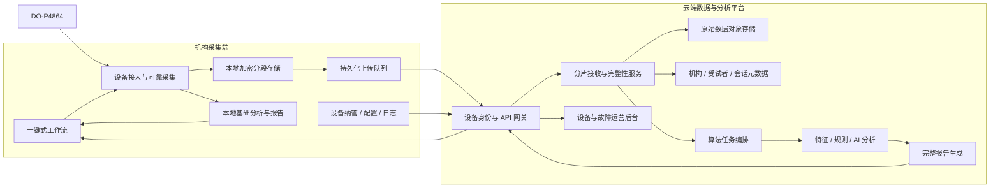
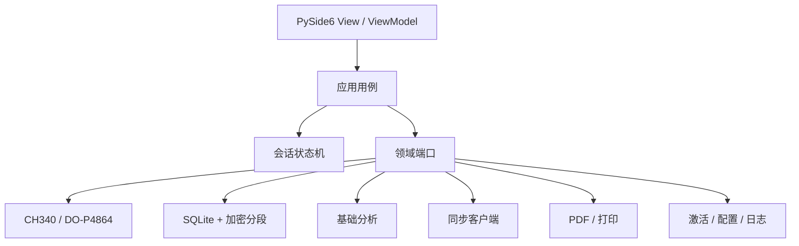
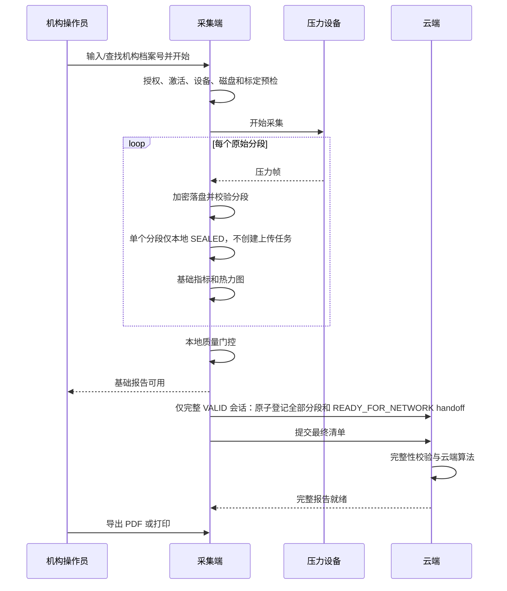
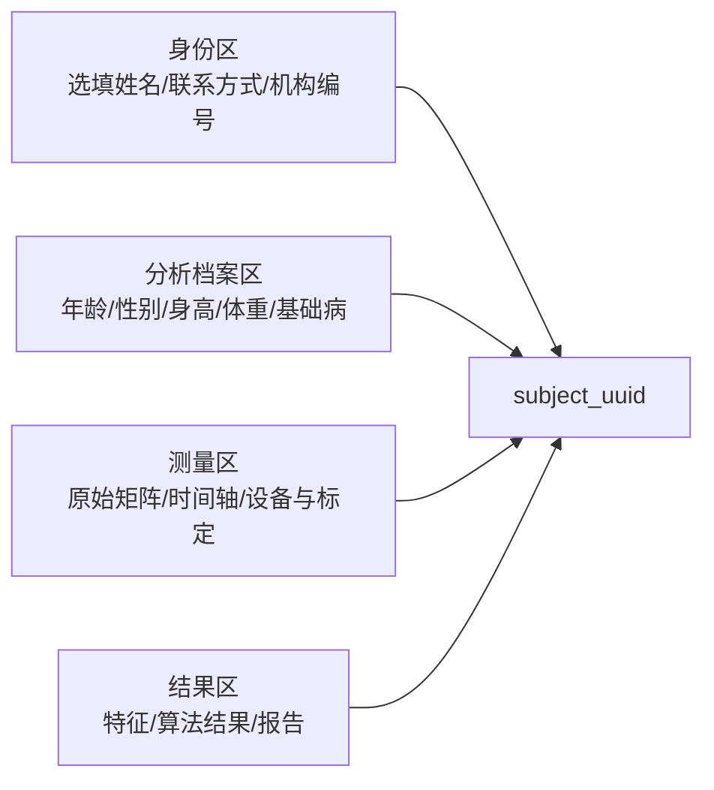

# 足底压力健康筛查与分析平台 —— 总体架构设计

| 项目 | 内容 |
|---|---|
| 文档版本 | v2.0（机构筛查与云端分析版） |
| 日期 | 2026-07-20 |
| 产品形态 | 机构采集端 + 云端数据与分析平台 |
| 产品定位 | 健康筛查、风险提示和专业分析工具，不自动输出临床诊断 |
| 目标场景 | 养老机构、体检机构、医院健康服务、体育与康复辅助分析 |
| 首款硬件 | 稻王 DO-P4864，48×64 阵列，CH340 USB 串口 |
| 客户端技术栈 | Python 3.11+ / PySide6 / NumPy |
| 云端建议技术栈 | FastAPI / PostgreSQL / S3 兼容对象存储 / 任务队列 |

---

## 1. 文档目的

本文定义平台的系统边界、模块关系、数据流、可靠性原则、安全边界和关键技术决策。具体模块设计位于 [`docs/modules/`](modules/README.md)，用户需求和界面规范位于 [`docs/产品需求文档_PRD.md`](产品需求文档_PRD.md)。

本架构优先解决两项产品要求：

1. **可靠性**：任何网络、设备、磁盘、软件或云端故障都不能造成静默数据丢失、错误报告或错误受试者关联。
2. **简单易用**：机构操作员只完成建档、站位和开始测试；设备连接、质量检查、上传、分析和恢复尽量自动完成。

---

## 2. 已批准的产品与架构决策

1. 产品只有一个一键式机构工作流，不设置普通/专业双模式。
2. 客户报告共用一套结构：筛查摘要、核心指标、专业参数与曲线。
3. 采样率、帧错误、标定状态和算法调试信息只进入内部质量记录，不进入客户报告。
4. 云端是核心能力；终端必须激活、周期联网，所有原始测试数据必须自动上传。
5. 采用“本地加密暂存 + 渐进式自动上传 + 断点续传”，短时断网不破坏当前测试。
6. 离线宽限期为 24 小时；待上传上限为 50 次或 2 GB，达到任一上限后限制新测试。
7. 本地提供热力图和基础报告兜底；云端完成复杂算法和 AI 增强分析。
8. 基础报告和完整报告属于同一报告 ID 的不同版本，不是两个独立业务对象。
9. 客户端上传原始数据，不上传可由服务器重算的一级算法特征。
10. 不强制收集身份证；使用平台 `subject_uuid` 以及机构档案号、病历号、体检号或住户编号关联历史记录。
11. 姓名、联系方式等直接身份信息选填，并与分析数据隔离存储。
12. 报告由合作机构通过 PDF 或打印交付，不建设受试者账号、二维码领取或公开链接。
13. 故障日志和设备健康信息默认自动上传；持续失败时提供诊断包导出兜底。

---

## 3. 产品边界与术语

### 3.1 产品边界

平台提供：

- 足底压力数据采集、显示和可靠保存；
- 基础筛查结果与风险提示；
- 经验证的专业参数、曲线和云端增强分析；
- 机构内受试者档案和历次记录；
- 原始数据回收、算法重算、设备运维和问题诊断；
- PDF 报告和打印。

平台不提供：

- 自动疾病诊断、处方或治疗建议；
- 超出硬件采样率和标定能力的指标承诺；
- 面向受试者的账号、公开报告链接或二维码领取；
- 将内部质量分数包装为客户可见的医学结论。

### 3.2 核心术语

| 术语 | 定义 |
|---|---|
| 机构 | 与平台合作的养老、体检、医疗健康或体育服务单位 |
| 站点 | 机构下的具体安装和运营地点 |
| 终端 | 安装采集端软件的 Windows/macOS 计算机 |
| 设备 | 足底压力垫及其控制板/接收器 |
| 受试者 | 接受筛查或分析的人，不要求平台注册账号 |
| 会话 | 一次完整测试，从建档确认到采集结束 |
| 原始数据 | 设备输出的压力计数、时间轴及质量标志 |
| 基础报告 | 本地能力生成的即时兜底报告 |
| 完整报告 | 云端复杂算法完成后生成的增强版本 |
| 内部质量记录 | 仅研发、售后和系统使用的数据质量与故障证据 |

---

## 4. DO-P4864 硬件基线

依据仓库中的《DO-P4864 手册》：

| 项目 | 已确认值 | 架构影响 |
|---|---|---|
| 阵列 | 48×64，共 3072 点 | 单帧载荷固定为 6144 bytes |
| 数据格式 | 12 bit，小端 uint16 承载 | 解码后屏蔽至 12 bit，原始计数保留 |
| 串口 | CH340，1,000,000 baud | 按 8N1 理论上限约 100 KB/s |
| 帧长 | 6151 bytes | 约 12 Hz 时为 73.8 KB/s |
| 当前帧率 | 约 12 Hz | UI 30 FPS 不等于 30 Hz 新数据 |
| 校验 | 单字节补码 CheckSum | 不是 CRC16 |
| 帧序号/设备时钟 | 当前协议未提供 | 不能精确审计设备端漏发，只能记录主机接收质量 |

当前线路需求：12 Hz 约 0.74 Mbps；30 Hz 约 1.85 Mbps；50 Hz 约 3.08 Mbps；100 Hz 约 6.15 Mbps。因此首版以 **48×64 / 12 Hz / 1 Mbps** 为真实交付基线。服务器算法不能弥补硬件采样不足；步态指标必须逐项声明最低采样率并通过验证后开放。

---

## 5. 总体架构



### 5.1 架构形态

- 采集端采用模块化单体和端口/适配器，避免本机微服务化。
- 云端按业务能力拆分服务边界，首版可部署为模块化后端，不强制一开始拆成大量微服务。
- 采集链路、本地分析链路和上传链路彼此隔离；上传和云端故障不能拖慢串口采集。
- 原始数据先可靠落盘再上传，内存流不是唯一数据源。
- 云端算法只消费完整、校验通过且有有效授权上下文的会话。

---

## 6. 机构采集端架构



客户端执行上下文：

| 执行上下文 | 职责 |
|---|---|
| UI 主线程 | Qt 事件循环、用户输入、轻量展示 |
| 设备线程 | 阻塞串口读取、协议解析、快速质量检查 |
| 分段写入线程 | 原始帧批量写入、校验、原子关闭分段 |
| 本地分析任务 | 热力图、COP 和基础指标，不阻塞采集 |
| 上传任务 | 读取已关闭分段、断点续传、重试 |
| 报告任务 | 本地基础 PDF、云端完整 PDF 下载与打印 |

客户端不把一个正在写入的大型 HDF5 文件同时交给上传线程读取。每 5–10 秒形成一个不可变加密分段，完成 `write → fsync → checksum → atomic rename` 后仅登记本地 `SEALED` 证据。全部阶段完成且最终质量为 `VALID` 时，才将全量分段与 `READY_FOR_NETWORK` handoff 原子登记给上传线程；会话结束后可生成本地归档索引或 HDF5 文件供回放。

---

## 7. 云端架构

### 7.1 服务边界

| 服务 | 职责 |
|---|---|
| 设备身份与 API 网关 | 终端证书、机构/站点绑定、限流、请求鉴权 |
| 会话服务 | 创建会话、状态机、幂等键、最终清单 |
| 数据接收服务 | 分片上传、摘要校验、缺段查询、完整性确认 |
| 身份与档案服务 | 平台受试者 UUID、机构外部编号、选填档案 |
| 授权记录服务 | 版本化告知与授权记录、撤回和用途范围 |
| 算法编排服务 | 算法版本选择、任务重试、资源配额、结果状态 |
| 算法运行时 | 一级特征、规则、统计和 AI 模型推理 |
| 报告服务 | 同一报告 ID 的基础/完整版本、PDF 工件 |
| 设备运营服务 | 心跳、版本、配置、升级、离线门槛和 License |
| 可观测性服务 | 日志、指标、追踪、告警和诊断包 |

### 7.2 部署原则

- 首版按模块化后端部署，数据库和对象存储独立；当吞吐和团队边界明确后再拆服务。
- 原始数据进入对象存储，关系元数据进入 PostgreSQL，不把大矩阵直接塞入关系库。
- 算法任务异步执行；API 请求不等待长时间算法完成。
- 任务按 `session_id + algorithm_version` 幂等，失败可重试但不能产生重复正式结果。
- 算法容器无权读取直接身份字段。

---

## 8. 端到端数据流

### 8.1 一次正常测试



### 8.2 短时断网

1. 当前测试继续采集并生成基础报告。
2. 单个加密分段保持本地 `SEALED`；只有完整 `VALID` 会话在不可变正式晋升时原子形成 `READY_FOR_NETWORK` handoff，随后该 handoff 使用持久化指数退避。
3. 网络恢复后仅租赁既有 handoff，先查询服务端状态，再对该会话补传缺段。
4. 24 小时、50 次或 2 GB 任一门槛达到后限制新测试。
5. 既有报告、当前测试收尾和上传恢复不受限制。

### 8.3 数据质量失败

1. 内部质量门控记录失败原因。
2. 客户界面只显示通俗重试提示，不展示技术质量分数。
3. 不生成客户报告，不把失败会话标记为成功。
4. 原始数据和内部日志按本地诊断策略保留，可供受控复盘；质量失败、取消、中断或不完整会话不得自动创建网络 handoff 或上传。

---

## 9. 状态模型

### 9.1 测试会话状态

```text
DRAFT → PREFLIGHT → ACQUIRING → FINALIZING
      → BASIC_READY → UPLOADING → CLOUD_ANALYZING → FULL_READY

异常终态：INVALID / INCOMPLETE / FAILED
```

- `INVALID`：数据质量不足，需要重新测试。
- `INCOMPLETE`：断电、拔线或写盘失败导致会话不完整。
- `FAILED`：系统错误且无法完成安全收尾。
- 上传失败不是测试失败；它只改变同步状态。

### 9.2 分段状态

```text
WRITING → SEALED（仅本地不可变文件）

完整 VALID 会话原子正式晋升后：
READY_FOR_NETWORK → UPLOADING → CLOUD_CONFIRMED
                         ↘ RETRY_WAIT
                  异常：CONFLICT / BLOCKED
```

单个 `SEALED` 分段永不直接入队；只有所有阶段完整且最终质量为 `VALID` 时，才原子登记全部原始分段和一个 `READY_FOR_NETWORK` handoff。`INVALID`、取消、中断、不完整、缺阶段或晋升失败均不上传。

### 9.3 报告状态

```text
NOT_AVAILABLE → BASIC_READY → CLOUD_ANALYZING → FULL_READY
                                     ↘ CLOUD_FAILED → RETRYING
```

同一 `report_id` 下使用不可变 `report_version`。完整报告不能静默覆盖已导出的基础报告。

---

## 10. 数据架构

### 10.1 主要标识

| 标识 | 用途 | 是否对客户可见 |
|---|---|---|
| `tenant_id` | 合作机构隔离 | 否 |
| `site_id` | 机构站点 | 可选 |
| `terminal_id` | 纳管终端 | 否 |
| `device_id` | 压力设备 | 内部/设置页 |
| `subject_uuid` | 平台受试者主键 | 否 |
| `external_subject_id` | 机构档案号/病历号/体检号 | 是，脱敏显示 |
| `session_id` | 一次测试 | 内部/支持编号 |
| `report_id` | 同一报告业务对象 | 内部 |
| `report_version` | 基础与完整报告版本 | 报告页脚可见 |

### 10.2 数据分区



- 身份区字段级加密，使用受控查询索引；不得进入算法任务、日志、对象路径。
- 分析档案允许缺失；必须区分“明确无”“未知”“拒绝提供”和“不适用”。
- 原始测量数据是算法源数据，一级特征由服务器按版本重算。
- 算法结果必须记录输入会话、算法/模型版本、参数、标定和生成时间。

### 10.3 原始分段清单

```text
session_id
segment_index
start_frame_index / frame_count
start_monotonic_ns / end_monotonic_ns
payload_schema_version
compression
cipher
sha256
size_bytes
```

最终会话清单包含所有分段摘要。云端只有在分段齐全、摘要一致后才能将会话标记为 `INGESTED`。

---

## 11. 受试者、授权与机构隔离

- 不强制身份证；机构外部编号是历史关联的主要业务入口。
- 外部编号必须包含 `tenant_id + issuer + id_type + normalized_value` 上下文。
- 不同机构默认不能通过编号互相匹配受试者。
- 重复或冲突档案不能自动合并，必须由有权限的机构人员确认。
- 首次建档进行简短、清晰、可追溯的授权确认；相同目的和范围的后续测试复用有效授权。
- 用途、数据种类、接收方或规则实质变化时重新确认。
- 服务必需的数据处理和额外算法研发/科研用途分别记录授权范围。
- 每次会话绑定当时有效的授权记录版本。

具体字段和授权交互见 [`08-subject-consent.md`](modules/08-subject-consent.md)。

---

## 12. 报告架构

客户报告固定包含：

1. 筛查摘要与风险提示；
2. 核心指标和通俗解释；
3. 专业参数、热力图、COP 轨迹和原始曲线。

内部质量详情不进入客户报告。数据质量不合格时直接阻止报告生成，而不是生成一份带大量免责文字的报告。

基础报告由本地固定版本算法生成；完整报告由云端版本化算法生成。两者共享报告 ID，但分别保存 PDF 快照、算法版本和生成时间。机构端只提供查看、导出 PDF 和打印。

---

## 13. 可靠性设计

### 13.1 不变量

1. 未可靠落盘的数据不得只存在于上传内存队列。
2. 未通过质量门控的会话不得生成客户报告。
3. 服务端未确认的数据不得按正常保留策略删除。
4. 任何重试必须幂等。
5. 上传失败不得阻塞采集或把有效测试改成失败。
6. 云端算法失败不得使本地基础报告不可用。
7. 受试者冲突不得自动合并。
8. 报告版本不得静默覆盖。

### 13.2 故障响应

| 故障 | 客户行为 | 内部行为 |
|---|---|---|
| 串口断开 | 当前测试停止并提示重新检测 | 保存完整分段、标记 INCOMPLETE、上传日志 |
| 数据质量不足 | 提示重新站稳后检测 | 记录质量原因，状态 INVALID |
| 磁盘不足/写入失败 | 阻止开始或安全停止 | 告警、诊断日志、禁止继续采集 |
| 网络断开 | 当前测试和基础报告继续 | 分段排队、自动重试、应用门槛 |
| 云端分析失败 | 基础报告继续可用 | 幂等重试、运营告警 |
| 应用崩溃/断电 | 下次启动提示恢复 | 扫描未完成分段和会话，禁止误报成功 |
| PDF 生成失败 | 提示重试或联系支持 | 保留报告数据和错误证据 |

### 13.3 验收基线

- 真机连续采集 30 分钟，无静默数据丢失；
- 强制断网、慢网、乱序和重复响应下上传最终一致；
- 强制断电后可识别和恢复已关闭分段；
- 队列满、磁盘满和数据库故障均进入安全状态；
- 相同算法任务重复执行不产生不同业务结果或重复报告；
- 机构和受试者隔离测试无越权访问。

---

## 14. 安全与隐私架构

- 终端使用设备证书或等价的强设备身份，不使用写死的共享密钥。
- 传输采用 TLS；本地分段、身份字段和云端存储加密。
- 机构级租户隔离贯穿 API、数据库查询、对象存储路径和审计。
- 算法运行身份无权访问姓名、联系方式和外部编号明文。
- 日志默认去除身份字段和原始健康内容，使用会话 ID 关联。
- 报告 PDF 属于敏感工件，存储和下载使用受控权限，不生成永久公开 URL。
- 保存授权、访问、导出、配置变更、远程支持和管理员操作审计。
- 建立数据保留、删除、导出、撤回和安全事件响应流程。
- 上线前完成个人信息保护影响评估、威胁建模和第三方依赖清单审查。

---

## 15. 可观测性与运营

云端运营后台至少展示：

- 机构、站点、终端和设备在线状态；
- 当前软件、协议和配置版本；
- 最近心跳、离线时长、待传次数和字节数；
- 采集错误、上传错误、云端任务失败和报告失败；
- License、激活和远程停用状态；
- 自动上传的结构化日志与错误编号；
- 诊断包接收、处理和关联工单。

客户端只显示可执行的通俗提示，复杂堆栈和内部质量数据进入云端日志。

---

## 16. 模块地图

跨模块和跨网络的具体契约见[通信接口设计文档](通信接口设计文档.md)，客户端 SQLite、云端 PostgreSQL 与对象存储的字段、约束和事务边界见[数据库设计文档](数据库设计文档.md)。

| 编号 | 模块文档 | 主要职责 |
|---|---|---|
| 01 | [`01-client-workflow.md`](modules/01-client-workflow.md) | 客户端外壳、一键流程、状态协调 |
| 02 | [`02-device-acquisition.md`](modules/02-device-acquisition.md) | 设备、协议、采集和实时质量 |
| 03 | [`03-local-session-spool.md`](modules/03-local-session-spool.md) | 本地会话、加密分段、崩溃恢复 |
| 04 | [`04-local-analysis.md`](modules/04-local-analysis.md) | 热力图、基础指标、质量门控 |
| 05 | [`05-sync-upload.md`](modules/05-sync-upload.md) | 渐进上传、队列、断点续传 |
| 06 | [`06-cloud-ingestion.md`](modules/06-cloud-ingestion.md) | 云端接收、完整性、对象存储 |
| 07 | [`07-cloud-analysis.md`](modules/07-cloud-analysis.md) | 特征、算法、AI 和版本化重算 |
| 08 | [`08-subject-consent.md`](modules/08-subject-consent.md) | 机构档案号、选填信息、授权记录 |
| 09 | [`09-reporting.md`](modules/09-reporting.md) | 基础/完整报告、PDF 和打印 |
| 10 | [`10-device-management.md`](modules/10-device-management.md) | 激活、心跳、配置、License、升级 |
| 11 | [`11-observability-support.md`](modules/11-observability-support.md) | 日志、监控、诊断包和运维 |

---

## 17. 建议项目结构

```text
FeetForcePlate/
├── src/feetforceplate/
│   ├── app/                    # 用例、状态机、依赖组装
│   ├── domain/                 # 帧、会话、报告、质量、端口
│   ├── acquisition/            # 串口、协议、分段管线
│   ├── local_analysis/         # 本地基础算法
│   ├── sync/                   # 持久化上传队列
│   ├── infrastructure/         # SQLite、文件、HTTP、凭据、PDF
│   └── presentation/qt/        # View、ViewModel、控件和资源
├── cloud/
│   ├── api/                    # 网关、会话、档案和报告 API
│   ├── ingestion/              # 分片与完整性
│   ├── analysis/               # 任务编排与算法运行时
│   ├── reporting/              # 云端报告
│   └── operations/             # 设备与可观测性后台
├── tests/
│   ├── unit/
│   ├── contract/
│   ├── integration/
│   ├── reliability/
│   └── fixtures/
├── docs/
└── packaging/
```

---

## 18. 分阶段交付

| 阶段 | 范围 | 关键门槛 |
|---|---|---|
| P0 硬件基线 | 真机抓包、协议 fixture、采样率/抖动/校验和标定资料 | 可复现硬件报告 |
| P1 可靠采集 | 设备、状态机、加密分段、恢复、模拟器 | 30 分钟真机、无静默丢失 |
| P2 一键筛查 | 建档、授权、自检、热力图、基础报告 | 操作员可独立完成标准测试 |
| P3 云端闭环 | 激活、渐进上传、原始数据存储、设备运营 | 断网补传和最终一致性通过 |
| P4 完整报告 | 云端特征、经验证算法、版本化报告 | 基础/完整报告状态闭环 |
| P5 商业运营 | License、升级、监控、支持、机构规模化 | 多租户安全与运维验收 |

---

## 19. 仍需验证的产品事实

1. 不同机构档案号的实际格式、是否可扫描及重复规则；
2. 一次标准筛查的姿势、时长、重测规则和现场空间；
3. 基础报告和完整报告各自允许包含的指标清单；
4. DO-P4864 的标定资料、长期漂移、坏点和个体差异；
5. 当前 12 Hz 下各专业参数的有效性与验证方法；
6. 云端完整报告的目标完成时延和峰值并发；
7. 数据保留期限、额外算法研发用途和正式授权文本；
8. Windows 目标硬件、打印机和机构网络的真实环境基线。

---

## Seed MVP access model

当前组合根是 provider-provisioned tenant account，而不是终端拥有 License。
`license/2` 关系为 tenant account → License assignment → hardware binding；
client installation 是可更换电脑的会话与刷新审计身份。租户可以动态完成
`1 -> 3 -> 2` 组扩缩，关系历史关闭但 tenant 数据不迁移。

租户凭据使用 `feetforceplate-tenant` audience 的 **15-minute access token**、
**30-day idle** / **180-day absolute** 刷新窗口；Platform 使用独立
`feetforceplate-platform` audience 和密钥。License 是 **6/12-month License**，
离线执行遵循 **24-hour offline grace**。在线 10 分钟硬件租约可阻止并发使用；
离线跨电脑全局排他仍不能证明。

Platform 角色是 `PLATFORM_OWNER`、`PLATFORM_OPERATIONS`、`PLATFORM_SUPPORT`、
`PLATFORM_ENGINEER`。所有应用角色均为 `NOBYPASSRLS`；支持人员必须持有
15 分钟 `SensitiveAccessGrant` 才能读取身份。种子对象使用 private filesystem
object store，接口保持 ObjectStore 可替换，后续可迁移到分布式对象存储和
托管 PostgreSQL，而不改变业务契约。IP:7443 不是 production；正式入口为
domain + public CA + 443。
