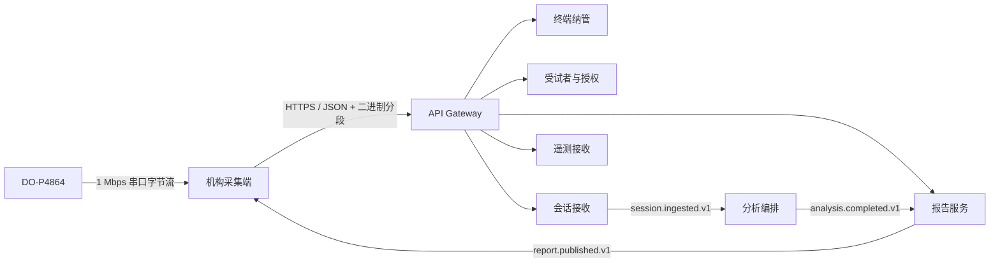
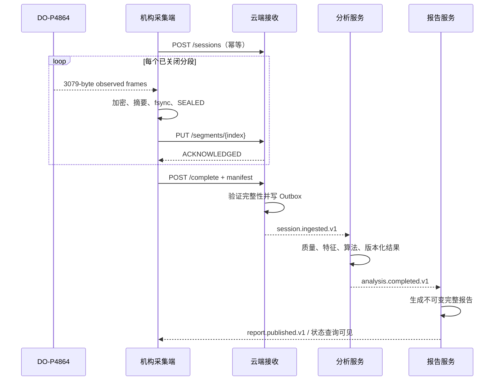
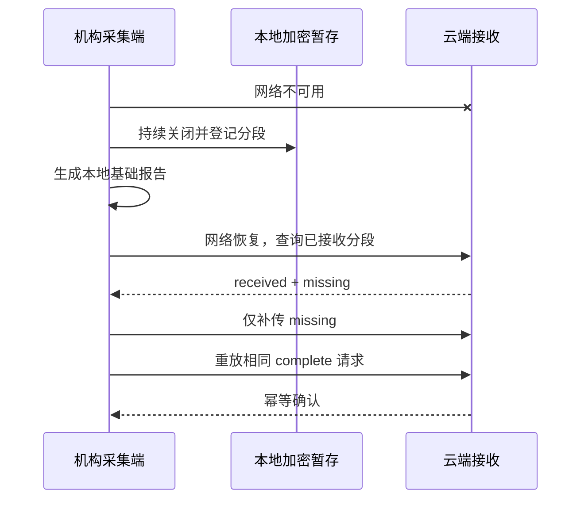

# 足底压力健康筛查与分析平台 —— 通信接口设计文档

| 项目 | 内容 |
|---|---|
| 文档版本 | 1.2 |
| 状态 | 已批准设计基线 |
| 日期 | 2026-07-21 |
| 适用范围 | DO-P4864、机构采集端、云端平台内部接口 |
| 关联文档 | [总体架构](架构设计文档.md) / [数据库设计](数据库设计文档.md) / [PRD](产品需求文档_PRD.md) |

---

## 1. 目的与范围

本文把设备、客户端和云端之间的通信约定收敛为可实现、可测试、可版本化的契约。目标是保证：

1. 串口噪声、断网、超时和重复请求不会造成静默数据丢失；
2. 采集、上传、分析和报告相互解耦，慢网络或慢算法不阻塞采集；
3. 所有写接口具备明确的幂等、重试和冲突语义；
4. 租户、终端、会话、分段、算法和报告可以端到端追踪；
5. 客户端只展示通俗状态，技术细节通过内部接口和日志回收。

本文覆盖：

- DO-P4864 串口帧协议和主机侧接收契约；
- 机构采集端到云端的 HTTPS REST 接口；
- 终端激活、心跳、配置、License 和升级接口；
- 受试者引用、授权、会话、分段、分析、报告和遥测接口；
- 云端模块之间的版本化异步事件；
- 统一认证、错误、幂等、超时、重试和契约测试规则。

本文不覆盖：

- 医院 HIS、LIS、EMR 或体检系统第三方集成；
- 受试者公开 API、二维码领取、永久公开报告链接；
- 设备固件下行控制协议。当前 DO-P4864 资料未定义正式下行命令。

---

## 2. 接口全景



首版云端采用模块化 FastAPI 应用。模块可以部署在同一进程中，但不得通过其他模块的私有数据库表模拟接口；跨模块副作用通过应用服务或事务 Outbox 事件完成。

---

## 3. 通用 HTTP 契约

### 3.1 基础约定

| 项目 | 约定 |
|---|---|
| 协议 | HTTPS；生产环境拒绝明文 HTTP |
| API 前缀 | `/v1` |
| JSON 类型 | `application/json; charset=utf-8` |
| 二进制分段 | `application/vnd.feetforceplate.segment.v1+octet-stream` |
| 时间 | UTC RFC 3339，例如 `2026-07-20T07:15:30.123Z` |
| 标识 | UUID 字符串；`session_id` 由客户端在创建会话前生成 |
| 金额/测量值 | JSON number；必须同时提供单位或单位定义引用 |
| 分页 | 游标分页：`limit` + `cursor`，默认 50，最大 250 |
| 空值 | 未知值使用 `null` 或显式缺失状态，不用空字符串代替 |
| 压缩 | JSON 可使用 `gzip`；分段自身已压缩时不得重复压缩 |

### 3.2 请求头

| 请求头 | 必填范围 | 说明 |
|---|---|---|
| `Authorization` | 激活后全部接口 | `Bearer <short-lived-token>` 或等价设备凭据 |
| `X-Terminal-ID` | 终端接口 | 纳管终端 UUID；服务端必须与凭据绑定关系交叉验证 |
| `X-Correlation-ID` | 全部接口 | 客户端生成 UUID；响应原样返回 |
| `Idempotency-Key` | 所有创建和状态变更请求 | 同一业务动作重试时保持不变 |
| `X-Schema-Version` | 版本化载荷 | 例如 `session-manifest/1` |
| `X-Content-SHA256` | 分段、清单、诊断包 | 小写十六进制 SHA-256 |
| `If-None-Match` | 配置、License、报告查询 | 支持条件请求和减少重复下载 |

`tenant_id` 来自认证上下文。载荷中的 `tenant_id` 仅用于交叉校验，不能自行决定请求所属机构。

### 3.3 成功响应

单对象接口返回资源本身，并附关联信息：

```json
{
  "data": {
    "session_id": "019c...",
    "ingest_status": "RECEIVING"
  },
  "meta": {
    "request_id": "019c...",
    "correlation_id": "019c...",
    "server_time": "2026-07-20T07:15:30.123Z"
  }
}
```

创建成功使用 `201 Created`；幂等重放已经存在的相同结果可以返回 `200 OK`。异步任务受理使用 `202 Accepted`。成功且无响应体的更新使用 `204 No Content`。

### 3.4 错误响应

```json
{
  "error": {
    "code": "E-SYN-409",
    "message": "同一分段索引已存在不同内容",
    "retryable": false,
    "action": "EXPORT_DIAGNOSTIC",
    "details": {
      "session_id": "019c...",
      "segment_index": 3
    }
  },
  "meta": {
    "request_id": "019c...",
    "correlation_id": "019c..."
  }
}
```

`message` 可用于操作员界面的通俗提示；`details` 只包含安全上下文，不包含姓名、完整机构编号、令牌或原始压力数据。

### 3.5 HTTP 与业务错误映射

| HTTP | 场景 | 客户端行为 |
|---|---|---|
| 400 | 模式或字段非法 | 不重试；隔离任务并记录错误 |
| 401 | 凭据无效或过期 | 刷新/轮换一次，仍失败则进入支持状态 |
| 403 | 终端停用、跨租户、权限不足 | 不重试；限制对应动作并告警 |
| 404 | 资源不存在 | 查询停止；写操作先核对父资源 |
| 409 | 幂等键冲突、摘要冲突、非法状态跳转 | 不覆盖；进入人工/支持处置 |
| 412 | ETag 或版本前置条件失败 | 重新获取最新资源后决定动作 |
| 413 | 载荷超过限制 | 不按原请求重试；调整合法分片方式 |
| 422 | 语义校验失败 | 不自动重试；修复数据或隔离 |
| 429 | 限流 | 按 `Retry-After` 重试，不影响采集 |
| 500/502/503/504 | 服务暂时失败 | 指数退避加随机抖动 |

### 3.6 幂等规则

1. `POST` 创建类接口必须带 `Idempotency-Key`；服务端保存请求摘要和结果引用。
2. 相同键、相同请求摘要返回第一次的业务结果。
3. 相同键、不同请求摘要返回 `409 E-API-409`，不得覆盖。
4. `PUT /sessions/{id}/segments/{index}` 的业务唯一键是 `tenant_id + session_id + segment_index`。
5. 相同分段索引和相同 SHA-256 返回成功；相同索引不同 SHA-256 返回 `409 E-SYN-409`。
6. 异步事件的消费者以 `event_id` 去重，以聚合版本防止乱序覆盖。

---

## 4. 认证与终端身份

### 4.1 首次激活

```http
POST /v1/terminals/enroll
Content-Type: application/json
Idempotency-Key: 019c...
X-Correlation-ID: 019c...
```

```json
{
  "activation_code": "ABCD-EFGH",
  "installation_id": "019c...",
  "client_public_key": "base64url...",
  "system": {
    "os": "windows",
    "os_version": "11",
    "app_version": "0.1.0"
  }
}
```

成功响应绑定 `tenant_id/site_id/terminal_id`，返回短期激活凭据或证书签发结果、受信任服务端信息和初始配置版本。激活码成功使用后立即失效，不能跨租户使用。

### 4.2 凭据轮换

```http
POST /v1/terminals/{terminal_id}/credentials/rotate
```

轮换要求旧凭据仍有效或通过受控恢复流程。安装包中不得包含长期共享密钥。吊销终端后，服务端拒绝创建新会话和下载新配置，但允许受控上传已存在的本地数据，具体权限由吊销原因决定并审计。

### 4.3 重放防护

- 访问凭据短期有效；
- 写请求包含幂等键、关联 ID 和服务端可验证的终端身份；
- 高风险接口可要求请求时间与一次性 nonce；
- 服务端允许有限时钟偏差，但采集时间轴仍以主机单调时钟为准。

---

## 5. DO-P4864 串口协议

### 5.1 物理和数据基线

| 项目 | 值 |
|---|---|
| 传输 | CH340 USB 转串口 |
| 波特率 | 1,000,000 baud |
| 串口格式 | 首版配置 8N1；作为 P0 真机验证项 |
| 阵列 | 48 × 64，共 3072 点 |
| 单点数据 | 原始 `uint8` 字节；硬件层可按 V1 曲线生成 `estimated_force_n`，但不伪造已认证 `normal_force_n` |
| 当前运行时帧率基线 | **20.7 Hz**；60 秒空板记录 1,242 帧，10 分钟记录约 20.6 Hz。当前紧凑帧 profile 的采集监控、回放与显示数据更新均以 20.7 Hz 作为默认名义输入速率；实际会话仍记录主机单调时间，不伪造设备时间戳 |
| 当前单帧长度 | 3079 bytes |
| 设备帧序号 | 无 |
| 设备时间戳 | 无 |
| 正式下行命令 | 当前资料未定义 |

**运行时标准。** 对本节定义的 `observed_compact_8bit` profile，当前真机实测的
20.7 Hz 是唯一可用的默认采集节律；历史 PDF 的“约 12 Hz”不再作为该 profile 的
运行时、显示更新或回放速率基线。20.7 Hz 是已观测的工作基线，不是设备可达到的
最高帧率承诺；每个会话仍须以接收时的主机单调时间计算实际到达间隔、缺帧和抖动。

### 5.2 帧布局

| 偏移 | 长度 | 字段 | 值/说明 |
|---:|---:|---|---|
| 0 | 2 | 帧头 | `0xFF 0xAA` |
| 2 | 2 | 长度候选 | 当前观察为 `0x0C 0x07`；与帧总长矛盾，**仅记录，不作为硬过滤条件** |
| 4 | 1 | 功能码 | `0x01` |
| 5 | 3072 | 内容 | 3072 个原始 `uint8` 字节，按列优先映射到 48 行 × 64 列 |
| 3077 | 1 | CheckSum 候选 | 记录、计数并产生质量标记；当前不作为丢帧条件 |
| 3078 | 1 | 帧尾 | `0xFA` |

真机四角加载验证确认内容的物理坐标顺序：第 1 个 48-byte 区间填充第 0 列的
第 0–47 行（上到下），第 2 个 48-byte 区间填充第 1 列，依次直到第 63 列。
当前接口解码为：

```text
matrix = uint8(frame[5:3077]).reshape((48, 64), order="F")
```

该映射在一次独立重复的四角测试中与物理空间一致：左上 `(0.2, 0.4)`、右上
`(0.4, 62.6)`、左下 `(43.4, 0.2)`、右下 `(45.7, 62.6)`，坐标为 `(行, 列)`。
这是**字节到传感点坐标**的真机验证，不代表原始 `uint8` 值已经是标定压力、物理
单位或健康结论。

`0x1807`、6,144-byte 内容、`uint16`/12-bit 与偏移 6,150 的帧尾不再是
当前接口定义，也不得被运行时代码用作默认帧长或解析规则。它们只保留为
用户提供的历史协议截图来源。截图中“从左到右逐行排列”的声明亦已被上述真机
四角验证证伪；当前实现必须以列优先 48×64 映射为准。RAY-78 evidence 保留两者
的冲突记录，等待供应商确认或新的匹配 golden fixture。

### 5.2.1 硬件质量与本地交接

硬件层在本地完成整项有效性门控：串口断连、存储交接失败、饱和、坏点不可修复、V1 力学
转换失败，或从上一个成功解码帧起**连续达到 5 秒没有成功解码信号**，均为 `INVALID`。
`INVALID` 采集只删除 `.staging/<session_id>` 的暂存文件；不得创建正式 SQLite 会话、网络
交接或分析输入。

单一结构错误、噪声或解析重同步不是整项会话失败条件。硬件层记录有序完整性事件；若错误
位于前后两个成功帧之间，则只在加密派生观测中按每个传感点的前后帧差值线性插值重建缺失
矩阵，并标记 `RECONSTRUCTED_FROM_NEIGHBORS` 和 `RAW_FRAME_UNAVAILABLE`。原始 AES-256-GCM
分段仅含真实成功解码帧，不得将重建矩阵写回原始分段或当作真机帧上传。缺少相邻成功帧时
保留事件但不重建。

`VALID` 会话的 `sessions/<session_id>` 目录包含：不可变 AES-256-GCM 原始分段、
加密派生观测（含 `estimated_force_n`、坏点掩码、修复值、基线/规格版本）和会话清单。
SQLite 仅保存这些文件的索引、密文 SHA-256、完整性状态和 `READY_FOR_NETWORK` 交接状态。
云端确认将交接状态更新为 `CLOUD_CONFIRMED`，不会触发本地自动删除；人工删除另行审计。

### 5.3 CheckSum 函数

用户提供的历史截图给出的算法为：

```c
int8_t checkSum(int8_t *pBuf, int16_t len) {
    uint16_t checksum = 0;
    for (int16_t i = 0; i < len; i++) {
        checksum += *(pBuf + i);
    }
    return 256 - (checksum % 256);
}
```

等价结果为输入字节求和后的二补数低 8 位。其调用范围与当前 3,079-byte
帧的关系尚未验证；已测试的内容范围候选不命中全部捕获帧。因此当前接口
使用 `OBSERVE` 策略：每个结构完整帧都记录 CheckSum 观察结果，候选不匹配
时添加 `CHECKSUM_MISMATCH_OBSERVED`，但不得因此丢帧。所有当前帧还必须标记
`CHECKSUM_NOT_ENFORCED`、`COMPACT_8BIT_PAYLOAD_UNVERIFIED` 和
`PROTOCOL_PROFILE_UNVERIFIED`。

在供应商确认并由真机 golden fixture 重复验证前，不得将 CheckSum、原始
`uint8` 字节的压力语义、量纲或标定状态表述为已确认。

### 5.4 增量解析状态机

```text
SEARCH_HEADER → READ_FIXED_FRAME → VALIDATE → EMIT_FRAME
      ↑                │              │
      └── RESYNC ──────┴── INVALID ───┘
```

解析要求：

1. 接受任意大小、任意边界的字节块；
2. 硬验证帧头、功能码和帧尾；长度候选与 CheckSum 只记录审计结果；
3. 结构性失败时从下一个候选 `0xFF 0xAA` 重新同步，不清空全部缓冲；
4. 缓冲设置硬上限，持续噪声不能导致无限内存增长；
5. 每个成功帧生成 `source_index`、`host_monotonic_ns` 和 `host_wall_time_ns`；
6. `source_index` 只能表示主机成功解码顺序，不得命名为设备帧序号；
7. 记录有效帧、无效帧、重同步次数、接收字节和帧间隔分布。

### 5.5 原始帧内部契约

```json
{
  "source_index": 1024,
  "host_monotonic_ns": 1234567890123,
  "host_wall_time_ns": 1784531730123000000,
  "device_frame_seq": null,
  "device_timestamp_ns": null,
  "shape": [48, 64],
  "dtype": "uint8",
  "quality_flags": [
    "CHECKSUM_NOT_ENFORCED",
    "COMPACT_8BIT_PAYLOAD_UNVERIFIED",
    "PROTOCOL_PROFILE_UNVERIFIED"
  ]
}
```

矩阵本体通过进程内只读对象或分段容器传递，不序列化为 JSON 数组。

---

## 6. 受试者与授权接口

### 6.1 查找或解析机构编号

```http
POST /v1/subjects/resolve
```

```json
{
  "issuer": "site-main",
  "id_type": "medical_record_number",
  "external_id": "A123456"
}
```

服务端在认证租户范围内规范化并使用受控 HMAC 查询。响应只返回最小摘要和冲突状态，不把身份明文写入日志。

### 6.2 创建受试者

```http
POST /v1/subjects
Idempotency-Key: 019c...
```

请求可包含机构编号、可选身份字段和分析档案。非实名建档可省略机构编号和身份字段，但服务端仍生成 `subject_uuid`。

重要选填字段采用：

```json
{
  "height_cm": {"state": "PROVIDED", "value": 168.0},
  "condition_tags": {"state": "UNKNOWN", "value": null}
}
```

允许状态为 `PROVIDED / NONE_REPORTED / DECLINED / UNKNOWN / NOT_APPLICABLE`。

### 6.3 保存授权

```http
POST /v1/consents
Idempotency-Key: 019c...
```

```json
{
  "consent_record_id": "019c...",
  "subject_uuid": "019c...",
  "policy_version": "privacy-policy/1.0",
  "purpose_codes": ["SCREENING_SERVICE"],
  "data_categories": ["PRESSURE_RAW", "ANALYSIS_PROFILE"],
  "granted_at": "2026-07-20T07:20:00Z",
  "evidence_type": "OPERATOR_CONFIRMED",
  "terminal_signature": "base64url..."
}
```

授权记录不可原地修改。撤回使用 `POST /v1/consents/{id}/revoke` 生成撤回事实。每次会话绑定当时有效的 `consent_record_id`。

---

## 7. 会话与渐进上传接口

### 7.1 创建或确认会话

```http
POST /v1/sessions
Idempotency-Key: 019c-session-create
```

```json
{
  "session_id": "019c...",
  "subject_uuid": "019c...",
  "consent_record_id": "019c...",
  "site_id": "019c...",
  "terminal_id": "019c...",
  "device_id": "019c...",
  "test_protocol": {"id": "standard-screening", "version": "1.0"},
  "versions": {
    "app": "0.1.0",
    "protocol_profile": "do-p4864/1",
    "payload_schema": "raw-segment/1",
  "hardware_quality": "do-p4864-quality/1",
  "force_profile": "do-p4864-voltage-force/mvp-screening-v1-20260722"
  },
  "started_at": "2026-07-20T07:21:00Z"
}
```

服务端校验终端绑定、设备型号、授权引用和模式版本，返回 `RECEIVING`。重复请求不得创建第二个会话。

### 7.2 上传不可变分段

```http
PUT /v1/sessions/{session_id}/segments/{segment_index}
Content-Type: application/vnd.feetforceplate.segment.v1+octet-stream
X-Content-SHA256: <ciphertext-sha256>
X-Schema-Version: raw-segment/1
Content-Length: 123456
```

分段元数据放在经过认证的请求头或紧随二进制对象的已签名描述中，至少包含：

```json
{
  "segment_index": 3,
  "start_frame_index": 360,
  "frame_count": 120,
  "start_monotonic_ns": 123000000000,
  "end_monotonic_ns": 133000000000,
  "compression": "zlib",
  "cipher": "aes-256-gcm",
  "size_bytes": 123456,
  "sha256": "..."
}
```

服务端先写入临时对象并校验长度和摘要，再建立数据库引用。部分失败按[数据库设计文档](数据库设计文档.md)的补偿流程处理。

### 7.3 查询缺段

```http
GET /v1/sessions/{session_id}/segments
```

```json
{
  "data": {
    "session_id": "019c...",
    "received": [
      {"index": 0, "sha256": "...", "status": "ACKNOWLEDGED"},
      {"index": 1, "sha256": "...", "status": "ACKNOWLEDGED"}
    ],
    "missing": [2, 3]
  }
}
```

客户端只补传缺失项。摘要冲突项不得自动以任一侧覆盖。

### 7.4 提交最终清单

```http
POST /v1/sessions/{session_id}/complete
Idempotency-Key: 019c-session-complete
X-Content-SHA256: <manifest-sha256>
X-Schema-Version: session-manifest/1
```

只有硬件层 `VALID` 的正式本地会话才允许提交清单。清单包含分段数量、总帧数、总字节数、
所有分段摘要、派生观测 artifact 摘要、结束时间、版本和本地质量结论。服务端重新计算集合并检查授权、租户和设备上下文。

响应状态：

- `202 Accepted`：清单已接受，等待异步完整性验证；
- `200 OK`：相同清单已完成验证；
- `409 E-SYN-409`：同一会话存在不同清单；
- `422 E-CLD-422`：分段缺失、统计不一致或模式不受支持。

只有完整验证通过后才能发布 `session.ingested.v1`。

### 7.5 查询端到端状态

```http
GET /v1/sessions/{session_id}/status
```

```json
{
  "data": {
    "session_id": "019c...",
    "validity_status": "VALID",
    "ingest_status": "INGESTED",
    "analysis_status": "RUNNING",
    "report_status": "BASIC_READY",
    "latest_report_version": 1,
    "retry_after_seconds": 10
  }
}
```

测试有效、上传完整、算法完成和报告完成是四个独立事实，不得压缩成单一 `completed` 布尔值。

---

## 8. 报告接口

### 8.1 查询报告业务对象

```http
GET /v1/reports/{report_id}
```

返回 `report_id`、当前状态、可交付版本列表、生成时间和安全摘要。基础版与完整版共享 `report_id`，每个版本不可变。

### 8.2 查询版本

```http
GET /v1/reports/{report_id}/versions/{version}
```

报告结构化数据遵循 `report-document/1`，包含筛查摘要、批准指标、专业参数和曲线引用，不包含内部质量详情或失败堆栈。

### 8.3 获取 PDF

```http
POST /v1/reports/{report_id}/versions/{version}/download-tokens
```

服务端返回短时、单次或受控次数的下载地址。不得生成永久公开 URL。每次下载、导出和打印触发审计事件；文件名不得包含完整身份明文。

---

## 9. 终端管理接口

### 9.1 心跳

```http
POST /v1/terminals/{terminal_id}/heartbeats
```

```json
{
  "app_version": "0.1.0",
  "config_version": "config/12",
  "protocol_version": "do-p4864/1",
  "device": {
    "device_id": "019c...",
    "model": "DO-P4864",
    "connection_state": "READY"
  },
  "sync": {
    "last_successful_sync": "2026-07-20T07:00:00Z",
    "pending_sessions": 2,
    "pending_bytes": 1234567
  },
  "health": {
    "disk_free_bytes": 10737418240,
    "clock_skew_seconds": 1.2,
    "last_error_code": null
  }
}
```

心跳不得包含姓名、机构编号明文、原始压力或报告内容。

### 9.2 配置和 License

```http
GET /v1/terminals/{terminal_id}/configuration
GET /v1/terminals/{terminal_id}/license
```

两者支持 ETag。响应必须包含模式版本、内容版本、签名、签发时间、适用终端和有效期。客户端验证签名后原子切换；失败时保留上一有效版本。当前会话固定使用开始时的配置快照。

### 9.3 更新清单

```http
GET /v1/terminals/{terminal_id}/updates
```

更新元数据包含平台、版本、最低兼容版本、安装包摘要、签名、灰度范围和回滚信息。采集、最终化或报告生成期间只下载，不安装。

---

## 10. 遥测与诊断接口

### 10.1 批量遥测

```http
POST /v1/telemetry/batches
Content-Encoding: gzip
```

每批具有 `batch_id` 和幂等键。事件统一字段：

```text
timestamp / severity / component / event_name
tenant_id / site_id / terminal_id / device_id
session_id / segment_index / upload_task_id
analysis_run_id / report_id / correlation_id
app_version / config_version / error_code / safe_context
```

`safe_context` 经过字段白名单验证，不接受任意本地文件路径、令牌、身份明文、原始帧或完整报告。

### 10.2 诊断包

```http
POST /v1/diagnostics
PUT  /v1/diagnostics/{diagnostic_id}/content
POST /v1/diagnostics/{diagnostic_id}/complete
```

诊断包采用独立队列、加密和摘要。默认不含原始会话；确需会话数据时必须走独立授权动作和独立工件类型。

---

## 11. 云端内部事件

### 11.1 事件信封

```json
{
  "event_id": "019c...",
  "event_type": "session.ingested.v1",
  "occurred_at": "2026-07-20T07:30:00Z",
  "producer": "ingestion",
  "tenant_id": "019c...",
  "aggregate_type": "screening_session",
  "aggregate_id": "019c...",
  "aggregate_version": 5,
  "correlation_id": "019c...",
  "causation_id": "019c...",
  "payload": {}
}
```

事件生产和业务状态更新在同一数据库事务中写入 `outbox_events`。发布器至少一次投递；消费者必须幂等。

### 11.2 事件目录

| 事件 | 生产者 | 主要消费者 | 触发条件 |
|---|---|---|---|
| `session.ingested.v1` | 接收模块 | 分析编排 | 最终清单和全部分段验证完成 |
| `session.quarantined.v1` | 接收模块 | 运营告警 | 摘要冲突、授权缺失或模式不支持 |
| `analysis.started.v1` | 分析模块 | 运营指标 | 分析运行进入 RUNNING |
| `analysis.completed.v1` | 分析模块 | 报告服务 | 版本化结果持久化成功 |
| `analysis.failed.v1` | 分析模块 | 重试/告警 | 运行失败并保存安全错误证据 |
| `report.published.v1` | 报告服务 | 客户端状态/通知 | 新不可变报告版本可交付 |
| `terminal.health_changed.v1` | 设备管理 | 运营告警 | 在线、积压、磁盘或版本状态变化 |
| `consent.revoked.v1` | 授权模块 | 数据治理 | 撤回记录持久化成功 |

### 11.3 事件演进

- 事件类型名包含主版本；不兼容变更发布新事件类型；
- 同主版本只允许增加可选字段；
- 消费者忽略未知可选字段；
- 历史事件不原地修改；修正通过新事实事件表达；
- Outbox 保留到发布确认，消费去重记录按保留策略清理。

---

## 12. 超时、重试与限流

| 操作 | 连接超时 | 请求超时 | 自动重试 |
|---|---:|---:|---|
| 激活/凭据轮换 | 5 s | 20 s | 最多 2 次，之后人工恢复 |
| JSON 业务接口 | 3 s | 15 s | 仅可恢复错误 |
| 分段上传 | 5 s | 按大小计算，最低 30 s | 持久化队列无限期退避至门槛处置 |
| 状态查询 | 3 s | 10 s | 允许，遵循服务端建议间隔 |
| 遥测批次 | 3 s | 15 s | 低优先级，不阻塞业务 |

指数退避建议从 1 秒开始，最大 15 分钟，并加入 0–30% 随机抖动。`Retry-After` 优先于本地计算。重试预算只限制请求频率，不允许丢弃未确认的原始分段。

---

## 13. 关键时序

### 13.1 正常测试



### 13.2 断网恢复



---

## 14. 契约测试与验收

### 14.1 设备协议

- 真实采集回放覆盖 3079-byte 结构、48×64 `uint8` 列优先映射、任意分块与粘包；
- CheckSum 观察计数与质量标记正确；在确认规则前不因候选不匹配丢帧；
- 逐字节、随机分块、粘包、半帧、噪声和错误帧尾；
- 缓冲有界，错误后能重新同步；
- 单一结构错误产生完整性审计，且在相邻成功帧可用时仅在派生观察中重建；连续 5 秒无成功
  解码信号才使会话无效；
- 四角真机载荷在列优先 48×64 坐标中与物理四角一致；主机时间字段一致；
- 10 分钟真机测试记录结构候选到达间隔、CheckSum 观察和重同步统计；不得把主机候选节律表述为设备时间戳。

### 14.2 HTTP API

- OpenAPI 模式校验请求与响应；
- 相同幂等键同载荷返回相同结果；
- 相同键不同载荷、相同索引不同摘要均返回冲突；
- 401、403、409、422、429 和 5xx 客户端策略正确；
- 跨租户伪造 ID 被拒绝并审计；
- 日志与错误响应不泄露身份和令牌。

### 14.3 上传一致性

- 随机断网、超时、乱序、重复响应和进程重启后最终分段集合一致；
- 对象存储和数据库任一侧部分失败可补偿；
- 未确认清单不发布 `session.ingested.v1`；
- 同一事件重复投递只产生一次业务效果。

### 14.4 报告与终端

- 基础与完整报告共享 `report_id` 且版本不可变；
- PDF 下载链接短时有效且受权限控制；
- 心跳、配置、License 和更新均不影响正在进行的采集；
- 24 小时、50 次和 2 GB 门槛在端云状态下解释一致。

---

## 15. 接口发布门槛

接口进入生产前必须同时满足：

1. OpenAPI/事件模式已经版本化并进入仓库；
2. 当前 3,079-byte 协议的 CheckSum 规则、原始 `uint8` 语义和标定资料已由真机 fixture/供应商确认；
3. 客户端和服务端契约测试在 CI 中运行；
4. 幂等、摘要冲突、超时、断网和重启测试通过；
5. 租户隔离、终端吊销和凭据轮换测试通过；
6. 字段级日志脱敏和诊断包内容检查通过；
7. 数据库迁移与对象存储补偿流程通过演练。
